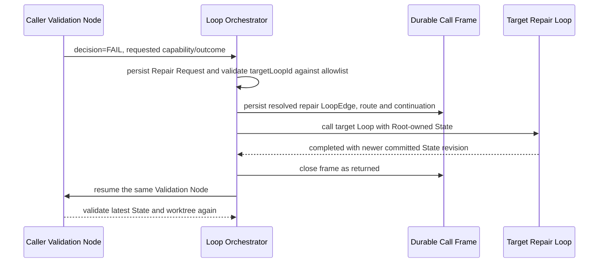
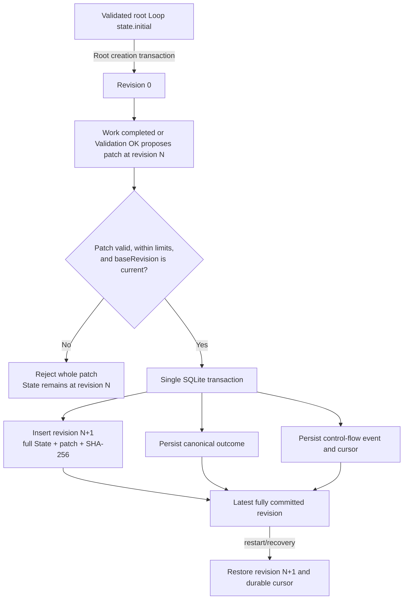

# Work Loop, revisioitu State ja Loop Orchestrator

## Konteksti

Balletin strict-v9-malli toteuttaa geneerisen workflow'n `ProjectLoop`-, `ProjectStep`-, terminal node-, Approved/Rejected Transition- ja `LoopRunEngine`-käsitteillä. Malli soveltuu lineaariseen Step-ketjuun, mutta se ei erota työn tekemistä sen validoinnista, eikä sillä ole Root Runin omistamaa kanonista, revisioitua Statea tai ulkoisesta korjaus-Loopista takaisin kutsuvaa continuation-semanttiikkaa.

Uuden mallin pitää säilyttää nykyisen toteutuksen hyvät rajat: versionhallittu project-local konfiguraatio, immutable Root Run snapshot, checkout-kohtainen SQLite-tila, Git-worktree-eristys, provider-neutraali suoritus, ExecutionProfilet, eksplisiittisesti valitut instructionit ja skillsit sekä piilotetun chain-of-thoughtin tallennus- ja näyttökielto. Platform ei saa tietää roadmap-, milestone-, issue-, release-, deploy- tai muusta projektikohtaisesta menettelystä.

### Strict-v9:n todellinen nykytila

Nykyinen toteutus muodostaa seuraavan lähtötilan:

| Alue | Strict-v9-toteutus | Work Loop -muutostarve |
| --- | --- | --- |
| Project-malli | `ProjectLoop` omistaa `start`-ID:n ja sekalaisen `nodes`-listan. `ProjectStep` on Agent-, Human- tai Scheduled-Step; samassa listassa ovat kiinteät `completed`, `blocked` ja `failed` terminal nodet. | Työ ja validointi on erotettava eksplisiittisiksi nodeiksi. Runtime-tiloja ei mallinneta authoring-nodeina. |
| Siirtymät | Jokainen executable Step omistaa käyttäjän konfiguroimat `approved`- ja `rejected`-kohteet. Kohde on paikallinen node/terminaali tai `{ loop }`. | Validation-päätös on `OK` tai `FAIL`; FAIL valitsee paikallisen retryn tai Orchestrator-korjauksen. Normaali node-flow, Loopien välinen flow ja repair-kutsu erotetaan toisistaan. |
| Root snapshot | `RootExecutionSnapshot.version = 1` sisältää saavutettavat Loopit, Stepit, Transitionit, teeman, ExecutionProfilet, runtime-bindingit ja execution-resurssit. Snapshot tallennetaan immutablena `root_runs.execution_snapshot_json`-kenttään. | Snapshot-periaate säilyy, mutta sisältö muuttuu v10 Work Loop-, Edge- ja LoopEdge-graafiksi. State ei ole konfiguraatiosnapshotin sisäinen muuttuva kenttä. |
| Runtime-rivit | `LoopRun` kuvaa Loop-instanssia ja parent-viitteitä. `StepRun` kuvaa executable Stepiä, sen attemptia, runtime-statusta ja mahdollista `approved \| rejected`-tulosta. Provider-tehtävä on erillinen `ExecutionTask`. | `LoopRun` ja `StepRun` korvataan Loop invocation-, Node Run-, call frame-, Repair Request- ja control-flow-riveillä. |
| Engine | `LoopRunEngine` lukee persistoidun `StepRun.result`-arvon, seuraa vastaavaa Transitionia, luo paikallisen Step Runin tai uuden lapsi-Loop Runin ja päättää lähde-Loopin cross-Loop-siirtymässä. Paluupistettä ei ole. | `LoopOrchestrator` omistaa deterministisen call/return-polun, State-revision, retryn, repair depthin ja transition limitin. |
| SQLite schema v3 | Kanoniset taulut ovat `root_runs`, `loop_runs`, `step_runs`, `execution_tasks`, `execution_events` ja `loop_schedule_state`. Yksi aktiivinen Run per Loop pakotetaan uniikki-indeksillä. | State-revisiot, node-ajot, control-flow-eventit, repair requestit ja call framet tarvitsevat omat relaationsa. Saman Loopin sisäkkäinen repair-kutsu on sallittava. |
| Task envelope ja outcome | `TaskEnvelopeV1` välittää Loop/Step-ID:t, taskin, Run inputin, kolme viimeistä Step-yhteenvetoa ja resume-kontekstin. `StepOutcome` on `completed + approved/rejected`, `needs_input`, `blocked` tai `failed`. | Envelope v2 välittää Loop descriptionin, node-roolin, State revisionin, kanonisen Staten ja mahdollisen Repair Requestin. Work- ja Validation-outcomeilla on eri skeemat. |
| Configure-graafi | `buildLoopVisualProjection` projisoi v9-nodet ja niiden kaksi tuloskohdetta visuaalisiksi nodeiksi ja edgeiksi; saavuttamattomat terminalit suodatetaan. | Canvas näyttää Work Loop Noden sisäisen Work/Validation-rakenteen, käyttäjän Edget ja LoopEdget ilman terminal-nodeja. |
| Run-graafi | Run käyttää immutablea snapshot-Loopia, liittää viimeisimmän `StepRun`-tilan nodeen ja animoi viimeisimmän Approved/Rejected-edgen. | Run projisoi Node Runit, aktiivisen call framen, repair-reitin ja State revisionin snapshot-graafiin. |

Repositoryn nykyinen tracked strict-v9-konfiguraatio sisältää neljä Loopia, 13 Agent-Stepiä, neljä Human-Stepiä, 12 terminal nodea ja viisi ExecutionProfilea. Se sisältää project-local toimitusworkflow'n, mutta nämä tunnisteet eivät ole platform-koodia eivätkä siirry uuden arkkitehtuurin pakollisiksi oletuksiksi.

## Päätös

Strict project configuration v10 ottaa käyttöön Work Loop -arkkitehtuurin. V10 on hard cut: v9 ei ole v10:n vaihtoehtoinen lukumuoto, eikä runtime tee automaattista, hiljaista tai best-effort-migraatiota.

### Terminologia ja omistajuus

#### Loop

`Loop` on versionhallittu, uudelleenkäytettävä orchestration-määritelmä, jolla on vakaa ID ja description. Loop ei ole Run eikä kanna mutablea runtime-statea. Root Run snapshottaa kaikki aloitus-Loopista `Edge`- ja `LoopEdge`-viitteillä saavutettavat Loopit ennen ensimmäisen noden jonotusta.

#### Loop description

Loop description on pakollinen, trimmaamisen jälkeen non-empty, enintään 2 000 merkin project-local kuvaus Loopin tarkoituksesta ja onnistumisen rajasta. Se:

- tallennetaan `.ballet/project.json`-tiedostoon ja immutableen Root Run snapshotiin;
- välitetään Work- ja Validation-nodejen task envelopeen sekä Repair Requestin lähdekontekstiin;
- auttaa Loop Orchestratoria ja operaattoria ymmärtämään reitin; ja
- ei sisällä platformin pakollista workflow'ta tai muuta System instructionia.

#### Work Loop

`WorkLoop` on v10:n ainoa konkreettinen Loop-muoto. Se laajentaa Loopin identityn ja descriptionin deklaratiivisella `state`-kuvauksella ja initial-arvolla, `startNodeId`-kentällä, `WorkLoopNode[]`-listalla ja saman Loopin sisäisillä `Edge[]`-määrittelyillä. Erillistä legacy-Loop-tyyppiä tai rinnakkaista Step-graafia ei jää.

#### Work Loop Node

`WorkLoopNode` on saman tavoitteen työn ja validoinnin muodostama komposiitti. Sillä on Loopissa yksilöllinen ID ja description sekä täsmälleen yksi `WorkNode` ja yksi `ValidationNode`. Sisäisten nodejen paikalliset roolit ovat kiinteästi `work` ja `validation`; niitä ei käytetä käyttäjän nimeäminä geneerisinä Stepeinä.

#### Work Node

`WorkNode` tekee työn. Sen tyyppi on `agent`, `human` tai `scheduled`. Agent- ja Scheduled Work Node omistavat taskin, yhden `executionProfileId`-viitteen, yhden Project-primary instruction -viitteen ja set-semanttiset Project-skill-viitteet; Human Work Node kieltää nämä provider-composition-kentät. Scheduled Work Node sisältää lisäksi schedulen ja on sallittu vain Loopin `startNodeId`-nodessa. `completed`-outcome voi ehdottaa yhtä State patchia. `needs_input` pausettaa ja jatkaa samaa Work Nodea. `blocked` ja `failed` eivät muodosta normaalia flow-edgeä.

#### Validation Node

`ValidationNode` arvioi Work Loop Noden tavoitteen nykyistä kanonista Statea, worktreen tilaa ja viimeisintä Work-outcomea vasten. Sen tyyppi on `agent` tai `human`; scheduled Validation Node ei kuulu skeemaan. Agent Validation Node omistaa provider-neutraalin execution compositionin ja Human Validation Node kieltää sen. Validation Node ei tuota Approved/Rejected-tulosta. `OK` saa tuottaa yhden State patchin; `FAIL` kieltää patchin ja tuottaa tässä ADR:ssä lukitun repair-sopimuksen.

#### State ja state revision

`State` on Root Runin omistama kanoninen JSON-arvo. Se ei kuulu yksittäiselle Loopille, Node Runille, ExecutionTaskille tai providerille. Kaikki saman Root Runin normaalit Loop-siirtymät, paikalliset retryt, nested repair -kutsut ja paluut lukevat samaa Statea.

Jokainen Loop määrittelee `state.description`-kentässä odottamansa State-sopimuksen ja `state.initial`-kentässä aloitusarvon silloin, kun juuri se Loop käynnistetään Root Loopina. Root Run kopioi valitun Root Loopin `state.initial`-arvon revisionumerolle `0`. FLOW- ja REPAIR-siirtymät eivät alusta Statea target-Loopin initial-arvosta, vaan jatkavat saman Root Runin kanonisella Statella. Jokainen hyväksytty, vähintään yhden mutatoivan operaation sisältävä patch luo täsmälleen uuden revision `N + 1`; revisioita ei ylikirjoiteta tai numeroida uudelleen.

#### Edge

`Edge` on käyttäjän konfiguroima, saman Work Loopin sisäinen normaali flow-edge yhden Work Loop Noden Validation `OK` -outputista joko toiseen Work Loop Nodeen tai eksplisiittiseen Loop-terminal targetiin `completed | blocked | failed`. Jokaisella source-nodella on täsmälleen yksi lähtevä Edge. Terminal target on edge-kohteen arvo, ei authoroitava terminal node. Edge ei osoita toiseen Loopiin.

#### Loop Edge

`LoopEdge` on käyttäjän konfiguroima, kahden Loopin välinen sallittu yhteys. Sen `kind` on joko `flow` tai `repair`:

- `flow` siirtää tavallisesti `completed`-tilaan päättyneen top-level Loop invocationin seuraavaan Loopiin ilman return-continuationia. Yhdellä source-Loopilla saa olla enintään yksi lähtevä flow-LoopEdge.
- `repair` lisää target-Loopin source-Loopin Orchestrator-allowlistiin. Source-Loopin Validation Node kuvaa tarvittavan capabilityn tai outcomen; hyväksytty Orchestrator-route valitsee yhden sallitun target Loopin, ratkaisee sen vakaan repair-edge-ID:n, luo call framen ja palaa requestin luoneeseen Validation Nodeen.

LoopEdge ei itsessään käynnistä mitään. Runtime voi käyttää vain immutableen Root Run snapshotiin sisältyvää, skeemassa validoitua edgeä.

#### Repair Request

`RepairRequest` on Validation-päätöksestä johdettu, runtimen ID:llä ja provenienssilla täydentämä immutable pyyntö. Siinä ovat vähintään source Loop, Work Loop Node ja Validation Node, Validation attempt, luontihetken State revision, summary, reason, evidence sekä requested capability tai outcome. Validation-outcome ei valitse LoopEdgeä, continuationia tai return targetia. Repair Request ei sisällä piilotettua chain-of-thoughtia.

#### Loop Orchestrator

`LoopOrchestrator` on provider-neutraali platform-palvelu. Project-konfiguraation `orchestrator` määrittelee sen ExecutionProfilen, primary instructionin, skillsit ja repair-rajat; provider voi tämän komposition perusteella ehdottaa routea. Platform validoi persisted Validation-outcomen ja route-ehdotuksen deterministisesti, ratkaisee vain sallitun LoopEdgen, ylläpitää yhtä aktiivista control-flow-cursoria Root Runia kohti, luo ja purkaa call framet, pakottaa retry/depth/transition-rajat sekä tekee outcome-, State- ja control-flow-kirjoitukset SQLite-transaktioissa. Orchestrator ei ole sidottu tiettyyn malliin tai provideriin, ei kutsu suoraan OpenAI API:a eikä sisällä project-workflow-tunnisteita.

#### Orchestrator route

`OrchestratorRoute` on yhden Repair Requestin runtime-päätös käyttää yhtä snapshotattua `repair`-LoopEdgeä. Route tallentaa repair requestin, source invocationin, source Validation Noden, valitun LoopEdgen, target invocationin ja call framen ID:t. Orchestrator executor voi nimetä vain yhden envelope-allowlistissä olevan `targetLoopId`-arvon. Loop Orchestrator ratkaisee ja todentaa, että sitä vastaava edge on `repair`, sen source on requestin nykyinen Loop ja target on snapshotissa. Executor ei voi nimetä edgeä, continuationia tai return targetia.

#### Continuation ja call frame

`Continuation` on paluuosoite source-Loop invocationin samaan Validation Nodeen. `CallFrame` on sen durable SQLite-esitys. Frame sisältää caller- ja callee-invocation-ID:t, Repair Requestin ja Orchestrator Routen ID:t, paluu-Validation Noden osoitteen, kutsuhetken State revisionin, syvyystason ja statuksen.

Normaali flow-LoopEdge ei luo framea. Repair-LoopEdge luo yhden framen. Target repair Loopin valmistuminen ei seuraa sen mahdollista flow-LoopEdgeä, vaan sulkee framen ja luo uuden Validation Node Runin callerin paluuosoitteeseen.

### Kiinteät ja käyttäjän konfiguroimat edget

Work Loop Noden sisäiset invariantit ovat kiinteitä eivätkä esiinny `.ballet/project.json`-tiedoston `edges`-listassa:

1. `Work completed → Validation`;
2. `Validation FAIL + LOCAL_RETRY → saman Work Loop Noden Work`;
3. `target repair Loop completed → callerin sama Validation`; ja
4. `Validation OK → Work Loop Noden exit`.

Käyttäjä konfiguroi:

- Work Loopin sisäiset `Edge`-yhteydet Work Loop Node exitistä seuraavaan Work Loop Nodeen;
- Loopien väliset normaalit `flow`-LoopEdget; sekä
- source-Loop-kohtaisen Orchestrator-allowlistin muodostavat `repair`-LoopEdget.

`Work needs_input`, Work/Validation `blocked` tai `failed`, root cancellation ja prosessikeskeytys ovat runtime-tapahtumia, eivät konfiguroituja edgejä. V10:ssä ei ole authoroitavia terminal nodeja; Loop-terminalit esiintyvät vain Edgen strict target-unionissa.

### Validation-sopimus

Validation Noden `completed` structured output on täsmälleen toinen seuraavista päätösmuodoista:

```ts
type ValidationOutcome =
  | {
      decision: "OK";
      summary: string;
      evidence: JsonValue;
      checks: RunCheck[];
      statePatch?: StatePatch;
    }
  | {
      decision: "FAIL";
      summary: string;
      evidence: JsonValue;
      checks: RunCheck[];
      repair:
        | {
            mode: "LOCAL_RETRY";
            feedback: string;
            expectedCorrection: string;
          }
        | {
            mode: "ORCHESTRATOR_REPAIR";
            reason: string;
            requestedCapability: string;
            evidenceRefs: string[];
          }
        | {
            mode: "ORCHESTRATOR_REPAIR";
            reason: string;
            requestedOutcome: JsonValue;
            evidenceRefs: string[];
          };
    };
```

Näin sopimus lukitaan:

```text
decision = OK
tai
decision = FAIL + repair.mode = LOCAL_RETRY | ORCHESTRATOR_REPAIR
```

`OK` kieltää `repair`-kentän ja voi sisältää atomisesti validoitavan `statePatch`-kentän. `FAIL` vaatii `repair`-kentän ja kieltää State patchin. `LOCAL_RETRY` vaatii palautteen ja odotetun korjauksen. `ORCHESTRATOR_REPAIR` vaatii syyn, evidence-viitteet ja täsmälleen toisen kentistä `requestedCapability | requestedOutcome`; Validation ei valitse target Loopia. Unknown kentät, tuntematon mode tai rajat ylittävä sisältö hylätään fail-closed ennen control-flow'ta. Providerin raw payload ei ohjaa control-flow'ta; vain roolin mukaan validoitu ja kanonisoitu ValidationOutcome voi muodostaa persistoidun Repair Requestin.

### Work outcome ja State patch

Work Noden structured outcome erotetaan ValidationOutcome-skeemasta:

```ts
type WorkOutcome =
  | {
      state: "completed";
      summary: string;
      checks: RunCheck[];
      artifacts: Record<string, JsonValue>;
      statePatch?: StatePatch;
    }
  | {
      state: "needs_input";
      summary: string;
      checks: RunCheck[];
      question: string;
      context: string;
    }
  | {
      state: "blocked" | "failed";
      summary: string;
      checks: RunCheck[];
    };

type StatePatch = Array<
    | { op: "add"; path: string; value: JsonValue }
    | { op: "remove"; path: string }
    | { op: "replace"; path: string; value: JsonValue }
  >;
```

Patch on RFC 6902 JSON Patchin strict mutating subset. Base revision kuuluu immutableen Node Run / Task Envelope -evidenssiin eikä providerin valittavaksi patch-kentäksi. Tyhjä JSON Pointer, `move`, `copy`, `test`, tuntemattomat operaatiot ja prototype-segmentit hylätään. Lopputuloksen pitää pysyä kelvollisena JSON-arvona; primitiiviseen root-arvoon ei voi kohdistaa tämän version child-path-operaatioita. Operaatiot sovelletaan järjestyksessä erilliseen kopioon, ja vasta kokonaan validoitu lopputulos voidaan hyväksyä.

Work Noden hyväksytty patch kirjataan ennen Validation Nodea, jotta paikallinen retry ja ulkoinen repair näkevät saman toteutuneen, revisioidun tilan. Tässä "hyväksytty" tarkoittaa State-skeeman, base revisionin ja rajojen läpäissyttä atomista patchia; se ei tarkoita Validation-päätöstä `OK`. Epäonnistunutta validointia ei peruta historiasta. Korjaus tuottaa uuden patchin ja revision, jolloin koko muutospolku säilyy auditoitavana.

### State-semanttiikka ja rajat

State noudattaa seuraavia invariantteja:

- Root Run omistaa yhden kanonisen Staten.
- Revision 0 luodaan Root Runin luonnin kanssa samassa transaktiossa.
- `MAX_STATE_BYTES = 262144` (256 KiB) mitataan kanonisen UTF-8 JSON -esityksen tavumääränä.
- `MAX_STATE_PATCH_BYTES = 65536` (64 KiB) mitataan patchin kanonisen UTF-8 JSON -esityksen tavumääränä.
- Yhdessä patchissa saa olla enintään 128 operaatiota ja Staten JSON-syvyys saa olla enintään 64.
- Patch vaatii täsmälleen nykyisen `baseRevision`-arvon. Ballet ei tee hiljaista rebasea tai last-writer-wins-yhdistämistä.
- Jokainen hyväksytty patch luo uuden immutable revision, tallentaa täyden post-patch Staten, patchin, SHA-256:n ja outcome/control-event-viitteet.
- Patch, kanoninen NodeOutcome ja siitä seuraava control-flow-siirtymä tallennetaan samassa SQLite-transaktiossa. Jos patch puuttuu, outcome ja siirtymä tallennetaan edelleen samassa transaktiossa nykyiseen revisioon viitaten.
- Epäkelpo patch ei muuta Statea osittain, ei kasvata revisionumeroa eikä siirrä control-flow-cursoria. Invalidi provider-payload jää evidenssiksi ja Node Run päätetään teknisellä `invalid_state_patch`-virheellä erillisessä atomisessa failure-transaktiossa.
- Restart palautuu `root_runs.current_state_revision`-arvon osoittamaan viimeiseen kokonaan commitoituun revisioon. Se ei rakenna Statea keskeneräisestä task-payloadista tai osittaisesta patch-ketjusta.
- Root Runin sisäinen suoritus on sekventiaalinen. Eri Root Runit voivat edelleen käyttää provider-kohtaisia FIFO-kaistoja nykyisen provider-neutraalin queue-politiikan mukaan.

### Control-flow-semanttiikka

| Tapahtuma | Atominen runtime-vaikutus | Seuraava tila |
| --- | --- | --- |
| Work completed | Validoi WorkOutcome ja mahdollinen patch; luo tarvittaessa State revisionin; tallentaa Work-outcomen ja kiinteän `Work → Validation`-siirtymän. | Sama Work Loop Node, Validation Node queued/waiting executorin mukaan. |
| Work needs input | Tallentaa kysymyksen ja contextin, ei hyväksy patchia eikä siirrä cursoria. | Sama Work Node ja Root Run `waiting_for_human`; vastaus luo uuden attemptin samalla State revisionilla. |
| Work blocked/failed | Tallentaa outcomen ilman patchia ja päättää nykyisen Loop invocationin samalla statuksella. | Tavallisessa flow'ssa Root Run propagoi `blocked`/`failed`; repair-targetissa käytetään alla kuvattua frame-propagointia. |
| Validation OK | Validoi mahdollisen patchin nykyistä base revisionia vasten, tallentaa uuden revision tarvittaessa ja seuraa source Work Loop Noden täsmälleen yhtä käyttäjän Edgeä samassa transaktiossa. | Target Work Loop Node tai target Loop-terminal; `completed` voi tämän jälkeen returnata repair-framesta, seurata flow-LoopEdgeä tai päättää Root Runin. |
| Validation FAIL/local | Luo Repair Requestin, kasvattaa saman Work Loop Noden local retry -laskuria ja tallentaa kiinteän paluun Work Nodeen. | Sama Work Node saa Repair Requestin ja uusimman Staten. |
| Validation FAIL/orchestrator | Validoi repair-payloadin, luo pending Repair Requestin ja Orchestrator Node Runin; ei vielä luo routea tai framea. | Caller suspendoidaan odottamaan roolikohtaista OrchestratorOutcomea. |
| Orchestrator completed | Validoi `targetLoopId`-arvon persisted Repair Requestin source-Loopin snapshot-allowlistia vasten, ratkaisee vakaan repair-LoopEdgen ja luo Orchestrator Routen, call framen sekä target Loop invocationin. | Target repair Loop aloittaa `startNodeId`-nodestaan samalla kanonisella Statella. |
| Orchestrator needs input / blocked / failed | Persistoi roolikohtaisen outcomen ilman routea. Needs input säilyttää pending Repair Requestin; terminal outcome päättää pyynnön ja propagoi terminaalin. | Caller pysyy suspendoituna inputin ajan tai päättyy fail-closed ilman target-kutsua. |
| Target repair Loop completed | Ohittaa targetin mahdollisen flow-LoopEdgen, sulkee call framen ja tallentaa kiinteän return-siirtymän. | Caller aktivoituu ja sama Validation Node suoritetaan uudelleen uusinta State revisionia vasten. |
| Target repair Loop blocked/failed/cancelled | Sulkee framen vastaavalla terminal-statuksella; targetin failure evidenssi liitetään callerin repair-kontekstiin. | `blocked` tai `failed` propagoi call stackin kautta Root Runiin; `cancelled` peruuttaa koko Root Runin. Validationia ei ajeta uudelleen. |
| Root cancellation | Merkitsee Root Runin cancellation-requestin, peruuttaa queued/running execution taskit ja päättää aktiiviset Node Runit, Loop invocationit ja framet yhdessä transaktiossa. | Root Run `cancelled`; uusia patcheja tai reittejä ei hyväksytä cancellation-commitin jälkeen. |
| Process interruption ja recovery | Queued taskit säilyvät. Running taskit merkitään `interrupted`-failediksi eikä niitä replayata. Persistoitu mutta vielä orkestroimaton terminal task käsitellään idempotentisti. | Cursor ja State palautetaan viimeisestä commitoidusta control-eventistä ja State revisionista; jo commitoitua patchia ei toisteta. |

Jos provider valmistuu samaan aikaan cancellationin kanssa, SQLite-transaktioiden commit-järjestys ratkaisee: ennen cancellationia kokonaan commitoitu revision jää historiaan; cancellationin jälkeen saapuva payload ei muuta Statea.

### Miksi ulkoinen korjaus palaa Validation Nodeen

Ulkoinen repair-kutsu syntyy vasta, kun Work Node on jo päättynyt ja Validation Node on tunnistanut täsmällisen puutteen. Repair-target toimii samassa worktreessä ja samassa Root-owned Statessa, ja sen hyväksytyt patchit ovat uusia revisioita.

Paluu Work Nodeen olisi virheellinen oletus: se toistaisi jo tehdyn työn, voisi tuottaa päällekkäisiä sivuvaikutuksia ja voisi ylikirjoittaa repair-targetin muutoksen. Paluu seuraavaan Work Loop Nodeen taas ohittaisi epäonnistuneen hyväksymisehdon. Siksi continuation osoittaa aina samaan Validation Nodeen. Uusi validation attempt arvioi alkuperäisen tavoitteen uusinta kanonista Statea ja worktreetä vasten; vasta `OK` vapauttaa normaalin Edgen.

### Normaali ja paikallinen retry


### Ulkoinen repair call/return



### State revision -elinkaari



### LoopEdge-validointi, self-routing ja rajat

Strict-v10-validointi tarkistaa ennen Runia:

- jokaisen Edgen source- ja target-Work Loop Noden olemassaolon samassa Loopissa;
- jokaisen LoopEdgen source- ja target-Loopin olemassaolon;
- jokaisen LoopEdgen vakaan ID:n, `flow | repair`-kindin ja non-empty descriptionin;
- edge-ID:iden globaalin yksikäsitteisyyden;
- täsmälleen yhden lähtevän Edgen per Work Loop Node ja enintään yhden lähtevän flow-LoopEdgen per Loop;
- kaikkien Work Loop Nodejen saavutettavuuden `startNodeId`-nodesta sekä vähintään yhden saavutettavan terminal targetin;
- Scheduled Work Noden sijainnin ainoastaan `startNodeId`-nodessa ja scheduled Validation Noden kiellon; sekä
- Orchestratorin, provider-Work Nodejen ja agent-Validation Nodejen ExecutionProfile-, instruction- ja skill-viitteet.

Self-routing on sallittu eksplisiittisesti:

- saman Loopin Edge saa kohdistua source Work Loop Nodeen tai muodostaa muun sisäisen syklin;
- flow-LoopEdge saa kohdistua samaan Loopiin ja aloittaa uuden invocationin ilman call framea; ja
- repair-LoopEdge saa kohdistua source-Loopiin, jolloin syntyy saman Loopin nested invocation ja call frame.

Snapshot-reachability käyttää visited-joukkoa eikä rekursioi staattiseen sykliin loputtomasti. Runtime sallii syklit vain seuraavien Root Run -kohtaisten, snapshotoitujen platform-rajojen sisällä:

- `MAX_CONTROL_FLOW_TRANSITIONS = 256`;
- Project Orchestratorin `maxRepairDepth` väliltä 0–32;
- Project Orchestratorin `maxRepairAttempts` väliltä 1–100; ja
- Work Loop Noden `maxLocalAttempts` väliltä 1–100, alkuperäinen attempt mukaan luettuna.

Jokainen durable cursorin siirto kasvattaa transition-laskuria: Work→Validation, Validation→seuraava Work/terminal, local retry, repair call, repair return ja flow-LoopEdge. `needs_input`-pause ei kasvata laskuria. Rajan ylitys ei valitse muuta edgeä, vaan päättää nykyisen invocationin ja Root Runin `blocked`-tilaan täsmällisellä limit-koodilla.

## Strict project configuration v10 -luonnos

V10:n domain-luonnos on seuraava:

```ts
interface ProjectConfigurationV10 {
  version: 10;
  executionProfiles: ExecutionProfile[];
  orchestrator: ProjectLoopOrchestrator;
  loops: ProjectLoop[];
  loopEdges: ProjectLoopEdge[];
}

interface ProjectLoop {
  id: string;
  description: string;
  state: { description: string; initial: JsonValue };
  startNodeId: string;
  nodes: ProjectWorkLoopNode[];
  edges: ProjectNodeEdge[];
}

interface ProjectWorkLoopNode {
  id: string;
  description: string;
  work: ProjectWorkNode;
  validation: ProjectValidationNode;
  /** Sisältää alkuperäisen attemptin. */
  maxLocalAttempts: number;
}

type ProjectWorkNode =
  | (ProjectNodeAppearance & ProjectExecutionComposition & {
      type: "agent";
      task: string;
    })
  | (ProjectNodeAppearance & { type: "human"; task: string })
  | (ProjectNodeAppearance & ProjectExecutionComposition & {
      type: "scheduled";
      task: string;
      schedule: ProjectWorkSchedule;
    });

type ProjectValidationNode =
  | (ProjectNodeAppearance & ProjectExecutionComposition & {
      type: "agent";
      task: string;
    })
  | (ProjectNodeAppearance & { type: "human"; task: string });

interface ProjectExecutionComposition {
  executionProfileId: string;
  primaryInstructionId: string;
  skillIds: string[];
}

interface ProjectNodeEdge {
  id: string;
  source: string;
  target:
    | { nodeId: string }
    | { terminal: "completed" | "blocked" | "failed" };
}

interface ProjectLoopEdge {
  id: string;
  source: string;
  target: string;
  kind: "flow" | "repair";
  description: string;
}

interface ProjectLoopOrchestrator extends ProjectExecutionComposition {
  maxRepairDepth: number;
  maxRepairAttempts: number;
}
```

Schedule säilyy Scheduled Work Noden geneerisenä ominaisuutena. Semanttinen validointi sallii Scheduled Work Noden vain Loopin `startNodeId`-nodessa; Validation Node ei koskaan ole scheduled. Scheduled Root Run aloittaa tästä Work Loop Nodesta revision 0:lla. `ExecutionProfile` säilyttää nykyisen provider-, model-, reasoning effort- ja network access -vastuunsa. `.ballet/theme.json` säilyy erillisenä project-wide visualisointidatana.

Tarkka strict-esimerkkimuoto:

```json
{
  "version": 10,
  "executionProfiles": [
    {
      "id": "default-runtime",
      "name": "Default runtime",
      "provider": "codex",
      "model": "configured-model",
      "reasoningEffort": "medium",
      "networkAccess": false
    }
  ],
  "orchestrator": {
    "executionProfileId": "default-runtime",
    "primaryInstructionId": "project:orchestrator",
    "skillIds": [],
    "maxRepairDepth": 4,
    "maxRepairAttempts": 3
  },
  "loops": [
    {
      "id": "primary-work",
      "description": "Produce and validate the requested result.",
      "state": {
        "description": "Structured facts shared by all Loop invocations in this Root Run.",
        "initial": {}
      },
      "startNodeId": "produce",
      "nodes": [
        {
          "id": "produce",
          "description": "Produce one validated result.",
          "work": {
            "type": "agent",
            "task": "Perform the requested work and report a State patch.",
            "executionProfileId": "default-runtime",
            "primaryInstructionId": "project:worker",
            "skillIds": [],
            "nodeStyle": "terra",
            "nodeSize": "medium"
          },
          "validation": {
            "type": "agent",
            "task": "Validate the result against the Loop description and current State.",
            "executionProfileId": "default-runtime",
            "primaryInstructionId": "project:validator",
            "skillIds": [],
            "nodeStyle": "luna",
            "nodeSize": "small"
          },
          "maxLocalAttempts": 3
        }
      ],
      "edges": [
        {
          "id": "produce-completed",
          "source": "produce",
          "target": { "terminal": "completed" }
        }
      ]
    },
    {
      "id": "repair-work",
      "description": "Apply a bounded repair request and validate the repair.",
      "state": {
        "description": "The caller-owned State repaired by this Loop.",
        "initial": {}
      },
      "startNodeId": "repair",
      "nodes": [
        {
          "id": "repair",
          "description": "Repair the state identified by the caller.",
          "work": {
            "type": "human",
            "task": "Apply the persisted Repair Request.",
            "nodeStyle": "mars",
            "nodeSize": "medium"
          },
          "validation": {
            "type": "human",
            "task": "Confirm that the Repair Request has been satisfied.",
            "nodeStyle": "luna",
            "nodeSize": "small"
          },
          "maxLocalAttempts": 2
        }
      ],
      "edges": [
        {
          "id": "repair-completed",
          "source": "repair",
          "target": { "terminal": "completed" }
        }
      ]
    }
  ],
  "loopEdges": [
    {
      "id": "primary-to-repair",
      "source": "primary-work",
      "target": "repair-work",
      "kind": "repair",
      "description": "Allow bounded repair by the repair-work Loop."
    }
  ]
}
```

Ylätason kentät ovat täsmälleen `version`, `executionProfiles`, `orchestrator`, `loops` ja `loopEdges`. Unknown kentät hylätään jokaisella tasolla. V9:n Loop `start`, sekalainen `nodes`, Step `type`, `on.approved`, `on.rejected`, authoroitavat terminal nodet ja top-level `version: 9` hylätään `invalid_schema`-virheenä. Readerin version-virhe on täsmälleen:

```text
Project configuration version 9 is not supported; update the project to strict v10.
```

Runtime ei tarjoa v9-readeria, v9→v10-autokonversiota, dual-writea, fallback-projektiota tai hiljaista oletusten täyttämistä. Repository-owned `.ballet/project.json` ja commitoidut fixturet muunnetaan eksplisiittisenä tracked-data-muutoksena siinä toteutusvaiheessa, jossa v10 otetaan käyttöön.

## Persistenssipäätös

SQLite-skeema vaihtuu v10-runtimea varten uuteen versioon ilman v9-Run compatibility -mallia. V9:n `loop_runs` ja `step_runs` poistetaan. Uuden kanonisen mallin taulut ovat vähintään:

- `root_runs` — Root Run, immutable execution snapshot, current State revision ja terminal/finalization state;
- `state_revisions` — revision 0 ja jokainen immutable post-patch State;
- `loop_invocations` — saman Loopin tavalliset ja nested invocationit;
- `node_runs` — Work- ja Validation-nodejen attemptit ja kanoniset outcomet;
- `repair_requests` — persisted FAIL-korjauspyynnöt;
- `call_frames` — durable continuation stack;
- `orchestrator_routes` — valitut repair-LoopEdge-reitit;
- `control_flow_events` — cursorin jokainen durable siirto;
- `execution_tasks` ja `execution_events` — provider-neutraali suoritus ja konsolievidenssi; sekä
- `loop_schedule_state` — Scheduled Work Node -triggerin durable tila.

`execution_tasks`-taulun spec ja `root_runs`-taulun snapshot pysyvät immutableina. Uusi schema hylkää ei-tyhjän vanhan local state -skeeman selkeällä unsupported schema -virheellä; Ballet ei yritä tulkita v9-snapshotteja v10-Run-historiaksi. Tyhjän pre-release-skeeman resetointi voi säilyä eksplisiittisesti testattuna poikkeuksena nykyisen käytännön mukaisesti.

## Task envelope, structured output ja evidenssi

Task envelope versioidaan v2:een. Se sisältää roolin mukaan Root Run-, Loop Run-, Node Run- ja Work Loop Node Run -identiteetit, Loopin ja Work Loop Noden descriptionit, node-roolin `work | validation | orchestrator`, taskin, current State revisionin/arvon/hashin, rajatun relevantin historian ja mahdollisen resume-vastauksen. Validation-envelope sisältää viimeisimmän kanonisen Work-outcomen. Workin local retry sisältää vain viimeisimmän Validation-palautteen. Orchestrator-envelope sisältää persistoidusta Repair Requestista rajatun projektion sekä source-Loopin repair-allowlistista johdetut target Loopit ID:n ja descriptionin kanssa deterministisesti järjestettyinä.

WorkOutcome-, ValidationOutcome- ja OrchestratorOutcome-JSON-skeemat ovat eri strict, versioituja sopimuksia ja niiden schema-ID, exact kanoninen UTF-8 schema sekä SHA-256 tallennetaan execution evidenceen. OrchestratorOutcome saa valita vain `targetLoopId`-arvon allowlististä; runtime määrää LoopEdgen, continuationin ja return targetin persistoidusta Repair Requestista. Nykyinen viiden sectionin composition order, resurssien SHA-256:t, promptin exact bytes, ExecutionProfile snapshot ja provider-neutraali adapteriraja säilyvät.

Providerin julkaistut tapahtumat ja reasoning-yhteenvedot voidaan näyttää kuten nykyään. Piilotettua tai raakaa chain-of-thoughtia ei pyydetä, tallenneta Stateen, Repair Requestiin, outcomeen, tapahtumiin tai käyttöliittymään.

## Cancellation, nesting ja recovery

- Root Run on ainoa käyttäjän peruutettava omistaja. Yksittäisen nested repair -Loopin peruuttaminen ei muodosta rinnakkaista osittaista cancellation-mallia.
- Caller on suspended koko repair-kutsun ajan. Root Runilla on yksi aktiivinen cursor, ja call framejen määrä rajataan snapshotatulla Orchestratorin `maxRepairDepth`-arvolla.
- Call framet suljetaan LIFO-järjestyksessä. Muu järjestys on integrity-virhe.
- Repair-target näkee kaikki callerin ennen kutsua commitoidut State-revisiot ja kirjoittaa samaan revision-ketjuun.
- Queued execution task voidaan jatkaa restartin jälkeen. Running task merkitään interrupted-failediksi eikä sitä replayata.
- Jos terminal ExecutionTask on jo persistoinut payloadin mutta outcome/control-transaktio puuttuu, recovery käsittelee sen idempotentisti task ID:n ja Node Run ID:n avulla.
- Jos outcome/control-transaktio on jo commitoitu, recovery ei luo toista revisionumeroa, Repair Requestia, framea tai seuraavaa Node Runia.
- Root Run finalisoidaan nykyisen Git-worktree-periaatteen mukaan vasta, kun control-flow on terminaalinen ja aktiiviset provider-prosessit on drainattu.

## Seuraukset

- `Step` ei ole uuden mallin geneerinen abstraktio. V9:n StepResult ja terminal-node-pohjainen control-flow poistuvat.
- Työn suoritus, validointi ja korjaus ovat erillisiä, testattavia sopimuksia.
- Ulkoinen repair on todellinen call/return eikä yksisuuntainen cross-Loop handoff.
- Root Runin State on auditoitava, atominen ja restart-turvallinen.
- Konfiguraatiograafi sallii self-routingin ja syklit, mutta runtime pysyy rajattuna.
- ExecutionProfile ja provider-adapterit säilyvät; mallia tai provideria ei hardkoodata.
- V10 aiheuttaa tarkoituksellisen breaking project-config- ja local runtime schema -cutoverin.
- Configure- ja Run-käyttöliittymät on rakennettava Work/Validation-komposiitin, LoopEdgejen, State revisionien ja call framejen ympärille ilman riippumatonta visuaalista redesignia.

## Hylätyt vaihtoehdot

### Approved/Rejected nimetään uudelleen mutta Step-malli säilytetään

Pelkkä nimeäminen ei luo State-revisioita, Work/Validation-rajaa eikä repair continuationia. Se jättäisi `ProjectStep`-abstraktion uuden mallin rinnalle.

### Ulkoinen repair palaa Work Nodeen

Tämä toistaa jo valmistuneen työn, kasvattaa sivuvaikutusten riskiä ja voi hukata repair-targetin muutoksen. Validation Node on ainoa oikea paluuosoite.

### Provider tai LLM toimii vapaana Orchestratorina

Malli voisi valita snapshotin ulkopuolisen targetin tai tuottaa provider-riippuvaista control-flow'ta. Orchestrator on deterministinen platform-palvelu; provider tuottaa vain strict outcomen ja yhden envelope-allowlistiin kuuluvan target Loop ID:n. Platform ratkaisee Edgen ja kaikki continuation-tiedot.

### V9 ja v10 luetaan rinnakkain

Dual reader, autokonversio tai compatibility-projektio jättäisi legacy-tyypit, taulut ja testimatriisin pysyväksi painolastiksi. Projekti ei ole productionissa, joten v10 tehdään hard cutina.

## Suhde aiempiin päätöksiin

Tämä päätös korvaa [ADR-004:n](./adr-004-loop-step-transition-run-domain-malli.md) v9 Loop/Step/Transition-käsitemallin ja [ADR-010:n](./adr-010-step-result-erotetaan-runtime-statesta.md) `approved | rejected` StepResult -control-sopimuksen v10:n osalta. Se säilyttää ja täsmentää [ADR-005:n](./adr-005-provider-neutraali-agenttisuoritus.md) provider-neutraaliuden, [ADR-006:n](./adr-006-root-run-git-worktree-eristys.md) immutable snapshot/worktree -rajan, [ADR-007:n](./adr-007-sqlite-suoritus-ja-ajastustila.md) durable SQLite -periaatteen, [ADR-012:n](./adr-012-execution-profile-erotetaan-stepin-instructions-ja-skills-valinnoista.md) ExecutionProfile-vastuun sekä [ADR-013:n](./adr-013-workflow-yksityiskohdat-kuuluvat-skillsiin.md) project-workflow-rajan.

Yksityiskohtainen cutover-järjestys, poistoinventaario ja validointimatriisi ovat [Work Loop -toteutussuunnitelmassa](../outputs/work-loop/IMPLEMENTATION-PLAN.md).

## Toteutuksen lähteet

- `README.md`
- `DESIGN.md`
- `shared/domain/automation.ts`
- `shared/domain/projectConfig.ts`
- `shared/domain/runtime.ts`
- `shared/api/workspace-schemas.ts`
- `shared/api/runtime-schemas.ts`
- `backend/automation/validateAutomationConfig.ts`
- `backend/runs/LoopExecutionSnapshot.ts`
- `backend/runs/LoopExecutionPlanner.ts`
- `backend/runs/RootRunExecutionCoordinator.ts`
- `backend/runtime/LoopRunEngine.ts`
- `backend/runtime/LoopRunStore.ts`
- `backend/storage/LocalDatabase.ts`
- `backend/integration/TaskEnvelopeV1.ts`
- `backend/execution/ExecutionComposition.ts`
- `frontend/src/workspace/automation/loops/loopVisualProjection.ts`
- `frontend/src/workspace/automation/loops/LoopCanvas.tsx`
- `frontend/src/workspace/automation/loops/LoopRunView.tsx`
