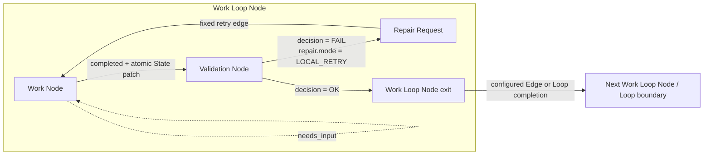
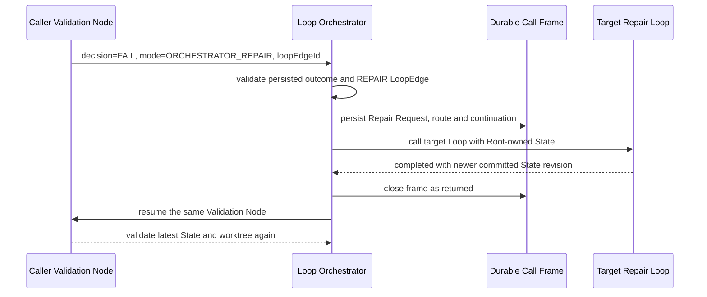
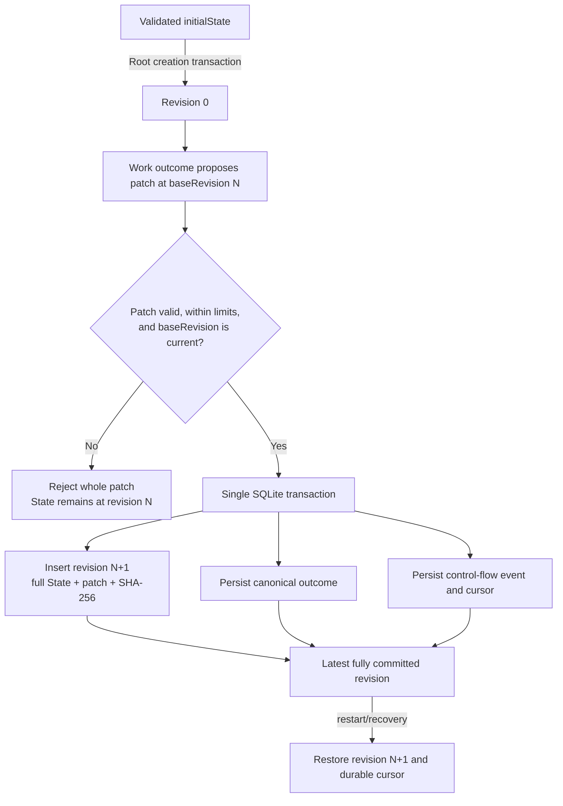

# Work Loop, revisioitu State ja Loop Orchestrator

## Konteksti

Balletin strict-v9-malli toteuttaa geneerisen workflow'n `ProjectLoop`-, `ProjectStep`-, terminal node-, Approved/Rejected Transition- ja `LoopRunEngine`-käsitteillä. Malli soveltuu lineaariseen Step-ketjuun, mutta se ei erota työn tekemistä sen validoinnista, eikä sillä ole Root Runin omistamaa kanonista, revisioitua Statea tai ulkoisesta korjaus-Loopista takaisin kutsuvaa continuation-semanttiikkaa.

Uuden mallin pitää säilyttää nykyisen toteutuksen hyvät rajat: versionhallittu project-local konfiguraatio, immutable Root Run snapshot, checkout-kohtainen SQLite-tila, Git-worktree-eristys, provider-neutraali suoritus, ExecutionProfilet, eksplisiittisesti valitut instructionit ja skillsit sekä piilotetun chain-of-thoughtin tallennus- ja näyttökielto. Platform ei saa tietää roadmap-, milestone-, issue-, release-, deploy- tai muusta projektikohtaisesta menettelystä.

### Strict-v9:n todellinen nykytila

Nykyinen toteutus muodostaa seuraavan lähtötilan:

| Alue | Strict-v9-toteutus | Work Loop -muutostarve |
| --- | --- | --- |
| Project-malli | `ProjectLoop` omistaa `start`-ID:n ja sekalaisen `nodes`-listan. `ProjectStep` on Agent-, Human- tai Scheduled-Step; samassa listassa ovat kiinteät `completed`, `blocked` ja `failed` terminal nodet. | Työ ja validointi on erotettava eksplisiittisiksi nodeiksi. Runtime-tiloja ei mallinneta authoring-nodeina. |
| Siirtymät | Jokainen executable Step omistaa käyttäjän konfiguroimat `approved`- ja `rejected`-kohteet. Kohde on paikallinen node/terminaali tai `{ loop }`. | Validation-päätös on `OK` tai `FAIL`; FAIL valitsee paikallisen retryn tai Orchestrator-korjauksen. Normaali node-flow, Loopien välinen flow ja repair-kutsu erotetaan toisistaan. |
| Root snapshot | `RootExecutionSnapshot.version = 1` sisältää saavutettavat Loopit, Stepit, Transitionit, teeman, ExecutionProfilet, runtime-bindingit ja execution-resurssit. Snapshot tallennetaan immutablena `root_runs.execution_snapshot_json`-kenttään. | Snapshot-periaate säilyy, mutta sisältö muuttuu v10 Work Loop-, Edge- ja LoopEdge-graafiksi. State ei ole konfiguraatiosnapshotin sisäinen muuttuva kenttä. |
| Runtime-rivit | `LoopRun` kuvaa Loop-instanssia ja parent-viitteitä. `StepRun` kuvaa executable Stepiä, sen attemptia, runtime-statusta ja mahdollista `approved \| rejected`-tulosta. Provider-tehtävä on erillinen `ExecutionTask`. | `LoopRun` ja `StepRun` korvataan Loop invocation-, Node Run-, call frame-, Repair Request- ja control-flow-riveillä. |
| Engine | `LoopRunEngine` lukee persistoidun `StepRun.result`-arvon, seuraa vastaavaa Transitionia, luo paikallisen Step Runin tai uuden lapsi-Loop Runin ja päättää lähde-Loopin cross-Loop-siirtymässä. Paluupistettä ei ole. | `LoopOrchestrator` omistaa deterministisen call/return-polun, State-revision, retryn, repair depthin ja transition limitin. |
| SQLite schema v3 | Kanoniset taulut ovat `root_runs`, `loop_runs`, `step_runs`, `execution_tasks`, `execution_events` ja `loop_schedule_state`. Yksi aktiivinen Run per Loop pakotetaan uniikki-indeksillä. | State-revisiot, node-ajot, control-flow-eventit, repair requestit ja call framet tarvitsevat omat relaationsa. Saman Loopin sisäkkäinen repair-kutsu on sallittava. |
| Task envelope ja outcome | `TaskEnvelopeV1` välittää Loop/Step-ID:t, taskin, Run inputin, kolme viimeistä Step-yhteenvetoa ja resume-kontekstin. `StepOutcome` on `completed + approved/rejected`, `needs_input`, `blocked` tai `failed`. | Envelope v2 välittää Loop descriptionin, node-roolin, State revisionin, kanonisen Staten ja mahdollisen Repair Requestin. Work- ja Validation-outcomeilla on eri skeemat. |
| Configure-graafi | `buildLoopVisualProjection` projisoi v9-nodet ja niiden kaksi tuloskohdetta visuaalisiksi nodeiksi ja edgeiksi; saavuttamattomat terminalit suodatetaan. | Canvas näyttää Work Loop Noden sisäisen Work/Validation-rakenteen, käyttäjän Edget ja LoopEdget ilman terminal-nodeja. |
| Run-graafi | Run käyttää immutablea snapshot-Loopia, liittää viimeisimmän `StepRun`-tilan nodeen ja animoi viimeisimmän Approved/Rejected-edgen. | Run projisoi Node Runit, aktiivisen call framen, repair-reitin ja State revisionin snapshot-graafiin. |

Repositoryn nykyinen tracked strict-v9-konfiguraatio sisältää neljä Loopia, 13 Agent-Stepiä, neljä Human-Stepiä, 12 terminal nodea ja viisi ExecutionProfilea. Se sisältää project-local toimitusworkflow'n, mutta nämä tunnisteet eivät ole platform-koodia eivätkä siirry uuden arkkitehtuurin pakollisiksi oletuksiksi.

## Päätös

Strict project configuration v10 ottaa käyttöön Work Loop -arkkitehtuurin. V10 on hard cut: v9 ei ole v10:n vaihtoehtoinen lukumuoto, eikä runtime tee automaattista, hiljaista tai best-effort-migraatiota.

### Terminologia ja omistajuus

#### Loop

`Loop` on versionhallittu, uudelleenkäytettävä orchestration-määritelmä, jolla on vakaa ID ja description. Loop ei ole Run eikä kanna mutablea runtime-statea. Root Run snapshottaa kaikki aloitus-Loopista `Edge`- ja `LoopEdge`-viitteillä saavutettavat Loopit ennen ensimmäisen noden jonotusta.

#### Loop description

Loop description on pakollinen, trimmaamisen jälkeen non-empty, enintään 4 000 merkin project-local kuvaus Loopin tarkoituksesta ja onnistumisen rajasta. Se:

- tallennetaan `.ballet/project.json`-tiedostoon ja immutableen Root Run snapshotiin;
- välitetään Work- ja Validation-nodejen task envelopeen sekä Repair Requestin lähdekontekstiin;
- auttaa Loop Orchestratoria ja operaattoria ymmärtämään reitin; ja
- ei sisällä platformin pakollista workflow'ta tai muuta System instructionia.

#### Work Loop

`WorkLoop` on v10:n ainoa konkreettinen Loop-muoto. Se laajentaa Loopin identityn ja descriptionin `entryNodeId`-kentällä, `WorkLoopNode[]`-listalla ja saman Loopin sisäisillä `Edge[]`-määrittelyillä. Erillistä legacy-Loop-tyyppiä tai rinnakkaista Step-graafia ei jää.

#### Work Loop Node

`WorkLoopNode` on saman tavoitteen työn ja validoinnin muodostama komposiitti. Sillä on Loopissa yksilöllinen ID ja description sekä täsmälleen yksi `WorkNode` ja yksi `ValidationNode`. Sisäisten nodejen paikalliset roolit ovat kiinteästi `work` ja `validation`; niitä ei käytetä käyttäjän nimeäminä geneerisinä Stepeinä.

#### Work Node

`WorkNode` tekee työn. Sen executor on joko ExecutionProfileen sidottu provider-neutraali suoritus tai eksplisiittinen human execution. Automatisoitu Work Node omistaa taskin, yhden `executionProfileId`-viitteen, yhden Project-primary instruction -viitteen ja set-semanttiset Project-skill-viitteet. `completed`-outcome voi ehdottaa yhtä State patchia. `needs_input` pausettaa ja jatkaa samaa Work Nodea. `blocked` ja `failed` eivät muodosta flow-edgeä.

#### Validation Node

`ValidationNode` arvioi Work Loop Noden tavoitteen nykyistä kanonista Statea, worktreen tilaa ja viimeisintä Work-outcomea vasten. Sen executor voi Work Noden tavoin olla ExecutionProfileen sidottu tai human. Validation Node ei tuota Approved/Rejected-StepResultia eikä State patchia. Se tuottaa vain tässä ADR:ssä lukitun Validation-sopimuksen.

#### State ja state revision

`State` on Root Runin omistama kanoninen JSON-object. Se ei kuulu yksittäiselle Loopille, Node Runille, ExecutionTaskille tai providerille. Kaikki saman Root Runin normaalit Loop-siirtymät, paikalliset retryt, nested repair -kutsut ja paluut lukevat samaa Statea.

State alkaa revisionumerosta `0`. Revision 0 sisältää Runin validoidun `initialState`-arvon, jonka oletus on `{}`. Jokainen hyväksytty, vähintään yhden mutatoivan operaation sisältävä patch luo täsmälleen uuden revision `N + 1`; revisioita ei ylikirjoiteta tai numeroida uudelleen.

#### Edge

`Edge` on käyttäjän konfiguroima, saman Work Loopin sisäinen normaali flow-edge yhden Work Loop Noden onnistuneesta exitistä toiseen Work Loop Nodeen. Edgeä seurataan vain Validation-päätöksellä `OK`. Yhdellä source-nodella saa v10:ssä olla enintään yksi lähtevä Edge. Kun Edgeä ei ole, Work Loop valmistuu. Edge ei osoita terminal-nodeen eikä toiseen Loopiin.

#### Loop Edge

`LoopEdge` on käyttäjän konfiguroima, kahden Loopin välinen sallittu yhteys. Sen role on joko `FLOW` tai `REPAIR`:

- `FLOW` siirtää tavallisesti valmistuneen top-level Loop invocationin seuraavaan Loopiin ilman return-continuationia. Yhdellä source-Loopilla saa olla enintään yksi lähtevä FLOW-LoopEdge.
- `REPAIR` sallii Loop Orchestratorin kutsua target-Loopia täsmällisen source-Validation Noden Repair Requestia varten. Se luo call framen ja palaa.

LoopEdge ei itsessään käynnistä mitään. Runtime voi käyttää vain immutableen Root Run snapshotiin sisältyvää, skeemassa validoitua edgeä.

#### Repair Request

`RepairRequest` on Validation-päätöksestä johdettu, runtimen ID:llä ja provenienssilla täydentämä immutable pyyntö. Siinä ovat vähintään source Loop, Work Loop Node ja Validation Node, Validation attempt, luontihetken State revision, mode, summary ja konkreettinen repair instruction. `ORCHESTRATOR_REPAIR` sisältää lisäksi Validation-outcomen valitseman `loopEdgeId`-arvon. Repair Request ei sisällä piilotettua chain-of-thoughtia.

#### Loop Orchestrator

`LoopOrchestrator` on provider-neutraali, deterministinen platform-palvelu. Se validoi persisted Validation-outcomen, ratkaisee vain sallitun LoopEdgen, ylläpitää yhtä aktiivista control-flow-cursoria Root Runia kohti, luo ja purkaa call framet, pakottaa retry/depth/transition-rajat sekä tekee outcome-, State- ja control-flow-kirjoitukset SQLite-transaktioissa. Se ei ole uusi pakollinen LLM, ei kutsu suoraan OpenAI API:a eikä sisällä project-workflow-tunnisteita.

#### Orchestrator route

`OrchestratorRoute` on yhden Repair Requestin runtime-päätös käyttää yhtä snapshotattua `REPAIR`-LoopEdgeä. Route tallentaa repair requestin, source invocationin, source Validation Noden, valitun LoopEdgen, target invocationin ja call framen ID:t. Validation executor voi nimetä vain `loopEdgeId`-arvon; Loop Orchestrator todentaa, että edge alkaa juuri kyseisestä Validation Nodesta. Executor ei voi nimetä mielivaltaista target-Loopia.

#### Continuation ja call frame

`Continuation` on paluuosoite source-Loop invocationin samaan Validation Nodeen. `CallFrame` on sen durable SQLite-esitys. Frame sisältää caller- ja callee-invocation-ID:t, Repair Requestin ja Orchestrator Routen ID:t, paluu-Validation Noden osoitteen, kutsuhetken State revisionin, syvyystason ja statuksen.

Normaali FLOW-LoopEdge ei luo framea. REPAIR-LoopEdge luo yhden framen. Target repair Loopin valmistuminen ei seuraa sen mahdollista FLOW-LoopEdgeä, vaan sulkee framen ja luo uuden Validation Node Runin callerin paluuosoitteeseen.

### Kiinteät ja käyttäjän konfiguroimat edget

Work Loop Noden sisäiset invariantit ovat kiinteitä eivätkä esiinny `.ballet/project.json`-tiedoston `edges`-listassa:

1. `Work completed → Validation`;
2. `Validation FAIL + LOCAL_RETRY → saman Work Loop Noden Work`;
3. `target repair Loop completed → callerin sama Validation`; ja
4. `Validation OK → Work Loop Noden exit`.

Käyttäjä konfiguroi:

- Work Loopin sisäiset `Edge`-yhteydet Work Loop Node exitistä seuraavaan Work Loop Nodeen;
- Loopien väliset normaalit `FLOW`-LoopEdget; sekä
- tietystä Validation Nodesta sallitut `REPAIR`-LoopEdget.

`Work needs_input`, Work/Validation `blocked` tai `failed`, root cancellation ja prosessikeskeytys ovat runtime-tapahtumia, eivät konfiguroituja edgejä. V10:ssä ei ole `completed`, `blocked` tai `failed` terminal nodeja.

### Validation-sopimus

Validation Noden kanoninen structured output on täsmälleen toinen seuraavista päätösmuodoista:

```ts
type ValidationOutcome =
  | {
      decision: "OK";
      summary: string;
      checks: RunCheck[];
    }
  | {
      decision: "FAIL";
      summary: string;
      checks: RunCheck[];
      repair:
        | {
            mode: "LOCAL_RETRY";
            request: RepairRequestPayload;
          }
        | {
            mode: "ORCHESTRATOR_REPAIR";
            loopEdgeId: string;
            request: RepairRequestPayload;
          };
    };
```

Näin sopimus lukitaan:

```text
decision = OK
tai
decision = FAIL + repair.mode = LOCAL_RETRY | ORCHESTRATOR_REPAIR
```

`OK` kieltää `repair`-kentän. `FAIL` vaatii `repair`-kentän. `LOCAL_RETRY` kieltää `loopEdgeId`-kentän, ja `ORCHESTRATOR_REPAIR` vaatii sen. Unknown kentät, tuntematon mode, puuttuva request, invalidi edge tai rajat ylittävä sisältö hylätään fail-closed ennen control-flow'ta. Providerin raw payload säilyy ExecutionTask-evidenssinä, mutta vain validoitu ja samassa transaktiossa kanonisoitu ValidationOutcome ohjaa Orchestratoria.

### Work outcome ja State patch

Work Noden structured outcome erotetaan ValidationOutcome-skeemasta:

```ts
type WorkOutcome =
  | {
      state: "completed";
      summary: string;
      checks: RunCheck[];
      artifacts?: Record<string, unknown>;
      patch?: StatePatch;
    }
  | {
      state: "needs_input";
      summary: string;
      checks: RunCheck[];
      question: string;
      context: string;
    }
  | {
      state: "blocked" | "failed";
      summary: string;
      checks: RunCheck[];
    };

interface StatePatch {
  baseRevision: number;
  operations: Array<
    | { op: "add"; path: string; value: JsonValue }
    | { op: "remove"; path: string }
    | { op: "replace"; path: string; value: JsonValue }
  >;
}
```

Patch on RFC 6902 JSON Patchin strict mutating subset. Tyhjä JSON Pointer, `move`, `copy`, `test`, tuntemattomat operaatiot ja prototype-segmentit hylätään. State-root pysyy JSON-objectina. Operaatiot sovelletaan järjestyksessä erilliseen kopioon, ja vasta kokonaan validoitu lopputulos voidaan hyväksyä.

Work Noden hyväksytty patch kirjataan ennen Validation Nodea, jotta paikallinen retry ja ulkoinen repair näkevät saman toteutuneen, revisioidun tilan. Tässä "hyväksytty" tarkoittaa State-skeeman, base revisionin ja rajojen läpäissyttä atomista patchia; se ei tarkoita Validation-päätöstä `OK`. Epäonnistunutta validointia ei peruta historiasta. Korjaus tuottaa uuden patchin ja revision, jolloin koko muutospolku säilyy auditoitavana.

### State-semanttiikka ja rajat

State noudattaa seuraavia invariantteja:

- Root Run omistaa yhden kanonisen Staten.
- Revision 0 luodaan Root Runin luonnin kanssa samassa transaktiossa.
- `MAX_STATE_BYTES = 262144` (256 KiB) mitataan kanonisen UTF-8 JSON -esityksen tavumääränä.
- `MAX_STATE_PATCH_BYTES = 65536` (64 KiB) mitataan patchin kanonisen UTF-8 JSON -esityksen tavumääränä.
- Yhdessä patchissa saa olla enintään 128 operaatiota ja Staten JSON-syvyys saa olla enintään 64.
- Patch vaatii täsmälleen nykyisen `baseRevision`-arvon. Ballet ei tee hiljaista rebasea tai last-writer-wins-yhdistämistä.
- Jokainen hyväksytty patch luo uuden immutable revision, tallentaa täyden post-patch Staten, patchin, SHA-256:n ja outcome/control-event-viitteet.
- Patch, kanoninen NodeOutcome ja siitä seuraava control-flow-siirtymä tallennetaan samassa SQLite-transaktiossa. Jos patch puuttuu, outcome ja siirtymä tallennetaan edelleen samassa transaktiossa nykyiseen revisioon viitaten.
- Epäkelpo patch ei muuta Statea osittain, ei kasvata revisionumeroa eikä siirrä control-flow-cursoria. Invalidi provider-payload jää evidenssiksi ja Node Run päätetään teknisellä `invalid_state_patch`-virheellä erillisessä atomisessa failure-transaktiossa.
- Restart palautuu `root_runs.current_state_revision`-arvon osoittamaan viimeiseen kokonaan commitoituun revisioon. Se ei rakenna Statea keskeneräisestä task-payloadista tai osittaisesta patch-ketjusta.
- Root Runin sisäinen suoritus on sekventiaalinen. Eri Root Runit voivat edelleen käyttää provider-kohtaisia FIFO-kaistoja nykyisen provider-neutraalin queue-politiikan mukaan.

### Control-flow-semanttiikka

| Tapahtuma | Atominen runtime-vaikutus | Seuraava tila |
| --- | --- | --- |
| Work completed | Validoi WorkOutcome ja mahdollinen patch; luo tarvittaessa State revisionin; tallentaa Work-outcomen ja kiinteän `Work → Validation`-siirtymän. | Sama Work Loop Node, Validation Node queued/waiting executorin mukaan. |
| Work needs input | Tallentaa kysymyksen ja contextin, ei hyväksy patchia eikä siirrä cursoria. | Sama Work Node ja Root Run `waiting_for_human`; vastaus luo uuden attemptin samalla State revisionilla. |
| Work blocked/failed | Tallentaa outcomen ilman patchia ja päättää nykyisen Loop invocationin samalla statuksella. | Tavallisessa flow'ssa Root Run propagoi `blocked`/`failed`; repair-targetissa käytetään alla kuvattua frame-propagointia. |
| Validation OK | Tallentaa ValidationOutcomen. Seuraa source Work Loop Noden mahdollista käyttäjän Edgeä; ilman Edgeä päättää Loop invocationin. | Seuraava Work Loop Node, repair-return, FLOW-LoopEdge tai Root completion. |
| Validation FAIL/local | Luo Repair Requestin, kasvattaa saman Work Loop Noden local retry -laskuria ja tallentaa kiinteän paluun Work Nodeen. | Sama Work Node saa Repair Requestin ja uusimman Staten. |
| Validation FAIL/orchestrator | Validoi `loopEdgeId`-arvon exact source Validation Nodea vasten; luo Repair Requestin, Orchestrator Routen, call framen ja target Loop invocationin. | Caller suspendoidaan; target repair Loop aloittaa entry-nodestaan samalla kanonisella Statella. |
| Target repair Loop completed | Ohittaa targetin FLOW-LoopEdgen, sulkee call framen ja tallentaa kiinteän return-siirtymän. | Caller aktivoituu ja sama Validation Node suoritetaan uudelleen uusinta State revisionia vasten. |
| Target repair Loop blocked/failed/cancelled | Sulkee framen vastaavalla terminal-statuksella; targetin failure evidenssi liitetään callerin repair-kontekstiin. | `blocked` tai `failed` propagoi call stackin kautta Root Runiin; `cancelled` peruuttaa koko Root Runin. Validationia ei ajeta uudelleen. |
| Root cancellation | Merkitsee Root Runin cancellation-requestin, peruuttaa queued/running execution taskit ja päättää aktiiviset Node Runit, Loop invocationit ja framet yhdessä transaktiossa. | Root Run `cancelled`; uusia patcheja tai reittejä ei hyväksytä cancellation-commitin jälkeen. |
| Process interruption ja recovery | Queued taskit säilyvät. Running taskit merkitään `interrupted`-failediksi eikä niitä replayata. Persistoitu mutta vielä orkestroimaton terminal task käsitellään idempotentisti. | Cursor ja State palautetaan viimeisestä commitoidusta control-eventistä ja State revisionista; jo commitoitua patchia ei toisteta. |

Jos provider valmistuu samaan aikaan cancellationin kanssa, SQLite-transaktioiden commit-järjestys ratkaisee: ennen cancellationia kokonaan commitoitu revision jää historiaan; cancellationin jälkeen saapuva payload ei muuta Statea.

### Miksi ulkoinen korjaus palaa Validation Nodeen

Ulkoinen repair-kutsu syntyy vasta, kun Work Node on jo päättynyt ja Validation Node on tunnistanut täsmällisen puutteen. Repair-target toimii samassa worktreessä ja samassa Root-owned Statessa, ja sen hyväksytyt patchit ovat uusia revisioita.

Paluu Work Nodeen olisi virheellinen oletus: se toistaisi jo tehdyn työn, voisi tuottaa päällekkäisiä sivuvaikutuksia ja voisi ylikirjoittaa repair-targetin muutoksen. Paluu seuraavaan Work Loop Nodeen taas ohittaisi epäonnistuneen hyväksymisehdon. Siksi continuation osoittaa aina samaan Validation Nodeen. Uusi validation attempt arvioi alkuperäisen tavoitteen uusinta kanonista Statea ja worktreetä vasten; vasta `OK` vapauttaa normaalin Edgen.

### Normaali ja paikallinen retry



### Ulkoinen repair call/return



### State revision -elinkaari



### LoopEdge-validointi, self-routing ja rajat

Strict-v10-validointi tarkistaa ennen Runia:

- jokaisen Edgen source- ja target-Work Loop Noden olemassaolon samassa Loopissa;
- jokaisen LoopEdgen source- ja target-Loopin olemassaolon;
- REPAIR-LoopEdgen source Work Loop Noden ja sen kiinteän Validation Noden olemassaolon;
- edge-ID:iden globaalin yksikäsitteisyyden;
- enintään yhden lähtevän Edgen per Work Loop Node ja yhden lähtevän FLOW-LoopEdgen per Loop;
- kaikkien Work Loop Nodejen saavutettavuuden entry-nodesta; sekä
- ExecutionProfile-, instruction- ja skill-viitteet kummallekin sisäiselle nodelle.

Self-routing on sallittu eksplisiittisesti:

- saman Loopin Edge saa kohdistua source Work Loop Nodeen tai muodostaa muun sisäisen syklin;
- FLOW-LoopEdge saa kohdistua samaan Loopiin ja aloittaa uuden invocationin ilman call framea; ja
- REPAIR-LoopEdge saa kohdistua source-Loopiin, jolloin syntyy saman Loopin nested invocation ja call frame.

Snapshot-reachability käyttää visited-joukkoa eikä rekursioi staattiseen sykliin loputtomasti. Runtime sallii syklit vain seuraavien Root Run -kohtaisten, snapshotoitujen platform-rajojen sisällä:

- `MAX_CONTROL_FLOW_TRANSITIONS = 256`;
- `MAX_REPAIR_DEPTH = 8`; ja
- `MAX_LOCAL_RETRIES_PER_WORK_LOOP_NODE = 3` alkuperäisen Work-attemptin lisäksi.

Jokainen durable cursorin siirto kasvattaa transition-laskuria: Work→Validation, Validation→seuraava Work, local retry, repair call, repair return ja FLOW-LoopEdge. `needs_input`-pause ei kasvata laskuria. Rajan ylitys ei valitse muuta edgeä, vaan päättää nykyisen invocationin ja Root Runin `blocked`-tilaan täsmällisellä limit-koodilla.

## Strict project configuration v10 -luonnos

V10:n domain-luonnos on seuraava:

```ts
interface ProjectConfigurationV10 {
  version: 10;
  executionProfiles: ExecutionProfile[];
  loops: WorkLoop[];
  loopEdges: LoopEdge[];
}

interface Loop {
  id: string;
  description: string;
}

interface WorkLoop extends Loop {
  entryNodeId: string;
  nodes: WorkLoopNode[];
  edges: Edge[];
  schedule?: ScheduleDefinition;
}

interface WorkLoopNode {
  id: string;
  description: string;
  work: WorkNode;
  validation: ValidationNode;
}

interface WorkNode {
  task: string;
  executor: NodeExecutor;
  appearance: NodeAppearance;
}

interface ValidationNode {
  task: string;
  executor: NodeExecutor;
  appearance: NodeAppearance;
}

type NodeExecutor =
  | {
      kind: "execution_profile";
      executionProfileId: string;
      primaryInstructionId: string;
      skillIds: string[];
    }
  | { kind: "human" };

interface Edge {
  id: string;
  sourceNodeId: string;
  targetNodeId: string;
}

type LoopEdge =
  | {
      id: string;
      role: "FLOW";
      source: { loopId: string };
      target: { loopId: string };
    }
  | {
      id: string;
      role: "REPAIR";
      source: { loopId: string; workLoopNodeId: string };
      target: { loopId: string };
    };
```

Schedule siirtyy Scheduled-Stepistä Loopin geneeriseksi triggeriksi. Schedule ei muuta Work Loop Node -tyyppiä eikä control-flow'ta: scheduled Root Run aloittaa Loopin `entryNodeId`-nodesta revision 0:lla. `ExecutionProfile` säilyttää nykyisen provider-, model-, reasoning effort- ja network access -vastuunsa. `.ballet/theme.json` säilyy erillisenä project-wide visualisointidatana.

Tarkka strict-esimerkkimuoto:

```json
{
  "version": 10,
  "executionProfiles": [
    {
      "id": "default-runtime",
      "name": "Default runtime",
      "provider": "codex",
      "model": "configured-model",
      "reasoningEffort": "medium",
      "networkAccess": false
    }
  ],
  "loops": [
    {
      "id": "primary-work",
      "description": "Produce and validate the requested result.",
      "entryNodeId": "produce",
      "nodes": [
        {
          "id": "produce",
          "description": "Produce one validated result.",
          "work": {
            "task": "Perform the requested work and report a State patch.",
            "executor": {
              "kind": "execution_profile",
              "executionProfileId": "default-runtime",
              "primaryInstructionId": "project:worker",
              "skillIds": []
            },
            "appearance": { "nodeStyle": "terra", "nodeSize": "medium" }
          },
          "validation": {
            "task": "Validate the result against the Loop description and current State.",
            "executor": {
              "kind": "execution_profile",
              "executionProfileId": "default-runtime",
              "primaryInstructionId": "project:validator",
              "skillIds": []
            },
            "appearance": { "nodeStyle": "luna", "nodeSize": "small" }
          }
        }
      ],
      "edges": []
    },
    {
      "id": "repair-work",
      "description": "Apply a bounded repair request and validate the repair.",
      "entryNodeId": "repair",
      "nodes": [
        {
          "id": "repair",
          "description": "Repair the state identified by the caller.",
          "work": {
            "task": "Apply the persisted Repair Request.",
            "executor": { "kind": "human" },
            "appearance": { "nodeStyle": "mars", "nodeSize": "medium" }
          },
          "validation": {
            "task": "Confirm that the Repair Request has been satisfied.",
            "executor": { "kind": "human" },
            "appearance": { "nodeStyle": "luna", "nodeSize": "small" }
          }
        }
      ],
      "edges": []
    }
  ],
  "loopEdges": [
    {
      "id": "primary-to-repair",
      "role": "REPAIR",
      "source": { "loopId": "primary-work", "workLoopNodeId": "produce" },
      "target": { "loopId": "repair-work" }
    }
  ]
}
```

Ylätason kentät ovat täsmälleen `version`, `executionProfiles`, `loops` ja `loopEdges`. Unknown kentät hylätään. V9:n `start`, sekalainen `nodes`, Step `type`, `on.approved`, `on.rejected`, terminal nodet ja top-level `version: 9` hylätään `invalid_schema`-virheenä. Readerin version-virheen tulee olla yksiselitteinen, esimerkiksi:

```text
Strict project config version 10 is required; version 9 is not supported.
```

Runtime ei tarjoa v9-readeria, v9→v10-autokonversiota, dual-writea, fallback-projektiota tai hiljaista oletusten täyttämistä. Repository-owned `.ballet/project.json` ja commitoidut fixturet muunnetaan eksplisiittisenä tracked-data-muutoksena siinä toteutusvaiheessa, jossa v10 otetaan käyttöön.

## Persistenssipäätös

SQLite-skeema vaihtuu v10-runtimea varten uuteen versioon ilman v9-Run compatibility -mallia. V9:n `loop_runs` ja `step_runs` poistetaan. Uuden kanonisen mallin taulut ovat vähintään:

- `root_runs` — Root Run, immutable execution snapshot, current State revision ja terminal/finalization state;
- `state_revisions` — revision 0 ja jokainen immutable post-patch State;
- `loop_invocations` — saman Loopin tavalliset ja nested invocationit;
- `node_runs` — Work- ja Validation-nodejen attemptit ja kanoniset outcomet;
- `repair_requests` — persisted FAIL-korjauspyynnöt;
- `call_frames` — durable continuation stack;
- `orchestrator_routes` — valitut REPAIR-LoopEdge-reitit;
- `control_flow_events` — cursorin jokainen durable siirto;
- `execution_tasks` ja `execution_events` — provider-neutraali suoritus ja konsolievidenssi; sekä
- `loop_schedule_state` — Loop-tasoisen schedule-triggerin tila.

`execution_tasks`-taulun spec ja `root_runs`-taulun snapshot pysyvät immutableina. Uusi schema hylkää ei-tyhjän vanhan local state -skeeman selkeällä unsupported schema -virheellä; Ballet ei yritä tulkita v9-snapshotteja v10-Run-historiaksi. Tyhjän pre-release-skeeman resetointi voi säilyä eksplisiittisesti testattuna poikkeuksena nykyisen käytännön mukaisesti.

## Task envelope, structured output ja evidenssi

Task envelope versioidaan v2:een. Se sisältää vähintään Root Run ID:n, Loop ID:n ja descriptionin, Work Loop Node ID:n ja descriptionin, node-roolin `work | validation`, taskin, current State revisionin, kanonisen Staten, viimeisimmän relevantin Work-outcomen, mahdollisen Repair Requestin ja resume-vastauksen. Validation-envelope sisältää vain source-Validation Nodelle sallitut REPAIR-LoopEdge-ID:t.

WorkOutcome- ja ValidationOutcome-JSON-skeemat ovat eri versioituja sopimuksia ja niiden exact UTF-8 schema/hash tallennetaan execution evidenceen. Nykyinen viiden sectionin composition order, resurssien SHA-256:t, promptin exact bytes, ExecutionProfile snapshot ja provider-neutraali adapteriraja säilyvät. System instruction päivitetään kuvaamaan Work- tai Validation-nodea ilman project-workflow'ta.

Providerin julkaistut tapahtumat ja reasoning-yhteenvedot voidaan näyttää kuten nykyään. Piilotettua tai raakaa chain-of-thoughtia ei pyydetä, tallenneta Stateen, Repair Requestiin, outcomeen, tapahtumiin tai käyttöliittymään.

## Cancellation, nesting ja recovery

- Root Run on ainoa käyttäjän peruutettava omistaja. Yksittäisen nested repair -Loopin peruuttaminen ei muodosta rinnakkaista osittaista cancellation-mallia.
- Caller on suspended koko REPAIR-kutsun ajan. Root Runilla on yksi aktiivinen cursor, vaikka call frameja voi olla enintään kahdeksan.
- Call framet suljetaan LIFO-järjestyksessä. Muu järjestys on integrity-virhe.
- Repair-target näkee kaikki callerin ennen kutsua commitoidut State-revisiot ja kirjoittaa samaan revision-ketjuun.
- Queued execution task voidaan jatkaa restartin jälkeen. Running task merkitään interrupted-failediksi eikä sitä replayata.
- Jos terminal ExecutionTask on jo persistoinut payloadin mutta outcome/control-transaktio puuttuu, recovery käsittelee sen idempotentisti task ID:n ja Node Run ID:n avulla.
- Jos outcome/control-transaktio on jo commitoitu, recovery ei luo toista revisionumeroa, Repair Requestia, framea tai seuraavaa Node Runia.
- Root Run finalisoidaan nykyisen Git-worktree-periaatteen mukaan vasta, kun control-flow on terminaalinen ja aktiiviset provider-prosessit on drainattu.

## Seuraukset

- `Step` ei ole uuden mallin geneerinen abstraktio. V9:n StepResult ja terminal-node-pohjainen control-flow poistuvat.
- Työn suoritus, validointi ja korjaus ovat erillisiä, testattavia sopimuksia.
- Ulkoinen repair on todellinen call/return eikä yksisuuntainen cross-Loop handoff.
- Root Runin State on auditoitava, atominen ja restart-turvallinen.
- Konfiguraatiograafi sallii self-routingin ja syklit, mutta runtime pysyy rajattuna.
- ExecutionProfile ja provider-adapterit säilyvät; mallia tai provideria ei hardkoodata.
- V10 aiheuttaa tarkoituksellisen breaking project-config- ja local runtime schema -cutoverin.
- Configure- ja Run-käyttöliittymät on rakennettava Work/Validation-komposiitin, LoopEdgejen, State revisionien ja call framejen ympärille ilman riippumatonta visuaalista redesignia.

## Hylätyt vaihtoehdot

### Approved/Rejected nimetään uudelleen mutta Step-malli säilytetään

Pelkkä nimeäminen ei luo State-revisioita, Work/Validation-rajaa eikä repair continuationia. Se jättäisi `ProjectStep`-abstraktion uuden mallin rinnalle.

### Ulkoinen repair palaa Work Nodeen

Tämä toistaa jo valmistuneen työn, kasvattaa sivuvaikutusten riskiä ja voi hukata repair-targetin muutoksen. Validation Node on ainoa oikea paluuosoite.

### Provider tai LLM toimii vapaana Orchestratorina

Malli voisi valita snapshotin ulkopuolisen targetin tai tuottaa provider-riippuvaista control-flow'ta. Orchestrator on deterministinen platform-palvelu; provider tuottaa vain strict outcomen ja sallitun edge-ID:n.

### V9 ja v10 luetaan rinnakkain

Dual reader, autokonversio tai compatibility-projektio jättäisi legacy-tyypit, taulut ja testimatriisin pysyväksi painolastiksi. Projekti ei ole productionissa, joten v10 tehdään hard cutina.

## Suhde aiempiin päätöksiin

Tämä päätös korvaa [ADR-004:n](./adr-004-loop-step-transition-run-domain-malli.md) v9 Loop/Step/Transition-käsitemallin ja [ADR-010:n](./adr-010-step-result-erotetaan-runtime-statesta.md) `approved | rejected` StepResult -control-sopimuksen v10:n osalta. Se säilyttää ja täsmentää [ADR-005:n](./adr-005-provider-neutraali-agenttisuoritus.md) provider-neutraaliuden, [ADR-006:n](./adr-006-root-run-git-worktree-eristys.md) immutable snapshot/worktree -rajan, [ADR-007:n](./adr-007-sqlite-suoritus-ja-ajastustila.md) durable SQLite -periaatteen, [ADR-012:n](./adr-012-execution-profile-erotetaan-stepin-instructions-ja-skills-valinnoista.md) ExecutionProfile-vastuun sekä [ADR-013:n](./adr-013-workflow-yksityiskohdat-kuuluvat-skillsiin.md) project-workflow-rajan.

Yksityiskohtainen cutover-järjestys, poistoinventaario ja validointimatriisi ovat [Work Loop -toteutussuunnitelmassa](../outputs/work-loop/IMPLEMENTATION-PLAN.md).

## Toteutuksen lähteet

- `README.md`
- `DESIGN.md`
- `shared/domain/automation.ts`
- `shared/domain/projectConfig.ts`
- `shared/domain/runtime.ts`
- `shared/api/workspace-schemas.ts`
- `shared/api/runtime-schemas.ts`
- `backend/automation/validateAutomationConfig.ts`
- `backend/runs/LoopExecutionSnapshot.ts`
- `backend/runs/LoopExecutionPlanner.ts`
- `backend/runs/RootRunExecutionCoordinator.ts`
- `backend/runtime/LoopRunEngine.ts`
- `backend/runtime/LoopRunStore.ts`
- `backend/storage/LocalDatabase.ts`
- `backend/integration/TaskEnvelopeV1.ts`
- `backend/execution/ExecutionComposition.ts`
- `frontend/src/workspace/automation/loops/loopVisualProjection.ts`
- `frontend/src/workspace/automation/loops/LoopCanvas.tsx`
- `frontend/src/workspace/automation/loops/LoopRunView.tsx`
