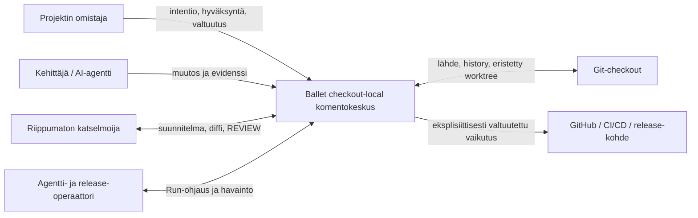
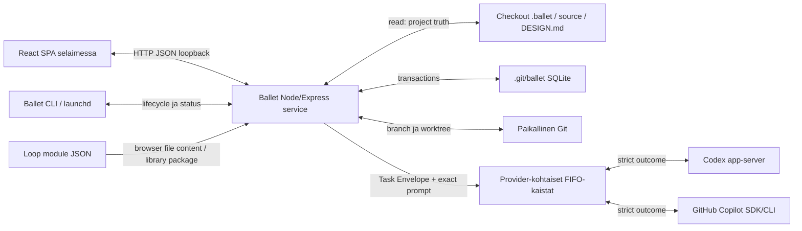

# 3. Konteksti ja rajaus

## Tarkoitus

Tämä osio määrittää Balletin liiketoiminta- ja teknisen järjestelmärajan, ulkoiset osapuolet, tietovirrat, kanavat ja luottamusrajat. Sisäiset rakennusosat kuvataan [osiossa 5](05-building-block-view.md).

## Tila

Konteksti vastaa nykyistä checkout-local-arkkitehtuuria. Loop Engineer- ja Run mission control -näkymät ovat käyttöliittymäprojektioita saman rajan sisällä; ne eivät ole uusia runtime-järjestelmiä.

## Liiketoimintakonteksti

Ballet auttaa projektin omistajaa ja toimitustiimiä määrittelemään, suorittamaan ja tarkastamaan toistettavia agenttityönkulkuja yhdessä checkoutissa. Se ei omista projektin liiketoimintapäätöksiä eikä integroi Run-tulosta automaattisesti.

| Osapuoli | Balletiin tuleva tieto | Balletista lähtevä tieto/vaikutus | Luottamusraja |
| --- | --- | --- | --- |
| Projektin omistaja/operaattori | Goalit, project-resurssit, Run-käsky, Human Validation ja ulkoinen valtuutus. | UI/CLI-tila, evidenssi, worktree-tulos ja pyydetty päätös. | Ihminen säilyttää WHAT/WHY:n ja ulkoisten toimien vallan. |
| Kehittäjä tai AI-agentti | Rajattu toteutus, analyysi ja schema-validi outcome. | Task Envelope, resurssit, rooli, tila ja korjauspyyntö. | Providerin vastaus ei ole kanoninen ennen validointia ja commitointia. |
| Riippumaton katselmoija | Conformance- ja hyväksymishavainto. | BRIEF, PLAN, diffi, testit ja EVIDENCE. | Katselmointi ei saa hiljaisesti muuttaa arvioitavaa toteutusta. |
| Git-checkout | Lähdekoodi, Goals, ADR:t, arc42, project config, instructionit, skillit ja historia. | Vain ihmisvaltuutettu integraatio; Node-työ tehdään Root Run -worktreessä. | Active checkout ja Run-worktree ovat eri kirjoitusalueita. |
| GitHub/CI/CD/release-kohde | Remote-status ja ulkoinen evidenssi. | Push, release, deploy tai rollback vain täsmällisellä valtuutuksella. | Verkko ja ulkoinen kirjoitus ovat oletuksena pois päältä. |
| macOS/launchd | Prosessi-, tiedosto- ja lifecycle-palvelut. | Checkout-kohtainen daemon ja lokit. | Nykyinen tuettu käyttöjärjestelmäraja. |

## Tekninen konteksti

React SPA käyttää Expressin loopback-API:a. Backend lukee project-local-resurssit, muodostaa reachable automationista immutable Root Run -snapshotin, luo branch/worktreen, jonottaa provider-tehtävät ja persistoi runtime-faktat SQLiteen. Adapterit saavat täsmällisesti koostetun promptin ja strict output-skeeman. Vain validoitu outcome voi tuottaa atomisen State-revision tai ohjausvirtatapahtuman.

## I/O-, kanava- ja luottamusrajakartoitus

| Rajapinta | Input | Output | Kanava ja muoto | Luottamus/validointi | Virhevaikutus |
| --- | --- | --- | --- | --- | --- |
| Browser ↔ API | Käyttäjäkomento, project/run/module payload. | Project-, automation-, Run-, State- ja module-näkymät. | Loopback HTTP + strict JSON. | Shared schema, exact checkout, ei ambient server-pathia. | 4xx/5xx; ei osittaista canonical state -muutosta. |
| CLI/launchd ↔ service | Install/start/stop/status ja checkout. | Lifecycle-status ja diagnostiikka. | Paikallinen prosessi/IPC/HTTP. | Checkout identity ja paikallinen käyttöoikeus. | Prosessi jää pysähtyneeksi tai diagnosoitavaksi; projektitotuus säilyy. |
| Backend ↔ repository | Project JSON, Markdown, instructionit, skillit, source. | Suunnitellut project-local-mutaatiot ja worktree-tulos. | Tiedostojärjestelmä + Git. | Strict parse, canonical path, worktree write boundary. | Validointivirhe; active checkoutia ei osittain muuteta. |
| Backend ↔ SQLite | Run-, queue-, outcome-, event- ja State-faktat. | Canonical runtime projection. | Paikallinen SQLite-transaktio. | Constraintit, revision check ja commit-raja. | Rollback; restart jatkaa viimeisestä kokonaisesta commitista. |
| Queue ↔ provider adapter | `TaskEnvelope`, exact prompt, profiili, oikeudet ja output schema. | Provider-tapahtumat, schema-validi outcome tai virhe. | Provider-protokolla provider-kohtaisessa FIFO-kaistassa. | Ei fallbackia; adapteri ei keksi resursseja tai päätöksiä. | Tehtävä epäonnistuu/keskeytyy; nolla implisiittistä uudelleenajoa. |
| Browser/package ↔ module service | UTF-8 JSON -sisältö tai versionhallittu library package. | Inspect/plan/commit/export/remove-tulos. | File API content tai HTTP JSON; ei mielivaltaista server-pathia. | Koko-, schema-, provenance-, conflict- ja trust-tarkistus. | Commitia ei tehdä ennen validia suunnitelmaa. |

## Luottamusrajat

1. **Ihminen → Ballet:** käyttäjän syöte on tarkoituksellinen mutta validoitava; Human Validation on päätösraja, ei pelkkä UI-toiminto.
2. **Project truth → runtime snapshot:** snapshot jää immutableksi, vaikka checkoutin tiedostot myöhemmin muuttuvat.
3. **Runtime → provider:** provider saa vain koostetun tehtävän; providerin teksti on epäluotettua, kunnes output schema ja runtime-säännöt hyväksyvät sen.
4. **Worktree → active checkout/remote:** tulos ei ylitä rajaa ilman erillistä ihmisvaltuutusta.
5. **Loop package → project-local resources:** paketti on dataa, ei luotettua koodia; materialisointi on inspect/plan/commit-transaktio.

## Rajauksen ulkopuolella

- Keskitetty tili-, projektinhallinta- tai remote control plane -palvelu.
- Cloud-hosted Ballet-runtime ja checkoutien välinen yhteinen runtime-tietokanta.
- Automaattinen merge, push, release, deploy tai rollback.
- Mielivaltaisen pakettipolun tai etärekisterin lataaminen backendissä.
- Project-specific roadmap-, milestone-, acceptance- tai arc42-workflow platform-koodissa.

## Kanoniset lähteet

`README.md`, `goal-001`, `goal-003`, `goal-005`, `goal-008`, `goal-010` ja ADR-001/005/006/008/009/016.

## Relevantit päätökset

`adr-001`, `adr-005`, `adr-006`, `adr-008`, `adr-009` ja `adr-016`.

## Evidenssi

Local API-, checkout identity-, provider adapter-, Git worktree-, recovery- ja Loop module -testit kattavat toteutetut tekniset rajat. Kahdeksan arkkitehtuurikaavion renderöitävyys tarkistetaan dokumentaatioaloitteen evidenssissä.

## Avoimet kysymykset

- Uutta provideria, käyttöjärjestelmää tai remote-integraatiota ei ole hyväksytty; jokainen laajentaisi yhtä tai useampaa luottamusrajaa.

## Seuraava katselmointiperuste

Katselmoi osio, kun järjestelmään tulee uusi actor, provider, käyttöjärjestelmä, persistence-kohde, ulkoinen vaikutus tai package source.
