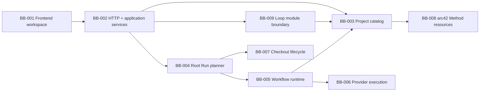

# 5. Rakennusosanäkymä

## Tarkoitus

Tämä osio kuvaa Balletin arkkitehtonisesti merkittävän staattisen jaon, vastuut, rajapinnat, laatuvaikutukset ja lähdekoodiankkurit. Syvyys valitaan riskin perusteella: erityisesti authoring-projektio, HTTP/application-raja, Root Run -suunnittelu, runtime, persistence, scheduler, provider-jono ja Loop module -materialisointi tarvitsevat whitebox-kuvauksen.

## Tila

BB-001–BB-009 säilyvät vakaina. BB-003/004/009 käyttävät strict-v12 Workflow/Graph/capability-sopimusta, BB-005:n Orchestrator-dispatch on toteutettu ja BB-001 käyttää vain Graph/Workflow-authoring-reittejä. Graph Engineeringin Orchestrator-control-node ja route-presentation projisoidaan olemassa olevista config-, snapshot- ja runtime-lähteistä. Workflow Engineering projisoi yhden Job-artworkin per Job/Validation-pari sekä persisted Pass/Fail Edget lisäämättä tai poistamatta domain-, Graph-, LoopNode- tai Orchestrator-entiteettiä.

## Taso 1: Balletin rakennusosat

| ID | Rakennusosa ja vastuu | Rajapinnat | Laatuvaikutus | Lähdekoodiankkurit | REQ | Avoin riski |
| --- | --- | --- | --- | --- | --- | --- |
| BB-001 | Frontend operator workspace: Configure/Run-navigaatio, Graph Engineering, selected-Loop-only Workflow Engineering, editorit, Mission / All Loops ja live inspector. | Loopback HTTP JSON/SSE, shared DTO:t ja URL-route state. | Yksiselitteinen, saavutettava ja canonical-dataan sidottu operointi. | `frontend/src/workspace/`, `frontend/src/workspace/automation/loops/` | REQ-001, REQ-007, REQ-011–REQ-013 | Read-model-drift tai koristeen tulkitseminen runtime-faktaksi. |
| BB-002 | Local HTTP service ja application services: validoi pyynnöt, orkestroi käyttötapaukset ja muuntaa domain-tulokset API-vastauksiksi. | Express router, service-rajapinnat ja shared API schemas. | Suljettu paikallinen raja, fail-closed-validointi ja transaktion omistajuus. | `backend/http/`, `backend/server/`, `backend/services/`, `shared/api/` | REQ-001, REQ-006, REQ-010 | Originless local client kuuluu dokumentoituun loopback trust boundaryyn. |
| BB-003 | Project document/config catalog: lukee strict-v12 Workflow/Graph/capability-konfiguraation, Markdown-lähteet, instructionit ja skillit. | Repositoryt, resource catalog ja workspace DTO:t. | Siirrettävä, katselmoitava ja deterministisesti ratkaistu project truth. | `backend/project-config/`, `backend/documents/`, `shared/api/workspace-schemas.ts` | REQ-002, REQ-003, REQ-009, REQ-013 | Puuttuvan/duplikaatin resurssin on pysyttävä blocking-virheenä. |
| BB-004 | Root Run planner/coordinator: ratkaisee reachable automationin, snapshottaa, luo worktreen ja omistaa lifecycle/finalizationin. | Run service, execution coordinator, worktree manager ja runtime engine. | Toistettavuus, eristys ja turvallinen finalization. | `backend/runs/` | REQ-004, REQ-005, REQ-006 | Snapshot-koko, cancel/finalize-kilpailut ja stale worktree. |
| BB-005 | Workflow runtime: Job/Validation PASS/FAIL -outcomet, State-revisiot, retry, repair-frame, call/return ja continuation. | Runtime-storet, strict role outcomes, scheduler-trigger ja provider task -portti. | Atomisuus, palautettavuus ja deterministinen control flow. | `backend/runtime/`, `backend/runtime/state/` | REQ-004, REQ-006, REQ-009, REQ-013 | Nested repair -kompleksisuus; depth/attempt/transition-rajat pienentävät riskiä. |
| BB-006 | Provider execution: deterministinen composition, policy, provider-kohtaiset FIFO-kaistat, Codex/Copilot-adapterit ja tapahtumien normalisointi. | `ExecutionProfile`, `ExecutionTask`/`TaskEnvelope`, adapteriportti ja strict output schema. | Provider-neutralisuus, least authority ja evidenssin eheys. | `backend/execution/`, `backend/integration/` | REQ-003, REQ-005, REQ-006 | Provider-capabilityn muutos voi estää preflightin; fallback ei peitä virhettä. |
| BB-007 | Checkout lifecycle ja jakelu: CLI, launchd, Git branch/worktree, packaging ja validoitu update. | Paikallinen shell/Git, launchd ja release-artefaktit. | Eristys, diagnosoitavuus ja supply-chain integrity. | `backend/cli/`, `backend/execution/git/`, `scripts/`, `packaging/` | REQ-005, REQ-008 | Remote-julkaisu riippuu ulkoisista palveluista ja ihmisvaltuutuksesta. |
| BB-008 | Project-local arc42 Method resources: arkkitehtuurikorpus, initiative-artefaktit, Loops, instructionit, skillit ja validator. | Vakaat Markdown/JSON-polut ja npm-validointi. | Jaettu intentio, traceability ja evidenssipohjainen parantaminen. | `.ballet/arc42/`, `.ballet/project.json`, `.ballet/instructions/`, `.agents/skills/arc42/` | REQ-002, REQ-009 | Menetelmän ensimmäisen pilotin tehokkuusevidenssi puuttuu. |
| BB-009 | Loop module authoring boundary: package inspection, local library, install plan/materialization, export closure ja provenance-aware removal. | Loop module DTO/API, project config mutation queue ja resource catalog. | Supply-chain-näkyvyys, atomiset referenssit ja siirrettävä reuse. | `shared/domain/loopModules.ts`, `shared/api/loop-module-schemas.ts`, `backend/loop-modules/`, Loop Library UI | REQ-002, REQ-007, REQ-010 | Remote distribution/update trust on tietoisesti ratkaisematta. |

## Rajapinta- ja riippuvuussäännöt

- BB-001 käyttää backend-käyttötapauksia vain BB-002:n shared schema -rajapinnan kautta; frontend ei lue SQLitea tai Git-worktree-dataa suoraan.
- BB-002 omistaa request-validoinnin ja application-tason orkestroinnin, mutta runtime-control flow kuuluu BB-004/BB-005:lle.
- BB-003 toimittaa versionhallittua intentiota. BB-004 jäädyttää siitä immutable snapshotin; BB-005 ei lue käynnissä olevaan Runiin uutta projektikonfiguraatiota.
- BB-005 pyytää BB-006:lta tehtävän eikä päätä provider-protokollaa. BB-006 ei päätä Loopin continuationia.
- BB-009 käyttää BB-003:n nykytilaa, mutta mutation etenee serialisoidun plan/commit-rajan kautta eikä runtime lue pakettia.
- BB-008:n project-specific Loop-tunnisteitä ei saa vuotaa BB-002–BB-007:n geneeriseen platform-koodiin.

## BB-001 whitebox: frontend operator workspace

| Elementti | Vastuu | Rajapinta ja omistajuus | Lähdeankkuri |
| --- | --- | --- | --- |
| Workspace shell ja route state | Jäsentää ja muodostaa canonical Configure/Run- sekä `graph | workflow` -reitit. | URL on aktiivisen authoring-näkymän ja Workflow Engineeringissä valitun Loopin totuus; Graph-inspectorin valinta on ephemeral UI-statea eikä mutatoi domainia tai topologiaa. | `frontend/src/workspace/WorkspaceShell.tsx`, `frontend/src/workspace/routing.ts`, `EngineeringShell.tsx` |
| Graph Engineering projection | Näyttää yhden black-box-LoopNoden per `ProjectLoop` ja project-global `ProjectLoopEdge` -topologian. | Graph omistaa cross-Loop-yhteydet; `LoopEdgesEditor` on ainoa niiden editori. Valinta ei luo client-owned topologiaa. | `engineeringProjections.ts`, `GraphEngineeringCanvas.tsx`, `GraphEngineeringWorkspace.tsx` |
| Workflow Engineering projection | Näyttää valitun Loopin JobNode-artworkit, projisoi paired Validationin Jobin sisäiseen tilaan ja piirtää vain persisted Pass/Fail Edget straight/smart-smoothstep-geometrialla ilman endpoint-nodeja. | Workflow Engineering omistaa Loopin sisäisen määrittelyn eikä näytä tai kirjoita project-global `LoopEdge`:jä; canvas-projektio ei muuta erillisiä domain-rooleja tai editoreita. | `LoopEditor.tsx`, `LoopCanvas.tsx`, `WorkflowNodeVisual.tsx` |
| Run mission control | Johtaa Mission-/All Loops -näkymän, aktiivisen reitin, repair/return-polun ja inspectorin immutable snapshotista sekä canonical runtime read -datasta. | Ei johda tilaa provider-tekstistä eikä keksi prosenttia, ETA:a tai elapsed-arvoa. | `RunVisualWorkspace.tsx`, `RunLoopMap.tsx`, `loopRunViewModel.ts`, `RunStatePanel.tsx` |
| Module handoff | Tarkastaa paketin, näyttää suunnitelman ja valitsee commitin jälkeen materialisoidun Loopin. | BB-009 API; recommended connections ovat neuvoa antavia. | `AutomationView.tsx`, `LoopLibraryDialog.tsx` |

### ADR-018:n Graph- ja ADR-020:n Workflow-target BB-001/003/004/005/009-rajalle

| Target-elementti | Vastuu | Omistava rakennusosa | Toteutustila |
| --- | --- | --- | --- |
| Graph Engineering projection | Projisoi v11 `ProjectAutomationConfig`-aggregaatista yhden `LoopNode`-näkymän per `ProjectLoop`, yhden Orchestrator-control-noden sekä graphin route-policyn ja canonical active Root Run -evidenssin ilman sisäisiä Work/Validation-nodeja. | BB-001 lukee BB-002/003:n shared DTO:n; runtime-tila pysyy serverin read modelissa. | projection/layout/canvas/inspector toteutettu ja todennettu `GLE-EVID-006`:ssa |
| Workflow Engineering projection | Projisoi vain valitun `ProjectLoop`in `ProjectWorkflow`-rakenteen: Job-artworkit ja erikseen valittavat persisted Pass/Fail Edget; Validationin tila kuuluu Job-artworkiin. | BB-001 | toteutettu; `WFE-EVID-005`, `WFE-EVID-009` |
| Strict-v12 Workflow/graph/capability catalog | Parsii 1:1 Job/Validation-parituksen, tarkat Pass/Fail-kardinaliteetit, reachabilityn, first-class Loop capability metadatan ja project-global route-candidatet ilman v11 readeria tai silent defaultia. | BB-003 | toteutettu; `WFE-EVID-001` |
| Immutable graph/workflow snapshot | Snapshottaa eksplisiittisestä entry Loopista reachable route/capability/resource closuren sekä erillisen Workflow-rakenteen. | BB-004 | toteutettu v5-snapshot-sopimuksessa; `WFE-EVID-002` |
| Cross-Loop dispatch | Validoi zero/one/many flow ja repair candidatea snapshot-allowlistilla/capabilityllä; ambiguity/permission → `needs_input`, repair käyttää framea ja flow ei. | BB-005, BB-006 | toteutettu; `GLE-EVID-004` |
| V2 module materialization | Materialisoi yhden target-riippumattoman Loopin Workflow-rakenteineen ja capabilityineen sekä jättää kaikki peer-route-päätökset project-global graphiin. | BB-009, BB-003 | toteutettu; `WFE-EVID-006` |

Graph UI:n route-edget ovat persisted policy- ja runtime-evidenssin projektio. Layout, valinta tai canvasin piirretty yhteys ei muodosta uutta BB-001:n client topology statea. Workflow UI:n Edget vastaavat strict-v12 persisted-rakennetta; kiinteät validate/retry-siirtymät eivät ole kolmas Edge-laji. Context-, numeric- ja `view=loop`-reitit puuttuvat tuotantokoodista; historialliset ADR-017/018- ja EVID-010/014-lähteet säilyvät auditointia varten.

## BB-002 whitebox: HTTP ja application-palvelut

| Elementti | Vastuu | Transaktio-/virheraja | Lähdeankkuri |
| --- | --- | --- | --- |
| API router | Parsii strict requestin, tarkistaa checkout-kontekstin ja mapittaa käyttötapauksen HTTP-status/DTO-vastaukseksi. | Validointivirhe pysähtyy ennen service-mutaatiota; ei domain-logiikkaa route-handleriin. | `backend/http/apiRouter.ts`, `shared/api/` |
| Workspace/project services | Kokoaa versionhallittujen resurssien read modelin ja serialisoi project config -mutaatiot. | Mutation queue estää päällekkäisten plan/commit-kirjoitusten stale-tilan. | `backend/services/`, `backend/tests/projectConfigMutationQueue.test.ts` |
| Run application service | Käynnistää, lukee, vastaa Human Nodeen ja peruuttaa Runin. | Delegoi snapshotin BB-004:lle ja persistence-transaktion runtime-storeille. | `backend/runs/`, `backend/http/apiRouter.ts` |
| Runtime database provider | Ratkaisee checkout-kohtaisen tietokannan ja välittää saman canonical store -kokoonpanon palveluille. | Init/migration on atominen startup-raja; väärä checkout ei jaa kantaa. | `backend/services/RuntimeDatabaseProvider.ts`, `backend/storage/LocalDatabase.ts` |

## BB-004 whitebox: Root Run planner ja lifecycle

1. Validioi target Loop, reachable `LoopEdge` -verkko, profile/resource closure ja käynnistysoikeus.
2. Muodostaa immutable snapshotin, johon UI- ja runtime-projektiot myöhemmin sidotaan.
3. Luo dedicated branch/worktree-parin ennen Node-kirjoitusta.
4. Käynnistää sekventiaalisen runtime-enginen ja välittää tehtävät BB-006:lle.
5. Omistaa cancel/finalization-barrierin, tallentaa lopputilan ja jättää worktreen tarkastettavaksi; ei mergeä eikä pushia.

Lähdeankkurit: `backend/runs/RootRunExecutionCoordinator.ts`, `backend/runs/RootRunStore.ts` ja Git-worktree-palvelut `backend/execution/git/`-hakemistossa.

## BB-005 whitebox: runtime engine ja SQLite-storet

| Elementti | Vastuu | Invariantti | Lähdeankkuri |
| --- | --- | --- | --- |
| `LoopOrchestrator` | Ajaa nykyisen Loopin Workflow-roolit, valitsee vain allowlistatun repair-targetin ja palauttaa LIFO-frameen samaan ValidationNodeen. | Vain runtime päättää continuationin; ambiguous repair → `needs_input`; repair return ei aja Jobia uudelleen eikä nollaa retryä. | `backend/runtime/LoopOrchestrator.ts` |
| State patch/revision | Validoi patchin nykyistä revisionia vasten ja committoi uuden State-revision atomisesti. | Ei partial revisionia; stale expected revision ei ylikirjoita uudempaa tilaa. | `backend/runtime/state/StatePatch.ts`, `backend/runtime/LoopStateStore.ts` |
| Runtime read store | Johtaa UI:lle Runin canonical position-, role-, attempt-, revision-, frame- ja event-projektion. | Read model ei tulkitse providerin vapaata tekstiä control statena. | `backend/runtime/RootRuntimeReadStore.ts` |
| Schedule state | Persistoi schedule-triggerin ja deduplication-tilan. | Sama due slot ei käynnistä kahta Root Runia. | `backend/runtime/LoopScheduleStateStore.ts`, `backend/scheduling/LoopScheduler.ts` |
| Root Run store | Persistoi snapshotin, lifecycle-tilan, cancellationin ja finalizationin. | Restart lukee viimeisen commitin; cancel barrier estää myöhäisen payloadin. | `backend/runs/RootRunStore.ts` |

SQLite on canonical machine-local runtime store. Store-metodit omistavat transaktiot, kun usean taulun State/control-flow-faktat kuuluvat samaan atomiseen vaikutukseen. API tai UI ei kokoa “uutta totuutta” eri storeista ilman runtime read -projektiota.

## BB-006 whitebox: provider-jono ja adapterit

| Elementti | Vastuu | Invariantti | Lähdeankkuri |
| --- | --- | --- | --- |
| `ExecutionComposition` | Ratkaisee System → primary → vakaasti järjestetyt skillit → Task Envelope → role/output schema -kokoonpanon ja hashin. | Sama snapshot/envelope tuottaa tavutasolla saman promptin; virheessä tehtävää ei jonoteta. | `backend/execution/ExecutionComposition.ts` |
| `LocalExecutionQueue` | Ylläpitää provider-kohtaisia FIFO-kaistoja ja tehtävän lifecyclea. | Yksi kaista säilyttää järjestyksen; toisen providerin työ voi edetä rinnakkain. | `backend/execution/LocalExecutionQueue.ts` |
| Task state store | Persistoi queued/running/interrupted/completed/failed/cancelled-tilat ja reconciliationin. | Restart ei replayaa running-tehtävää eikä duplicate committed outcomea. | `backend/execution/ExecutionTaskStateStore.ts` |
| Codex adapter | Mapittaa canonical taskin Codex app-server -protokollaan ja normalisoi tapahtumat/outcomen. | Ei model/profile/resource-fallbackia. | `backend/execution/providers/codex/CodexAppServerAdapter.ts` |
| Copilot adapter | Mapittaa saman portin Copilot SDK/CLI -protokollaan ja normalisoi tuloksen. | Provider-erot eivät muuta runtime-outcome-sopimusta. | `backend/execution/providers/copilot/CopilotSdkAdapter.ts` |

## BB-009 whitebox: Loop module -raja

1. **Inspect:** rajaa koon, parsii UTF-8 JSON:n, validoi strict package -skeeman, canonicalisoi ja laskee SHA-256:n.
2. **Plan:** vertaa nykyiseen project configiin, valitsee deterministic namespacen, mapittaa yhteensopivat profile slotit, listaa resurssi- ja Loop-muutokset sekä trust/provenance-tiedot.
3. **Commit:** re-plannaa samasta inputista, serialisoi mutaation, kirjoittaa uudet resurssit ja provenance-tiedon ja kirjoittaa project configin viimeisenä.
4. **Export/remove:** vie vain Loopin transitive resource closuren tai poistaa omistetut viitteet säilyttäen jaetut resurssit; active Run estää vaarallisen operaation.

Keskeiset ankkurit ovat `backend/loop-modules/LoopModuleService.ts`, `backend/loop-modules/canonicalLoopModule.ts`, `backend/loop-modules/InstalledLoopModuleRepository.ts`, `shared/domain/loopModules.ts` ja `shared/api/loop-module-schemas.ts`.

## BB-008:n menetelmäraja

`.ballet/arc42/**` sisältää pitkäikäisen arkkitehtuurin ja initiative-evidenssin, `.ballet/goals/**` WHAT/WHY:n, `.ballet/adr/**` päätökset ja `.ballet/project.json` runtimeen materialisoidun project-local-topologian. Runtime State sisältää vain rajatun nykytilan ja vakaat viitteet; se ei kopioi dokumentteja, diffejä tai lokeja.

## Kanoniset lähteet

Lähdehakemistot ja shared contracts ovat toteutuksen totuus. ADR:t omistavat vastuurajojen päätökset; tämä osio omistaa arkkitehtuuritason jaon.

## Relevantit päätökset

`adr-001`–`adr-003`, `adr-005`–`adr-008` ja `adr-011`–`adr-021`.

## Evidenssi

`npm run build` tarkistaa compile-time-kokoonpanon. TRACEABILITYn nimetyt testit kattavat composition-, runtime-, persistence-, UI- ja module-rajat. Polkuankkurit tarkistetaan dokumentaation conformance review’ssa.

## Avoimet kysymykset

- BB-008:aa ei jaeta uusiin platform-rakennusosiin ennen kuin ensimmäinen pilotti osoittaa konkreettisen monimutkaisuus- tai omistajuusongelman.
- Remote Loop module registry ei kuulu nykyiseen BB-009-rajaan.

## Seuraava katselmointiperuste

Katselmoi osio, kun vastuu, public interface, transaktion omistajuus tai lähdekoodi siirtyy rakennusosien välillä.
