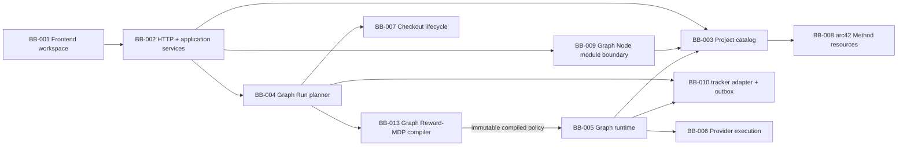

# 5. Rakennusosanäkymä

## Tarkoitus

Tämä osio kuvaa Balletin arkkitehtonisesti merkittävän staattisen jaon, vastuut, rajapinnat, laatuvaikutukset ja lähdekoodiankkurit. Aktiivinen strict-v18 implementation käyttää yhtä Graph-tason Reward-MDP:tä, immutable compiled policya, ordered GraphNode-optioita ja Graph Node Module v6 -rajaa.

## Tila

BB-001–BB-010 säilyvät yleisinä vastuualueina. BB-011/012 ovat `adr-031`:n supersedoimaa historiallista scoped-policy/learning-jakoa. BB-013 omistaa aktiivisen Graph Reward-MDP compiler/runtime -rajan. ADR-025/027:n Action Node flow säilyy.

## Taso 1: Balletin rakennusosat

| ID | Rakennusosa ja vastuu | Rajapinnat | Laatuvaikutus | Lähdekoodiankkurit | REQ |
| --- | --- | --- | --- | --- | --- |
| BB-001 | Frontend operator workspace: capability-first Graph/GraphNode cards, Graph Reward Decision Model, protected Action flow, inspector/Sheet ja factual Run-evidenssi. | Loopback HTTP JSON, shared DTO:t ja URL route/section state. | Ymmärrettävä, saavutettava ja projection/truth-rajan säilyttävä operointi. | `frontend/src/workspace/automation/`, `frontend/src/workspace/routing.ts`, `frontend/src/workspace/runs/` | REQ-001, REQ-007, REQ-018, REQ-020 |
| BB-002 | Local HTTP/application services validoivat pyynnöt ja orkestroivat käyttötapaukset. | Express router, service-portit ja shared schemas. | Fail-closed local boundary ja yksi mutaation omistaja. | `backend/http/`, `backend/services/`, `shared/api/` | REQ-001, REQ-006, REQ-015 |
| BB-003 | Project catalog lukee strict-v18 Graph/Reward-MDP/GraphNode/ordered Action Node -konfiguraation ja resource closuren. | Repositoryt, yksi base schema structural/readiness-rajoille, resource catalog ja workspace DTO:t. | Siirrettävä project truth; draft tallentuu mutta invalidi/absorboitumaton Run estyy. | `shared/domain/automation.ts`, `shared/domain/decisionModel*.ts`, `shared/api/workspace-schemas.ts`, `backend/project-config/` | REQ-002, REQ-003, REQ-020 |
| BB-004 | Graph Run planner luo Graph- tai GraphNode-snapshotin, worktreen ja ensimmäisen policy/option-dispatchin. | Run service, GraphExecutionPlanner, RootRunStore ja BB-005/006/013. | Immutable execution, eristys ja turvallinen lifecycle ilman standalone Action Node Runia. | `backend/runs/GraphExecutionPlanner.ts`, `backend/runs/LocalRunService.ts`, `backend/runs/RootRunStore.ts` | REQ-004–REQ-006, REQ-015, REQ-020 |
| BB-005 | Runtime tekee immutable compiled policy -lookupin, dispatchaa GraphNode-optionin, suorittaa Action Nodet array-järjestyksessä ja käsittelee Work→Validation→bounded retry/escalate -polun. | SQLite v14, strict outcome v9, acceptance/state/policy-storet ja provider-task-portti. | Atominen, outcome-aware, restartissa selitettävä control flow yhdellä omistajalla. | `backend/runtime-db.ts`, `backend/runtime/RuntimeFlowCoordinator.ts`, `backend/storage/RuntimeSchema.ts` | REQ-004, REQ-006, REQ-020 |
| BB-006 | Provider execution ratkaisee exact compositionin, FIFO-kaistat ja adapterit. | ExecutionProfile, ExecutionSpec v11, Task Envelope v9 ja strict output schema. | Provider-neutralisuus, tavustabiili composition ja no-fallback; provider ei valitse MDP-actionia. | `backend/execution/`, `backend/integration/` | REQ-003, REQ-005, REQ-006, REQ-020 |
| BB-007 | Checkout lifecycle, Git branch/worktree ja macOS-jakelu. | CLI, Git, launchd ja release-artefaktit. | Active checkout -eristys ja ulkoisen kirjoituksen ihmisraja. | `backend/cli/`, `backend/execution/git/`, `scripts/`, `packaging/` | REQ-005, REQ-008 |
| BB-008 | Project-local arc42 Method resources ja validointi. | Markdown/JSON-polut, stable ID:t ja npm-validointi. | Jaettu intentio, traceability ja evidenssipohjainen muutos. | `.ballet/arc42/`, `.ballet/goals/`, `.ballet/adr/`, `.agents/skills/arc42/` | REQ-002, REQ-009, REQ-015 |
| BB-009 | Graph Node Module v6 inspect/plan/install/export/remove ja provenance; ordered Action Nodet ja intrinsic outcomes mukana, local policy/Repair ja project-specific Reward-MDP pois. | Strict package/API, materialisointijono ja resource catalog. | Supply-chain-näkyvyys ja project/runtime/model-omistajuusrajan säilyminen. | `shared/domain/graphNodeModules.ts`, `shared/api/graph-node-module-schemas.ts`, `backend/graph-node-modules/` | REQ-002, REQ-010, REQ-020 |
| BB-010 | Tracker adapter ja transactional outbox. | argv-only process adapter, SQLite intent/linkit ja worktree-local stores. | Fail-closed external process boundary ja idempotentti reconciliation. | `backend/tracker/`, `backend/cli/TrackerCli.ts`, SQLite v14 tracker-taulut | REQ-006, REQ-015 |
| BB-011 | Historiallinen superseded scoped policy subsystem. | Ei active runtime -rajapintaa. | Säilyy vain audit trailina. | Historiallinen `goal-016/017` / `adr-026/028` evidence | REQ-016–REQ-017 |
| BB-012 | Historiallinen superseded offline learning/promotion -pinta. | Ei active runtime -rajapintaa. | Säilyy vain audit trailina. | Historiallinen `goal-019` / `adr-030` evidence | REQ-019 |
| BB-013 | Graph Reward-MDP subsystem snapshottaa acceptance/authorizationin, canonicalisoi `P(outcome,s′|s,a)`-mallin, laskee rewardin, ratkaisee deterministic discounted value iterationin, tarkistaa absorptionin ja tuottaa immutable policy/Q/V-taulukon. Runtime lukee taulukkoa eikä ratkaise tai opi uudelleen. | BB-003:n v3 model/capability, BB-004:n Root Snapshot v11, BB-005:n state/ledger/auth facts ja BB-001:n factual read models. | Aito valinta, reward hacking -suoja, deterministic hash/policy, hard authorization ja yksi control owner. | `backend/policy/RewardMdpCompiler.ts`, `backend/policy/AdmissibleActionResolver.ts`, `backend/runtime/RuntimePolicyStore.ts`, `backend/runs/GraphExecutionPlanner.ts` | REQ-020 |

## Rajapinta- ja riippuvuussäännöt

- BB-001 käyttää backend-käyttötapauksia vain BB-002:n shared schema -rajapinnan kautta; frontend ei lue SQLitea tai Git-worktree-dataa suoraan.
- BB-003 toimittaa versionhallittua intentiota. BB-004 jäädyttää siitä immutable snapshotin; BB-005 ei lue käynnissä olevaan Runiin uutta project configia.
- BB-005 pyytää BB-006:lta roolitehtävän. BB-006 ei päätä GraphNode-actionia, retryä, escalate-outcomea tai terminaalia.
- BB-013 valitsee GraphNode-optionin; provider ei valitse GraphNodea tai seuraavaa Action Nodea. Out-of-contract outcome muuttaa canonical statea ja acceptance-ledgeriä nolla kertaa.
- BB-009 materialisoi package-datan project-local-resursseiksi config-last-transaktiolla. Runtime ei lue packagea eikä package sisällä peer-GraphNode-targetteja.
- BB-010 ei päätä Graph-control-flow'ta eikä issueita kopioida Stateen; pending reconciliation estää seuraavan vaikutuksen.
- BB-002–BB-007 toteuttavat vain geneerisiä primitivejä. Balletin viiden GraphNoden nimet ja arc42-/release-menettely pysyvät project-local-datassa.
- BB-013 saa action-ID:t vain BB-003:n snapshotatusta GraphNode-kokoelmasta. Se ei tunne default-nodejen merkitystä, lue live project configia, kutsu provideria tai mutatoi probabilityjä/rewardia havaintojen perusteella.
- BB-005 omistaa atomisen dispatchin/terminalin. BB-013:n compiler toimii kerran snapshot creationissa; runtime käyttää vain compiled row'ta ja hard admissible settiä.

## BB-001 whitebox: kolmitasoinen operator workspace

| Elementti | Vastuu | Omistajuus | Lähdeankkuri |
| --- | --- | --- | --- |
| Workspace route state | Jäsentää canonical Configure/Run-reitit, breadcrumbin ja browser back/forwardin. | URL omistaa aktiivisen Graph-, GraphNode- tai Action Node -scopen; inspector selection on ephemeral. | `frontend/src/workspace/routing.ts`, `WorkspaceRouteOutlet.tsx` |
| Graph Engineering | Projisoi Capability Graph -kortit ja Graph Reward Decision Modelin omissa URL-osioissaan. | Sisältää 0 Work/Validation-nodea, local policy/Repair -pintaa ja upper-level appearance-dataa. | `AutomationView.tsx`, `CapabilityCards.tsx`, `DecisionModelWorkspace.tsx` |
| Graph Node | Projisoi vain valitun Graph Noden ordered Action Node -kortit. | Sisältää 0 peer-GraphNodea, 0 toisen Graph Noden Action Nodea ja 0 local policy/Repair -pintaa. | `AutomationView.tsx`, `CapabilityCards.tsx` |
| Action Node | Projisoi Start/Work ID/Validation ID/Pass?/Retry?/Retry count/Continue/Escalate -industrial flow'n. | Vain Work/Validation ovat valittavia; Retry count on visuaalinen ghost, Continue jatkaa ordered sarjaa ja Escalate palauttaa typed Graph-outcomen. | `ActionFlowCanvas.tsx`, `actionFlowProjection.ts`, `EngineeringInspector.tsx` |
| Inspector/Sheet | Näyttää Work-, Validation- tai Action Node -asetukset ja instructionit; Graph-policy authoroidaan inline. | 22–24rem desktop inspector; narrow-viewportissa sama Action Node -sisältö Sheetissä. | `EngineeringInspector.tsx`, `EngineeringShell.tsx` |

Graph/Graph Node käyttävät responsive stable-order card gridia 1/5/40 GraphNode- ja 1/17/64 Action Node -fixtureille. Vain Action flow käyttää tummaa 24 px gridia, Work/Validation-artworkia, reduced motionia ja deterministic wide/narrow-flow-layoutia, jossa normal/retry/fail-yhteydet ja ghost/read-only-tilat ovat eksplisiittisiä. UI ei kirjoita runtime control statea.

## BB-004/005 whitebox: snapshot ja runtime

1. Planner hyväksyy vain Graph- tai GraphNode-targetin, validoi strict-v18-readinessin ja ratkaisee exact resource closuren.
2. Planner snapshottaa project Staten, erillisen authorizationin ja acceptance-obligaatiot sekä compileeraa policy/Q/V-taulukon kerran Root Snapshot v11:een.
3. Runtime projisoi Staten ja ledgerin, muodostaa hard `A(s)`:n ja tekee compiled policy -lookupin; provider ei valitse actionia.
4. GraphNode dispatchaa Action Nodet array-järjestyksessä; Work `completed` siirtyy aina paired Validationiin.
5. Validation PASS jatkaa ordered sarjaa. FAIL `retry` noudattaa `maxRetries`:a; `escalate` tai loppunut retry päättää GraphNode-optionin typed outcomella.
6. Runtime persistoi actual state/outcome/reward/acceptance/policy-evidenssin mutta ei muuta model probabilityjä tai rewardia.
7. GraphNode Run suorittaa target-optionin ilman Graph-policy-dispatchia.
8. SQLite v14 committoi policy/observation/acceptance/outcome/State/control-flow-faktat transaction coordinatorin kautta; vanhaa kantaa ei lueta tai migroida.

## BB-006 whitebox: composition ja provider

`ExecutionComposition` ratkaisee System → primary → vakaasti järjestetyt skillit → Task Envelope v9 → role/output schema -järjestyksen ja hashin. Sama snapshot/envelope tuottaa samat tavut. Profile, model, instruction tai skill ei saa fallbackia. Validation-output sisältää deklaroidun outcome-ID:n, matching PASS/FAIL:n, acceptance-evidenssin ja FAIL-dispositionin; BB-006 ei valitse Graph actionia.

## BB-013 whitebox: Graph Reward-MDP subsystem

| Osa | Vastuu | Input/output | Fail-closed-raja |
| --- | --- | --- | --- |
| Decision model compiler | Tarkistaa finite feature/acceptance-state/action/outcome-katalogin, ppm-summat, integer rewardit, terminalit, stable viitteet ja valitun policyn absorptionin. | Snapshotted `ProjectRewardDecisionModelV3` → compiled policy/Q/V/hash tai typed issue. | Nonterminal recurrent class, invalid numeric/reference tai iteration-bound failure → 0 Runia. |
| Decision State projector | Lukee nimetyt runtime-/State revision-/authorization-faktat ja immutable ledgerin. | Canonical facts → `DecisionStateV3`. | Missing/unknown/ambiguous mapping → 0 policy decisioniä; transition prediction ei kirjoita statea. |
| Admissible action resolver | Leikkaa snapshot-, model-, hard guard-, authorization- ja lifecycle-rajat. | State + Capability Graph + guards → included/excluded actions. | Unauthorized action puuttuu `A(s)`:stä; persisted excluded Q = 0. |
| Reward solver | Laskee branchikohtaisen potential/rewardin ja deterministic discounted value iterationin stable orderissa kerran. | Finite model + per-state admissible actions → Q/V/policy/iterations/residual/hash. | Ei wall-clock-decision timeoutia, runtime re-solvea tai online mutationia. |
| Policy evidence projection | Näyttää current state-, acceptance-, admissibility-, reward-, PPM/prior-, Q/V-, selected action- ja factual execution-faktat. | Persisted Graph decision/observation → read-only evidence. | Projektio ei ole control state eikä numeerinen LLM-progress. |

## BB-009 whitebox: Graph Node Module v6

1. **Inspect:** rajoita koko, parsi UTF-8 JSON, validoi strict v6, canonicalisoi ja laske SHA-256.
2. **Plan:** valitse deterministic namespace, vaadi explicit profile/instruction-mapping, listaa GraphNode/resource/provenance-muutokset ja hylkää peer-targetit.
3. **Install:** re-plannaa samasta inputista, materialisoi resource closure ja kirjoita project config viimeisenä.
4. **Export/remove:** vie yhden Graph Noden transitive closure tai poista vain omistettu sisältö; shared resources ja active Run -rajat säilyvät.

## Kanoniset lähteet

Shared contractit ja lähdekoodi omistavat suoritettavan käyttäytymisen. `adr-031` omistaa BB-013:n ja strict runtime-rajan, `adr-025`/`adr-027` Action-canvasprojektion, `DESIGN.md` visuaalisen järjestelmän ja tämä osio rakennusosajaon.

## Relevantit päätökset

`adr-001`–`adr-003`, `adr-005`–`adr-008`, `adr-011`–`adr-016`, `adr-025`, `adr-027`, `adr-029` säilyvin osin ja `adr-031`.

## Evidenssi

`TEST-026` / `EVID-026` / `GRM-evid-004` kattavat aktiiviset domain-, snapshot-, compiler-, runtime-, persistence-, module- ja UI-rajat. BB-011/012:n vanha evidenssi säilyy vain historiallisissa initiativeissa. Tuotantokaltainen pilotti ja lopullinen ihmisvisual verdict ovat avoimia.

## Avoimet kysymykset

- Remote Graph Node Module registry ei kuulu BB-009:n nykyiseen rajaan.
- Ensimmäinen tuotantokaltainen pilotti mittaa Reward-MDP:n käytännön outcome/reward/completion-laatua; platform-raja ei muutu ilman uutta päätöstä.

## Seuraava katselmointiperuste

Katselmoi osio, kun vastuu, public interface, transaktion omistajuus, scope-raja tai source anchor siirtyy rakennusosien välillä.
