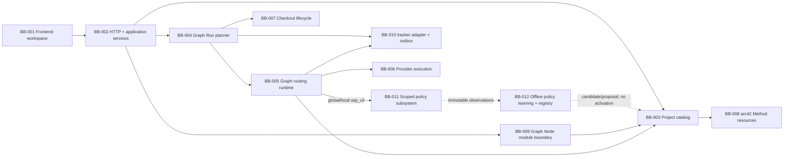

# 5. Rakennusosanäkymä

## Tarkoitus

Tämä osio kuvaa Balletin arkkitehtonisesti merkittävän staattisen jaon, vastuut, rajapinnat, laatuvaikutukset ja lähdekoodiankkurit. Portti A:n strict-v16 implementation käyttää yhtä sisäkkäistä Graph/GraphNode/JobNode-domainia, explicit scoped strategioita, outcome-aware policy/repair-runtimea ja Graph Node Module v5 -rajaa.

## Tila

BB-001–BB-010 säilyvät accepted vastuualueina. BB-011:n Portti A -implementation ratkaisee saman pure decision -portin kautta Graph- ja GraphNode-scopea. Draft BB-012 rajaa ehdotetun offline calibration/registry/evaluation/promotion -pinnan erilleen runtime controlista. ADR-023:n domain/Repair- ja ADR-025/027:n Job-flow-invariantit säilyvät.

## Taso 1: Balletin rakennusosat

| ID | Rakennusosa ja vastuu | Rajapinnat | Laatuvaikutus | Lähdekoodiankkurit | REQ |
| --- | --- | --- | --- | --- | --- |
| BB-001 | Frontend operator workspace: capability-first Graph/GraphNode cards, scoped Decision Model -authoring, protected Job flow, inspector/Sheet ja scoped Run-evidenssi. | Loopback HTTP JSON, shared DTO:t ja URL route/section state. | Ymmärrettävä, saavutettava ja projection/truth-rajan säilyttävä operointi. | `frontend/src/workspace/automation/`, `frontend/src/workspace/policy/`, `frontend/src/workspace/routing.ts`, `frontend/src/workspace/runs/` | REQ-001, REQ-007, REQ-015, REQ-017, REQ-018 |
| BB-002 | Local HTTP/application services validoivat pyynnöt ja orkestroivat käyttötapaukset. | Express router, service-portit ja shared schemas. | Fail-closed local boundary ja yksi mutaation omistaja. | `backend/http/`, `backend/services/`, `shared/api/` | REQ-001, REQ-006, REQ-015 |
| BB-003 | Project catalog lukee strict-v16 Graph/strategy/GraphNode/JobNode/intrinsic-outcome/Decision Model -konfiguraation ja resource closuren. | Repositoryt, structural draft/readiness schemas, resource catalog ja workspace DTO:t. | Siirrettävä, katselmoitava project truth; draft tallentuu mutta invalidi Run estyy. | `shared/domain/automation.ts`, `shared/domain/decisionModel*.ts`, `shared/api/workspace-schemas.ts`, `backend/project-config/` | REQ-002, REQ-003, REQ-015–REQ-017 |
| BB-004 | Graph Run planner luo Graph- tai GraphNode-snapshotin, worktreen ja ensimmäisen scoped dispatchin. | Run service, GraphExecutionPlanner, RootRunStore ja BB-005/006. | Immutable execution, eristys ja turvallinen lifecycle ilman standalone JobRunia. | `backend/runs/GraphExecutionPlanner.ts`, `backend/runs/LocalRunService.ts`, `backend/runs/RootRunStore.ts` | REQ-004–REQ-006, REQ-015 |
| BB-005 | Graph routing runtime validoi semantic outcome + PASS/FAIL:n, projisoi actual Staten, ajaa scoped agent/policy-päätökset, retryt, repair-framet ja terminaalit. | SQLite v12, strict role outcome v8 ja provider-task-portti. | Atominen, rajattu, model-miss-jäljitettävä ja restartissa selitettävä control flow. | `backend/runtime-db.ts`, `backend/runtime/GraphRoutingEngine.ts`, `backend/storage/RuntimeSchema.ts` | REQ-004, REQ-006, REQ-015–REQ-017 |
| BB-006 | Provider execution ratkaisee exact compositionin, policyt, FIFO-kaistat ja adapterit. | ExecutionProfile, ExecutionSpec v10, Task Envelope v8 ja strict output schema. | Provider-neutralisuus, tavustabiili composition ja no-fallback. | `backend/execution/`, `backend/integration/` | REQ-003, REQ-005, REQ-006, REQ-015, REQ-017 |
| BB-007 | Checkout lifecycle, Git branch/worktree ja macOS-jakelu. | CLI, Git, launchd ja release-artefaktit. | Active checkout -eristys ja ulkoisen kirjoituksen ihmisraja. | `backend/cli/`, `backend/execution/git/`, `scripts/`, `packaging/` | REQ-005, REQ-008 |
| BB-008 | Project-local arc42 Method resources ja validointi. | Markdown/JSON-polut, stable ID:t ja npm-validointi. | Jaettu intentio, traceability ja evidenssipohjainen muutos. | `.ballet/arc42/`, `.ballet/goals/`, `.ballet/adr/`, `.agents/skills/arc42/` | REQ-002, REQ-009, REQ-015 |
| BB-009 | Graph Node Module v5 inspect/plan/install/export/remove ja provenance; intrinsic outcomes mukana, upper appearance ja project-specific model pois. | Strict package/API, materialisointijono ja resource catalog. | Supply-chain-näkyvyys ja project/runtime/model-omistajuusrajan säilyminen. | `shared/domain/graphNodeModules.ts`, `shared/api/graph-node-module-schemas.ts`, `backend/graph-node-modules/` | REQ-002, REQ-010, REQ-015, REQ-017 |
| BB-010 | Tracker adapter ja transactional outbox. | argv-only process adapter, SQLite intent/linkit ja worktree-local stores. | Fail-closed external process boundary ja idempotentti reconciliation. | `backend/tracker/`, `backend/cli/TrackerCli.ts`, SQLite v12 tracker-taulut | REQ-006, REQ-015 |
| BB-011 | Scoped policy subsystem projisoi bounded Decision Staten, ratkaisee hard `A(s)`:n, validoi outcome-aware finite SSP/SMDP-mallin ja laskee global/local Q/V/policyn sekä bounded rolloutin. Se ei suorita actionia eikä omista canonical statea. | BB-003:n snapshotted Capability/Decision Model, BB-005:n canonical facts/guards ja pure projector/resolver/compiler/solver/projection-portit. | Project-agnostic deterministic routing, proper-policy safety, model-miss trace ja erillinen execution evidence. | `shared/domain/decisionModel*.ts`, `backend/policy/`, BB-005 SQLite v12 adapter, BB-001 read models | REQ-002, REQ-006, REQ-007, REQ-016–REQ-018 |
| BB-012 | Ehdotettu offline policy learning ja immutable model registry snapshottaa observations-datasetin, kalibroi joint outcome/actual-state- ja cost-estimaatit, arvioi candidaten, tuottaa shadow-evidenssin sekä promotion proposalin. Se ei aktivoi mallia eikä muuta runtime snapshotia. | BB-005:n immutable observations, BB-011:n compiler/solver/evaluation-portit, BB-003:n project-local calibration/promotion policy ja append-only artifact/event store. | Deterministinen lineage, fail-closed readiness, controller/shadow-erottelu ja human activation/rollback. | Suunniteltu `shared/domain/policyLearning*.ts`, `backend/policy-calibration/`, registry/store/API/read models | REQ-019 |

## Rajapinta- ja riippuvuussäännöt

- BB-001 käyttää backend-käyttötapauksia vain BB-002:n shared schema -rajapinnan kautta; frontend ei lue SQLitea tai Git-worktree-dataa suoraan.
- BB-003 toimittaa versionhallittua intentiota. BB-004 jäädyttää siitä immutable snapshotin; BB-005 ei lue käynnissä olevaan Runiin uutta project configia.
- BB-005 pyytää BB-006:lta roolitehtävän. BB-006 ei päätä dispatch-targetia, repairia, retryä tai terminaalia.
- `agent_v1`-Orchestrator saa vain BB-005:n snapshotatun enum-joukon. `ssp_v2`:ssa provider ei valitse GraphNodea tai JobNodea; out-of-contract outcome muuttaa canonical statea nolla kertaa.
- BB-009 materialisoi package-datan project-local-resursseiksi config-last-transaktiolla. Runtime ei lue packagea eikä package sisällä peer-GraphNode-targetteja.
- BB-010 ei päätä Graph-control-flow'ta eikä issueita kopioida Stateen; pending reconciliation estää seuraavan vaikutuksen.
- BB-002–BB-007 toteuttavat vain geneerisiä primitivejä. Balletin viiden GraphNoden nimet ja arc42-/release-menettely pysyvät project-local-datassa.
- BB-011 saa action-ID:t vain BB-003:n snapshotatusta kyseisen scopen GraphNode- tai JobNode-kokoelmasta. Se ei tunne default-nodeja, lue live project configia, kutsu provideria tai mutatoi model probabilityjä/costeja.
- BB-005 omistaa edelleen atomisen dispatchin/terminalin. BB-011 palauttaa validin policy-päätöksen tai typed failure -tuloksen; se ei muodosta toista control-flow/store-omistajaa.
- Draft BB-012 lukee vain immutable observations- ja project policy -snapshotteja. Se saa kirjoittaa candidate/report/proposal-artifacteja, mutta live model ref-, activation- tai rollback-muutos vaatii exact ihmisvaltuutuksen BB-002/003-mutaation kautta.

## BB-001 whitebox: kolmitasoinen operator workspace

| Elementti | Vastuu | Omistajuus | Lähdeankkuri |
| --- | --- | --- | --- |
| Workspace route state | Jäsentää canonical Configure/Run-reitit, breadcrumbin ja browser back/forwardin. | URL omistaa aktiivisen Graph-, GraphNode- tai JobNode-scopen; inspector selection on ephemeral. | `frontend/src/workspace/routing.ts`, `WorkspaceRouteOutlet.tsx` |
| Graph Engineering | Projisoi Capability Graph -kortit ja global Decision Model & Repair -authoringin omissa URL-osioissaan. | Sisältää 0 Job/Work/Validation-nodea ja 0 upper-level appearance/canvas-dataa. | `AutomationView.tsx`, `CapabilityCards.tsx`, `DecisionModelWorkspace.tsx` |
| Graph Node | Projisoi vain valitun Graph Noden Jobs-kortit ja Local Decision Model & Repair -authoringin. | Sisältää 0 peer-GraphNodea ja 0 toisen Graph Noden Jobia. | `AutomationView.tsx`, `CapabilityCards.tsx`, `DecisionModelWorkspace.tsx` |
| Job Node | Projisoi Start/Work ID/Validation ID/Pass?/Retry?/Retry count/Continue/Escalate -industrial flow'n. Pass?/Retry? sekä Continue/Escalate ovat omilla yhteisillä tasoillaan. | Vain Work/Validation ovat valittavia; Retry count on vasemmalla leijuva visuaalinen ghost ja retry-edge kiertää sen suoraan Workiin. Graph Node Orchestrator omistaa runtime routingin, mutta sitä ei renderöidä Job-canvasissa. | `JobFlowCanvas.tsx`, `jobFlowProjection.ts`, `EngineeringInspector.tsx` |
| Inspector/Sheet | Näyttää Work-, Validation- tai Job-asetukset ja instructionit; upper-level policy authoroidaan inline. | 22–24rem desktop inspector; narrow-viewportissa sama Job sisältö Sheetissä. | `EngineeringInspector.tsx`, `EngineeringShell.tsx` |

Graph/Graph Node käyttävät responsive stable-order card gridia 1/5/40 GraphNode- ja 1/17/64 JobNode-fixtureille. Vain Job canvas käyttää tummaa 24 px gridia, Work/Validation-artworkia, reduced motionia ja deterministic wide/narrow-flow-layoutia, jossa normal/retry/fail-yhteydet ja ghost/read-only-tilat ovat eksplisiittisiä. UI ei kirjoita runtime control statea.

## BB-004/005 whitebox: snapshot ja runtime

1. Planner hyväksyy vain Graph- tai GraphNode-targetin, validoi strict-v16-scopen sekä global/reachable-local readinessin ja ratkaisee exact resource closuren.
2. Root Snapshot v9 jäädyttää project headin, Staten, molempien scopejen strategy/model/capability-hashit, module provenance, compositions, rightsit, resurssit ja limitit.
3. `agent_v1` kutsuu scoped Orchestratoria. `ssp_v2` projisoi Graph- tai GraphNode-Decision Staten, ratkaisee hard `A(s)`:n ja SSP-policyn; provider ei valitse actionia.
4. Work `completed` siirtyy aina paired Validationiin. Validation `FAIL` palaa Workiin retryrajan sisällä; rajan jälkeen orchestrator valitsee strict repair/escalation-candidateista.
5. Invalidi orchestrator-target voidaan uusia enintään kolme kertaa. Saman tason Repair Node voi patchata validoitua Statea tai Run-worktreen artefakteja, dispatchata sallittuun repair-candidateen tai eskaloida.
6. Durable frame palauttaa repairista samaan Validationiin uusimmalla Statella, Work rerun = 0 ja retry reset = 0. Depth/attempt ovat enintään 3 ja transition count enintään 256.
7. GraphNode Runin normaali flow päättyy paikalliseen terminaliin. Ylempi Graph Orchestrator on käytettävissä vain repair-eskalaatioon.
8. SQLite v12 committoi scoped agent request/decision-, policy decision/observation/model-miss-, frame/outcome/State- ja control-flow-faktat transaktiorajojen mukaisesti. V11-kanta failaa suljetusti eikä sitä muuteta.

## BB-006 whitebox: composition ja provider

`ExecutionComposition` ratkaisee System → primary → vakaasti järjestetyt skillit → Task Envelope v8 → role/output schema -järjestyksen ja hashin. Sama snapshot/envelope tuottaa samat tavut. Profile, model, instruction tai skill ei saa fallbackia. `ssp_v2` Validation-output sisältää deklaroidun outcome-ID:n ja matching PASS/FAIL:n; BB-006 ei valitse routing-actionia.

## BB-011 whitebox: policy decision subsystem

| Osa | Vastuu | Input/output | Fail-closed-raja |
| --- | --- | --- | --- |
| Decision model compiler | Tarkistaa finite feature/state/action/outcome-catalogin, result-semanticsin, terminalit, ppm-summat, positive microcostit, cardinalityn, stable ID -viitteet ja guardien jälkeisen proper policyn. | Snapshotted `ProjectSspDecisionModelV2` → canonical model/hash tai typed issue list. | Ei normalizationia, default-prioria, stale action/outcome -viitettä tai improper runnable scopea. |
| Decision State projector | Lukee nimetyt runtime-/State revision-/authorization/evidence-faktat ja tuottaa yhden exact feature vector/state ID:n. | Canonical facts + feature definitions → `DecisionStateV2`. | Missing/unknown/ambiguous mapping → 0 policy decisioniä; transition prediction ei kirjoita statea. |
| Admissible action resolver | Leikkaa snapshot-, candidate-, model-, permission-, authorization- ja lifecycle-rajat. | State + Capability Graph + guards → included/excluded actions reason codeineen. | Unauthorized action puuttuu solver-inputista eikä saa Q-arvoa. |
| SSP solver | Tekee proper-policy/MEC-preflightin ja bounded Bellman value iterationin stable orderissa. | Finite model + `A(s)` → Q/V/policy/iterations/residual/hash tai typed failure. | No proper policy, invalid numerics, timeout tai non-convergence → 0 dispatchia ja 0 strategy fallbackia. |
| Policy evidence projection | Projisoi current state-, admissibility-, Q/V-, cumulative rollout-, selected action- ja factual model-miss/execution-faktat Run DTO:hon. | Persisted scoped decision/observation → read-only evidence. | Projektio ei ole control state; Most Likely Rollout ei käytä greedy successor -valintaa. |

## BB-009 whitebox: Graph Node Module v5

1. **Inspect:** rajoita koko, parsi UTF-8 JSON, validoi strict v5, canonicalisoi ja laske SHA-256.
2. **Plan:** valitse deterministic namespace, vaadi explicit profile/instruction-mapping, listaa GraphNode/resource/provenance-muutokset ja hylkää peer-targetit.
3. **Install:** re-plannaa samasta inputista, materialisoi resource closure ja kirjoita project config viimeisenä.
4. **Export/remove:** vie yhden Graph Noden transitive closure tai poista vain omistettu sisältö; shared resources ja active Run -rajat säilyvät.

## Kanoniset lähteet

Shared contractit ja lähdekoodi omistavat suoritettavan käyttäytymisen. `adr-023` omistaa säilyvän domain/runtime-vastuurajan, `adr-025` ja `adr-027` Job-canvasprojektion, `adr-026` BB-011:n, `DESIGN.md` visuaalisen järjestelmän ja tämä osio rakennusosajaon.

## Relevantit päätökset

`adr-001`–`adr-003`, `adr-005`–`adr-008`, `adr-011`–`adr-016`, `adr-023`, `adr-025`–`adr-027`, review-tilaiset `adr-028` ja `adr-029` sekä draft `adr-030`.

## Evidenssi

`TEST-019` kattaa domain-, snapshot-, runtime-, persistence- ja module-rajat. `TEST-020` kattaa BB-001:n reitit, scope-projektiot, a11y:n ja layoutin. Conformance-evidenssi indeksoidaan `EVID-019`/`EVID-020`:een.

BB-011:n scoped v2 compiler/solver/projection/model-miss-read model ja BB-001:n capability-first UI on toteutettu Portti A:ssa ja indeksoitu `TEST-022`–`TEST-024` / `EVID-022`–`EVID-024`:ään. Calibrated pilot, browser/human review ja Portti B ovat avoimia.

BB-012 on draft-ratkaisu ilman toteutusevidenssiä. Sen governance-chain on `TEST-025` / `EVID-025`; runtime evidence pysyy pending-tilassa.

## Avoimet kysymykset

- Remote Graph Node Module registry ei kuulu BB-009:n nykyiseen rajaan.
- Ensimmäinen tuotantokaltainen pilotti mittaa Luna-routerin ja Sol-repairin käytännön laatua; platform-raja ei muutu ilman uutta päätöstä.

## Seuraava katselmointiperuste

Katselmoi osio, kun vastuu, public interface, transaktion omistajuus, scope-raja tai source anchor siirtyy rakennusosien välillä.
