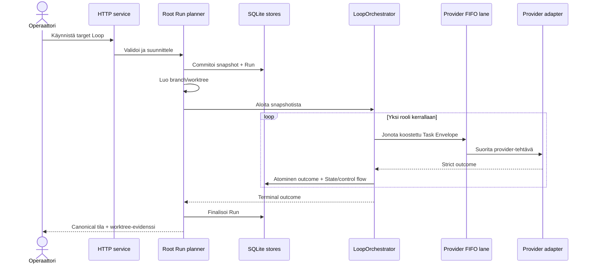
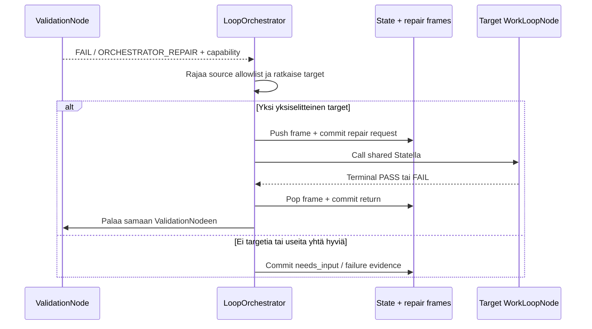
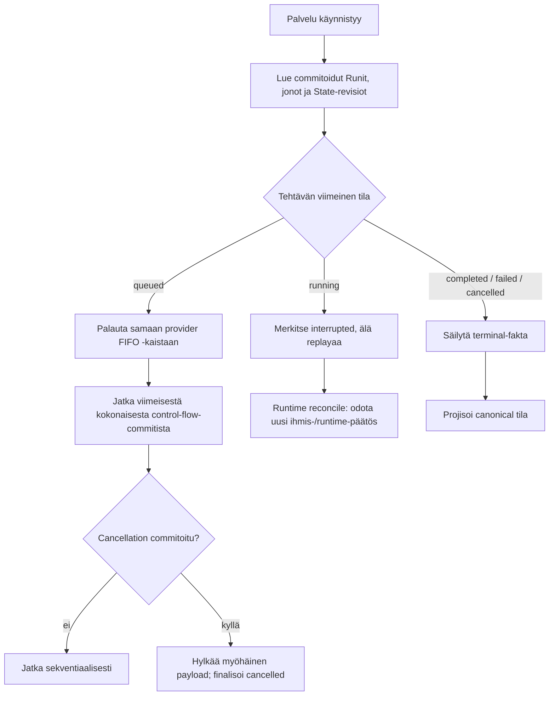
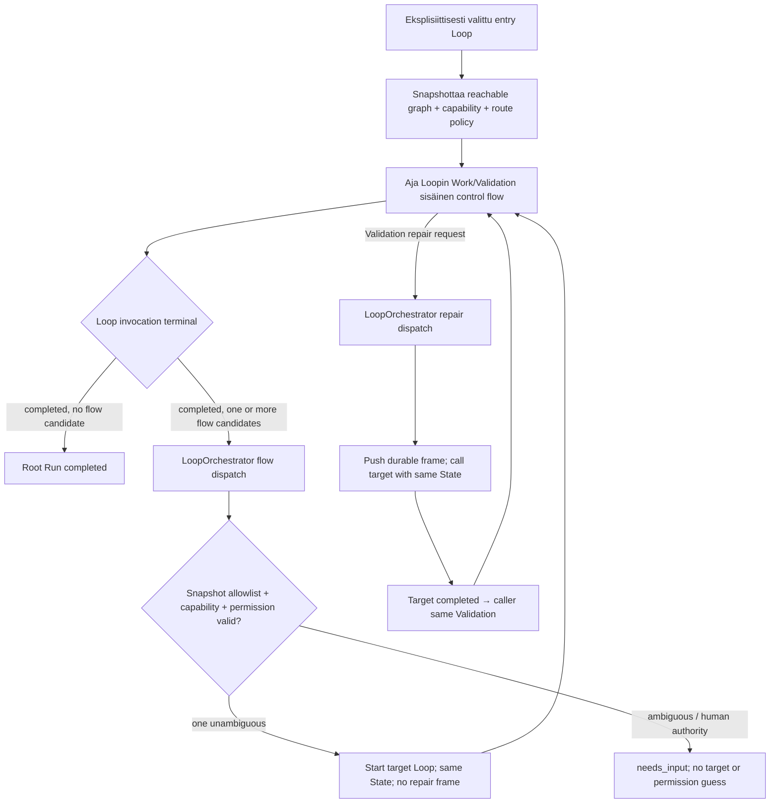

# 6. Ajonäkymä

## Tarkoitus

Tämä osio kuvaa vain sellaiset runtime-skenaariot, joiden järjestys, samanaikaisuus, palautuminen, virhe tai ulkoinen vaikutus on arkkitehtonisesti merkittävä. Project-local Loop-topologia ei kuulu platformin kiinteään ohjauslogiikkaan.

## Tila

RT-001–RT-003 ja RT-006–RT-010 ovat toteutettua platform-käyttäytymistä. Niiden config ja immutable snapshot ovat strict v11, mutta cross-Loop-control flow säilyy ennallaan. RT-004 on konfiguroitu project-local schedule, jonka ensimmäinen materiaalinen ajo on vielä pending. RT-005 käynnistyy ainoastaan täsmällisellä ihmisvaltuutuksella. RT-011:n Graph/capability snapshot -edellytys on toteutettu; Orchestrator-dispatch ei vielä ole runtime-fakta.

## RT-001: normaali sekventiaalinen Root Run

Järjestys ja invariantit:

1. Request ja kaikki reachable config/resource -viitteet validoidaan ennen Runin luontia.
2. Snapshot sekä Root Run -identiteetti commitoidaan ennen ensimmäistä provider-tehtävää.
3. Branch/worktree on Node-kirjoitusten ainoa työalue; active checkout säilyy muuttumattomana.
4. Root Run ajaa yhden roolin/outcomen kerrallaan. Seuraava rooli määräytyy nykyisestä control flow’sta, ei providerin vapaasta tekstistä; v11 Orchestrator-owned flow-dispatch on erillinen pending-vaihe.
5. Outcome, State patch/revision, attempt ja control-flow-tapahtuma kuuluvat samaan atomiseen vaikutukseen silloin, kun ne muuttavat samaa runtime-siirtymää.
6. Finalization tekee terminal-tilan näkyväksi mutta ei mergeä tai pushaa worktreetä.

## RT-003: capability repair call/return

Repair ei ole vapaamuotoinen hyppy. Validation pyytää capabilitya, Orchestrator valitsee vain lähteen allowlistista, frame tallentaa callerin ja paluu tapahtuu LIFO-järjestyksessä samaan Validation Nodeen. Repair-target ei valitse callerin continuationia. Depth-, attempt- ja transition-rajat estävät rajattoman kutsuketjun.

## RT-009: restart, reconciliation ja cancellation

Restart ei tee oletusta provider-prosessin elossaolosta. `queued`-työ säilyy, mutta ennen restartia `running`-tilassa ollut tehtävä merkitään keskeytyneeksi eikä sitä replayata automaattisesti. Runtime jatkaa vain täysin commitoidusta State/control-flow-faktasta. Cancellation on persistentoitu barrier: sen jälkeen saapuva adapter-payload ei saa luoda outcomea, State-revisiota tai uutta continuationia.

## RT-011: strict-v11 Graph Orchestrator dispatch (target)

RT-011 korvaa v11-toteutuksessa vain top-level completed-flow'n automaattisen `followFlow`-kohdan. Nolla outgoing flow candidatea päättää Root Runin. Yksi tai useampi candidate kulkee Orchestrator-dispatchin kautta; flow ei luo repair-framea. Repair säilyttää RT-003:n durable call/returnin. Jokainen valinta perustuu immutable snapshotin graph-allowlistiin ja targetin capability metadataan. Puuttuva/ristiriitainen capability, ambiguity tai ihmisvaltuutus pysähtyy ennen target invocationia.

## Skenaarioindeksi RT-001–RT-011

| ID | Trigger ja vuorovaikutus | Rakennusosat | Tulos ja evidenssi |
| --- | --- | --- | --- |
| RT-001 | Operaattori käynnistää Root Runin; planner snapshottaa reachable automationin ja runtime ajaa Node-roolit sekventiaalisesti. | BB-003–BB-007 | Active checkout säilyy; snapshot, revisionit, terminal-tila ja worktree ovat tarkastettavia. |
| RT-002 | Validation palauttaa `FAIL/LOCAL_RETRY`. Runtime tallentaa feedbackin, kasvattaa rajattua attemptia ja palaa saman Work-vaiheen suoritukseen nykyisellä Statella. | BB-005, BB-006 | Ei user-authored retry-edgeä; attemptit ja evidenssi säilyvät append-only. |
| RT-003 | Validation palauttaa `FAIL/ORCHESTRATOR_REPAIR`; capability ratkaistaan allowlistista, frame pushataan, target ajetaan ja paluu tapahtuu LIFO samaan Validationiin. | BB-004–BB-006, BB-008 | Ambiguous/puuttuva target → `needs_input`; provider ei valitse continuationia. |
| RT-004 | Maanantain 09:00 Europe/Helsinki scheduled learning käynnistää `research-authoritative-change`-työn ja voi pyytää capability repairia. | BB-004–BB-006, BB-008 | Ei dokumenttichurnia tai ulkoista kirjoitusta, jos materiaalista löydöstä ei ole. |
| RT-005 | Ihminen valtuuttaa rajatun release-toimenpiteen, minkä jälkeen `release-validation` voi käyttää network-enabled-profiilia ulkoisen evidenssin luontiin. | BB-004, BB-006–BB-008 | Toimi traceytyy täsmälliseen valtuutukseen; oletus-flow ei käynnistä sitä. |
| RT-006 | Operaattori valitsee local/library-paketin; inspect ja plan näyttävät hashin, trustin, diff/polut ja profile mappingin, minkä jälkeen commit re-plannaa ja kirjoittaa configin viimeisenä. | BB-001–BB-003, BB-009 | Stale/conflict/active-run -tilanne failaa suljetusti; config ei viittaa puuttuvaan resurssiin. |
| RT-007 | Operaattori exportoi tai poistaa Loopin; resource closure tai provenance määrittää vaikutusalan. | BB-001, BB-003, BB-009 | Canonical JSON/SHA-256 export tai jaetut resurssit säilyttävä poisto. |
| RT-008 | Runtime muodostaa Node-roolille exact compositionin immutable snapshotista ja `TaskEnvelope`:sta, laskee hashin ja jonottaa sen eksplisiittisen providerin FIFO-kaistaan. | BB-003–BB-006 | Sama input → samat tavut, hash, resurssijärjestys ja output schema; composition-virhe → 0 jonotettua tehtävää ja 0 fallbackia. |
| RT-009 | Palvelu restarttaa tai Run peruutetaan kesken provider-työn; queue/store reconciliation soveltaa viimeistä commitoitua faktaa. | BB-002, BB-004–BB-006 | Queued säilyy, running → interrupted ilman replayta, committed State/control flow ei monistu ja post-cancel-payload vaikuttaa 0 kertaa. |
| RT-010 | Operaattori avaa Run mission controlin ja vastaa tarvittaessa Human Nodeen; UI johtaa roolin, profilen, attemptin, revisionin, repairin, returnin ja finalizationin snapshotista/read storesta. | BB-001, BB-002, BB-004, BB-005 | Mission / All Loops / inspector vastaavat canonical dataa; ei keksittyä prosenttia, ETA:a tai provider-tekstistä johdettua tilaa. |
| RT-011 | V11 Root Run alkaa eksplisiittisestä entry Loopista tai completed/repair-outcome tuottaa cross-Loop-candidatet; Orchestrator validoi graph-allowlistin, capabilityn ja permission-rajan. | BB-001, BB-003–BB-006, BB-009 | Zero-flow päättää Runin; yksi eroteltu target dispatchataan; ambiguity/ihmisvaltuutus → `needs_input`; repair palaa samaan Validationiin, flow-frameja 0. Runtime passed `GLE-EVID-004`, routing/Loop UI `GLE-EVID-005/007`; koko `EVID-014` pending. |

## Samanaikaisuusmalli

- **Root Run:** yhden Runin Statea muuttavat Node-roolit etenevät sekventiaalisesti.
- **Provider lanes:** `LocalExecutionQueue` ylläpitää provider-kohtaista FIFO-kaistaa. Sama provider säilyttää jonotusjärjestyksen; erilliset provider-kaistat voivat edetä rinnakkain.
- **State:** expected revision ja SQLite-transaktio estävät lost update -tilanteen.
- **Project config mutation:** authoring/module-mutaatiot serialisoidaan; stale plan revalidoidaan ennen commitia.
- **Schedule:** due-slotin persistence estää saman schedule-instanssin duplikaattikäynnistyksen.
- **Cancel/finalize:** persistent barrier ratkaisee kilpailun myöhäisen provider-payloadin kanssa.

## Virhetilat ja vastuut

| Virhe | Omistaja | Fail-closed-vaste | Jatkaminen |
| --- | --- | --- | --- |
| Config/resource/schema-invalidi | BB-003/BB-004 | Root Runia tai provider-tehtävää ei luoda. | Korjaa project truth ja käynnistä uusi suunnitelma. |
| Work/Validation local failure | BB-005 | Commitoi outcome ja rajattu retry/terminal failure. | Runtime-sääntö tai ihmisvastaus. |
| Ambiguous repair | BB-005 | `needs_input`, ei target-arvausta. | Ihmispäätös tai project-local topology -korjaus. |
| Provider preflight/protocol failure | BB-006 | Tehtävä failed/interrupted, ei provider-fallbackia. | Korjaa profiili/provider tai käynnistä uusi valtuutettu yritys. |
| Persistence-transaction failure | BB-005/store | Rollback; osittaista revisionia/control flow’ta ei näy. | Restart/retry viimeisestä commitista. |
| Worktree/Git failure | BB-004/BB-007 | Run failaa ennen active checkout -kirjoitusta. | Operaattori tarkastaa worktreen ja korjaa Git-tilan. |
| Module plan stale/conflict | BB-009 | Commit estyy eikä project configia kirjoiteta. | Inspect/plan uudelleen nykytilasta. |
| Myöhäinen payload cancellationin jälkeen | BB-004–BB-006 | Payload hylätään, state-effect = 0. | Ei replayta; canonical cancelled-tila säilyy. |

## Kanoniset lähteet

ADR-015 ja runtime-lähde omistavat nykyisen geneerisen control-semanticsin. ADR-018 omistaa strict-v11 cross-Loop-dispatch-rajan. `.ballet/project.json` omistaa strict-v11 project-local Graphin, Loop capabilityt, schedule-konfiguraation ja tehtävät. UI lukee canonical Run API -projektiota eikä muodosta vaihtoehtoista control flow’ta.

## Relevantit päätökset

`adr-005`, `adr-006`, `adr-007`, `adr-008`, `adr-011`, `adr-012`, `adr-013`, `adr-015`, `adr-016` ja `adr-018`.

## Evidenssi

Runtime-, State-, persistence-, scheduler-, queue-, adapter-, worktree- ja Run UI -testit kattavat toteutetut skenaariot. RT-008–RT-010:n hyväksymisevidenssi on `EVID-011`–`EVID-013`. RT-011:n runtime-, routing- ja selected-Loop-UI-evidenssi on `GLE-EVID-004/005/007`; Graph-control-noden ja ihmisacceptancen sisältävä `EVID-014` on pending. Scheduled learning ja release pysyvät pending-tilassa, kunnes todellinen ajo/valtuutus on olemassa.

## Avoimet kysymykset

- Mikä ensimmäinen materiaalinen learning-löydös, jos mikään, käyttää RT-004:n repair-reititystä?
- Tuotantokaltainen restart kesken pitkäkestoisen provider-tehtävän täydentää QS-012:n testievidenssiä operatiivisella evidenssillä.

## Seuraava katselmointiperuste

Katselmoi osio, kun uusi failure-, concurrency-, recovery-, repair-, scheduling- tai external-effect-skenaario muuttaa yllä kuvattuja invariantteja.
