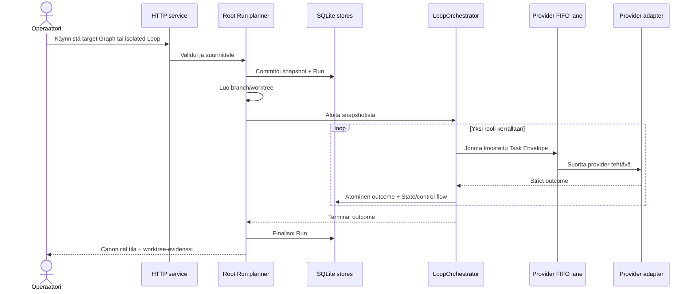
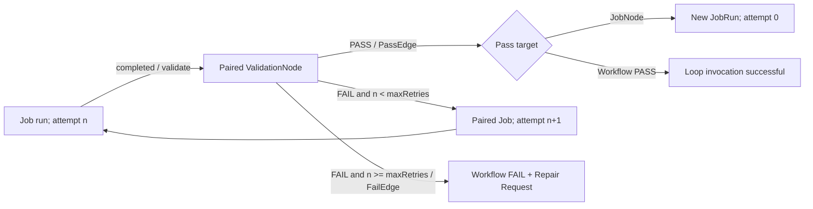
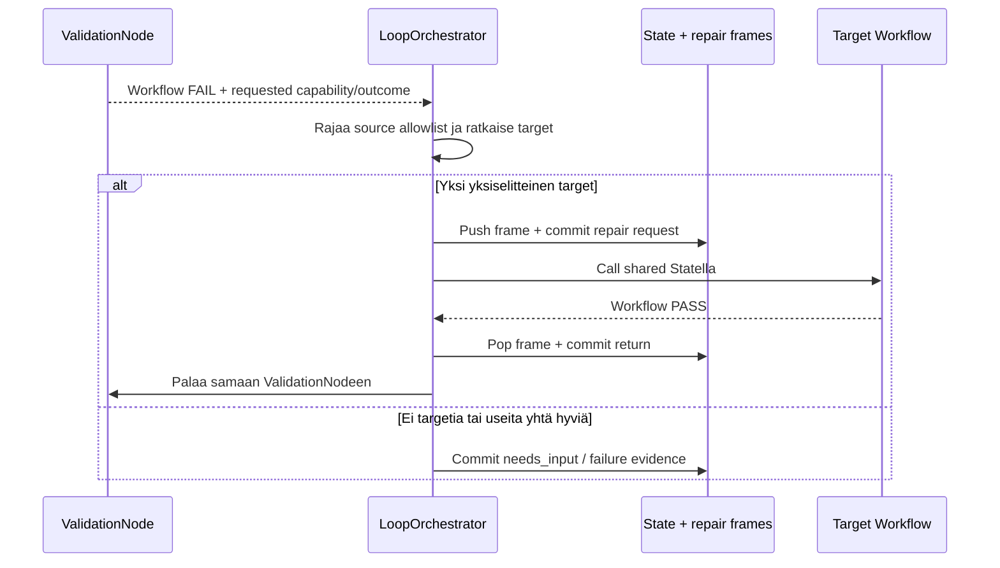
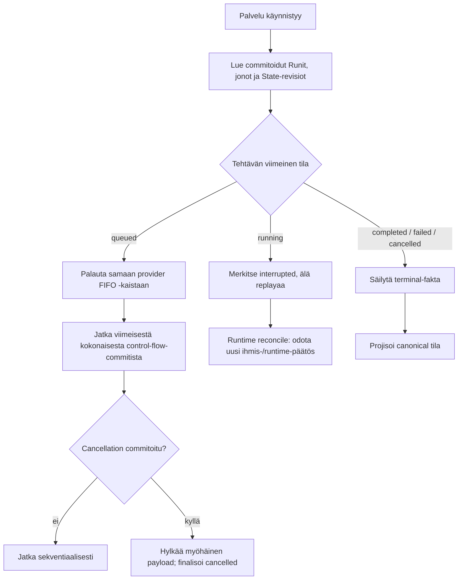
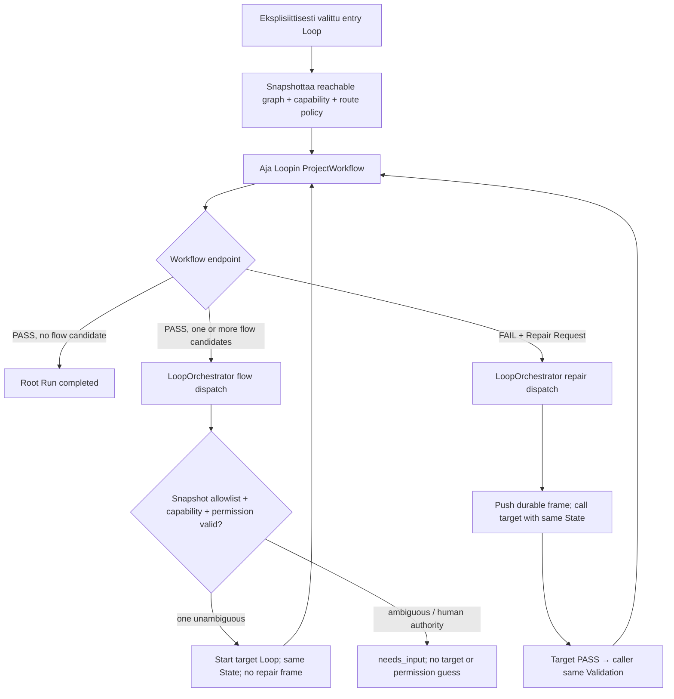
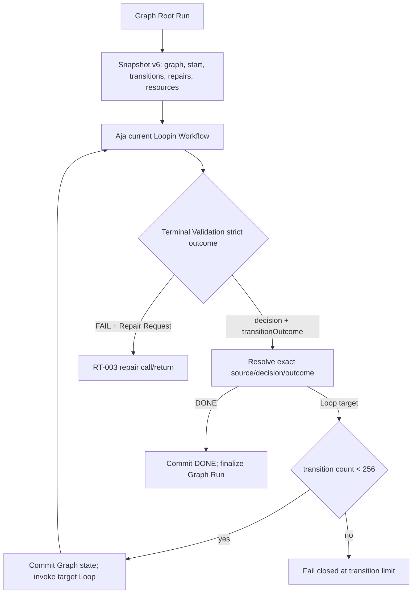
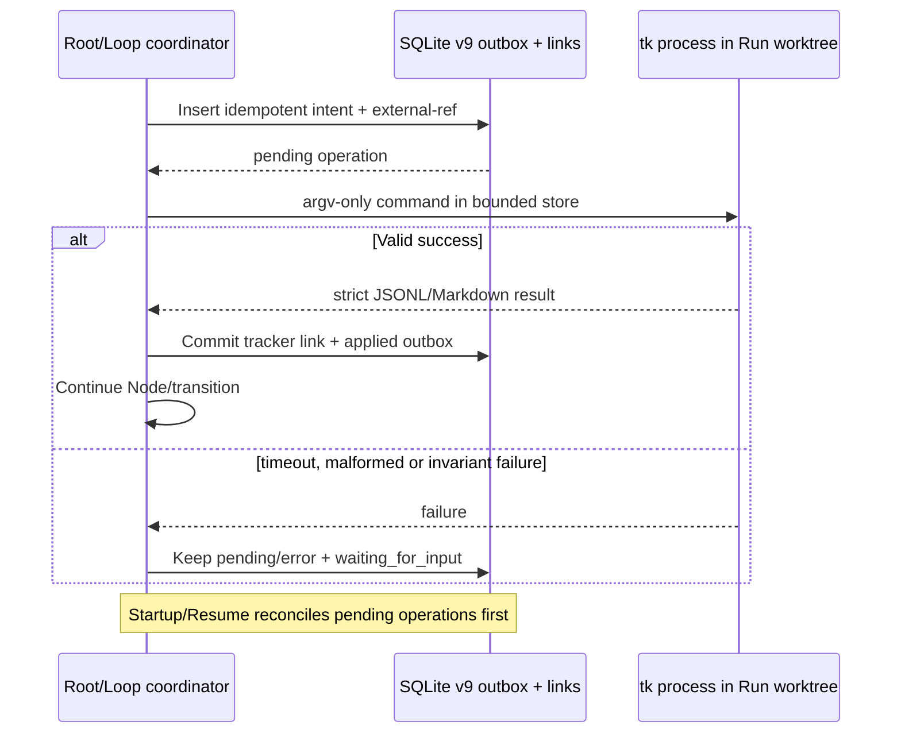
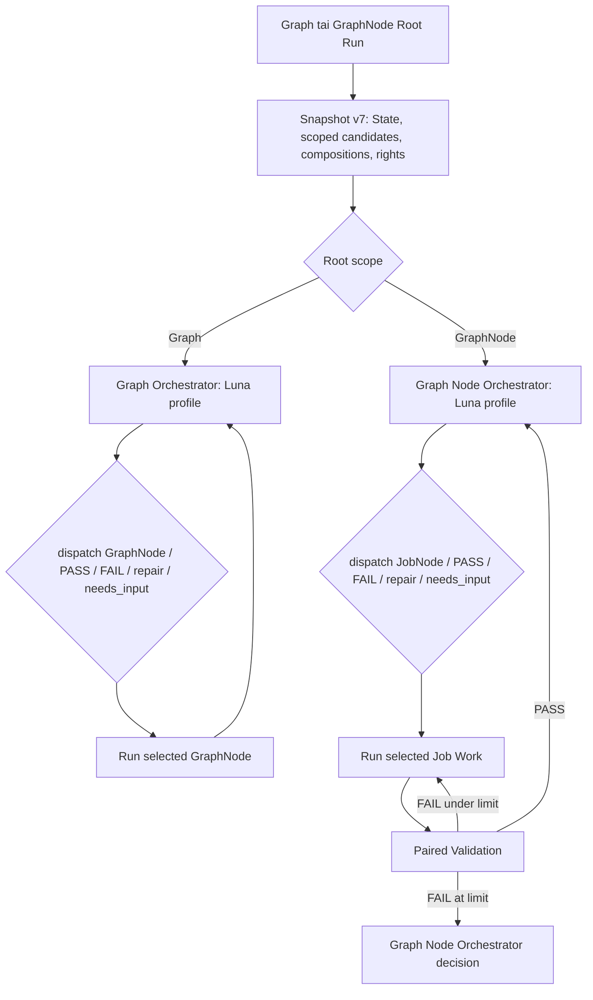

# 6. Ajonäkymä

## Tarkoitus

Tämä osio kuvaa vain sellaiset runtime-skenaariot, joiden järjestys, samanaikaisuus, palautuminen, virhe tai ulkoinen vaikutus on arkkitehtonisesti merkittävä. Project-local GraphNode-topologia ja Luna/Sol-profiilimapping eivät kuulu platformin kiinteään ohjauslogiikkaan.

## Tila

RT-001–RT-013 säilyvät invariantteina tai historiallisina skenaarioina. Strict-v14-baseline lisää RT-014:n scoped Graph/GraphNode-orchestrator-dispatchin ja RT-015:n bounded repair/escalation/return-polun. Config on v14, immutable snapshot v7 ja SQLite schema v10. Julkiset rootit ovat Graph ja GraphNode; standalone JobNode Run ja schedule poistuvat. Ulkoinen toimi käynnistyy edelleen vain täsmällisellä ihmisvaltuutuksella.

## RT-001: normaali sekventiaalinen Root Run



Järjestys ja invariantit:

1. Request ja kaikki reachable config/resource -viitteet validoidaan ennen Runin luontia.
2. Snapshot sekä Root Run -identiteetti commitoidaan ennen ensimmäistä provider-tehtävää.
3. Branch/worktree on Node-kirjoitusten ainoa työalue; active checkout säilyy muuttumattomana.
4. Root Run ajaa yhden Job-, Validation- tai optional repair-router -roolin kerrallaan. Workflow-rooli ja Graph-transition määräytyvät strict-v13 snapshotista ja runtime-invarianteista, eivät providerin vapaasta target-tekstistä.
5. Outcome, State patch/revision, attempt ja control-flow-tapahtuma kuuluvat samaan atomiseen vaikutukseen silloin, kun ne muuttavat samaa runtime-siirtymää.
6. Finalization tekee terminal-tilan näkyväksi mutta ei mergeä tai pushaa worktreetä.

## RT-002: Job, Validation ja rajattu retry



Jobin valmistuminen ja retry ovat kiinteitä runtime-siirtymiä, eivät authoroitavia Edgejä. Oletus `maxRetries = 3` tarkoittaa ensimmäistä Job-ajoa ja kolmea paikallista retryä. PASS voi päivittää Statea atomisesti ja seuraa yhtä PassEdgeä. FAIL ei päivitä Statea; retryrajan jälkeen se sisältää korjauspalautteen ja capability/outcome-eskaloinnin sekä seuraa yhtä FailEdgeä. Tekniset `blocked | failed` -tilat terminaalisoivat Runin ennen FailEdgeä.

## RT-003: capability repair call/return



Repair ei ole vapaamuotoinen hyppy. Validation pyytää capabilitya tai outcomea ilman target-ID:tä, Orchestrator valitsee vain lähteen allowlistista, frame tallentaa callerin ja paluu tapahtuu LIFO-järjestyksessä samaan ValidationNodeen uusimmalla Statella. Jobia ei ajeta uudelleen eikä retry-laskuria nollata; uusi FAIL eskaloituu heti. Repair-target ei valitse callerin continuationia. Depth-, attempt- ja transition-rajat estävät rajattoman kutsuketjun.

## RT-009: restart, reconciliation ja cancellation



Restart ei tee oletusta provider-prosessin elossaolosta. `queued`-työ säilyy, mutta ennen restartia `running`-tilassa ollut tehtävä merkitään keskeytyneeksi eikä sitä replayata automaattisesti. Runtime jatkaa vain täysin commitoidusta State/control-flow-faktasta. Cancellation on persistentoitu barrier: sen jälkeen saapuva adapter-payload ei saa luoda outcomea, State-revisiota tai uutta continuationia.

## RT-011: strict-v12 Workflow ja Graph Orchestrator dispatch



Workflow PASS on ainoa sisäinen tulos, joka käynnistää top-level Graph flow'n. Nolla outgoing flow candidatea päättää Root Runin. Yksi tai useampi candidate kulkee Orchestrator-dispatchin kautta; flow ei luo repair-framea. Workflow FAIL käynnistää RT-003:n durable repair call/returnin. Jokainen valinta perustuu immutable snapshotin graph-allowlistiin ja targetin capability metadataan. Puuttuva/ristiriitainen capability, ambiguity tai ihmisvaltuutus pysähtyy ennen target invocationia.

RT-011 säilyttää strict-v11/v12-historiallisen dispatch-evidenssin. Sen tavallisen flow'n agentti-/candidate-valinta ja zero-flow-completion eivät ole strict-v13:n aktiivista semantiikkaa; ADR-022/RT-012 korvaavat ne. RT-003:n repair call/return säilyy.

## RT-012: strict-v13 Graph RunBook



Terminal Validationin Task Envelope sisältää current Loopille sallitut transitionit. Composition v7 muodostaa decision-kohtaisen `transitionOutcome`-enumin; väli-Validation ei saa antaa Graph-outcomea. Runtime hyväksyy vain immutable snapshotin yksikäsitteisen avaimen ja committoi viimeisimmän transition ID:n, decisionin, outcomen, current Loopin ja laskurin `GraphOrchestrationStateV1`:een. `DONE` on terminal-fakta, ei Loop invocation.

Graph Root Run aloittaa `graph.startLoopId`:stä ja voi jatkaa transitioneihin. Eksplisiittinen Loop Root Run ja scheduled start Job ajavat vain valitun Loopin ja finalisoituvat sen tulokseen. Repair reititetään erillisestä collectionista RT-003:n mukaisesti eikä kasvata tavallisen RunBookin kohdevalinnan vapautta.

## RT-013: `tk`-outbox ja reconciliation



Root Runin orchestration epic ja Loop invocationin chore käyttävät pysyviä external-refeja. Osittainen ulkoinen kirjoitus ei luo seuraavalla yrityksellä duplikaattia, koska reconciliation kysyy external-refin ja sovittaa linkin ennen uutta createa. Work-store CLI käyttää samaa strict adapteria mutta ei voi muokata orchestration-storea. BUILD claim valitsee enintään yhden ready-issuen yhtä invocationia kohti.

RT-013 säilyttää strict-v13 tracker-evidenssin. Strict-v14 käyttää samoja fail-closed-idempotenssi-invariantteja GraphNode-invocationeihin ja SQLite v10:n generalisoituun request/decision/frame-evidenssiin.

## RT-014: scoped Graph ja GraphNode orchestrator dispatch



Runtime kutsuu Graph Orchestratoria Graph Runin alussa ja jokaisen GraphNode-tuloksen jälkeen. Graph Node Orchestratoria kutsutaan GraphNode-ajon alussa ja jokaisen JobNode-tuloksen jälkeen. Provider saa vain current requestiin sopivan strict candidate-enumin. Targetin pitää olla snapshotissa, oikeassa parent-scopessa ja oikeaa sääntötyyppiä; muuten canonical target-, invocation- ja State-vaikutus on nolla ja orchestrator-yritys kasvaa.

GraphNode Run käyttää paikallista orchestratoria normaalissa flow'ssa ja päättyy paikalliseen `PASS | FAIL`-tulokseen. Se saa kutsua Graph-tason orchestratoria vain repair-eskalaatioon eikä jatka seuraavaan GraphNodeen. Work `completed` siirtyy aina paired Validationiin; tämä ja bounded retry ovat ainoat providerista riippumattomat child-siirtymät.

## RT-015: orchestrator failure, Repair Node ja same-Validation-return

```mermaid
sequenceDiagram
  participant V as Validation
  participant O as Scoped Orchestrator
  participant DB as SQLite v10 State + frames
  participant R as Scoped Repair Node
  participant GO as Graph Orchestrator/Repair
  V-->>O: FAIL + evidence + target-ID-free repair request
  O->>O: Select strict repair/delegate/escalate candidate
  alt Invalid decision, attempt under 3
    O->>O: Retry with same immutable enum
  else Local repair selected
    O->>DB: Push durable frame to exact Validation
    O->>R: Sol profile; bounded State/artifact authority
    R-->>DB: Valid patch + revalidate / allowed dispatch / escalate
    DB-->>V: Pop frame; same Validation; latest State
  else Escalate from GraphNode scope
    O->>GO: Repair escalation only
    GO-->>DB: Graph repair or human needs_input
  end
```

Orchestratorin invalidi target tai kelpaamaton `needs_input` uusitaan enintään kolme kertaa, minkä jälkeen saman tason Repair Node aktivoituu, jos se on snapshotissa. Repair saa muuttaa vain Run-worktreen artefakteja ja validoitua Statea. Se ei saa lisätä candidatea, profiilia, oikeutta, skilliä tai resurssia aktiiviseen snapshotiin.

Repair palaa durable LIFO-framella samaan Validationiin uusimmalla Statella: Work rerun = 0 ja retry reset = 0. Paikallinen Repair voi käyttää vain sallittua repair-dispatchia tai eskaloida Graph-tasolle. Graph Repairin jälkeen viimeinen raja on ihmisen `needs_input`. Repair depth, per-frame attempts ja orchestrator invalid attempts ovat enintään 3; transition count on enintään 256. Restart lukee vain commitoidun request/decision/frame-faktan ja cancellation estää myöhäisen vaikutuksen.

## Skenaarioindeksi RT-001–RT-015

| ID | Trigger ja vuorovaikutus | Rakennusosat | Tulos ja evidenssi |
| --- | --- | --- | --- |
| RT-001 | Operaattori käynnistää Root Runin; planner snapshottaa reachable automationin ja runtime ajaa Node-roolit sekventiaalisesti. | BB-003–BB-007 | Active checkout säilyy; snapshot, revisionit, terminal-tila ja worktree ovat tarkastettavia. |
| RT-002 | Job valmistuu paired Validationiin; Validation PASS seuraa PassEdgeä ja FAIL palaa retryrajan sisällä paired Jobiin tai seuraa FailEdgeä Workflow FAILiin. | BB-005, BB-006 | Ensimmäinen ajo + kolme oletusretryä; ei authoroitavaa retry-edgeä; technical failure ohittaa FailEdgen. |
| RT-003 | Workflow FAIL tuottaa target-ID:stä vapaan Repair Requestin; capability/outcome ratkaistaan allowlistista, frame pushataan, target ajetaan ja paluu tapahtuu LIFO samaan Validationiin. | BB-004–BB-006, BB-008 | Ambiguous/puuttuva target → `needs_input`; Jobia ei ajeta uudelleen eikä retryä nollata. |
| RT-004 | Maanantain 09:00 Europe/Helsinki scheduled learning käynnistää `research-authoritative-change`-työn ja voi pyytää capability repairia. | BB-004–BB-006, BB-008 | Ei dokumenttichurnia tai ulkoista kirjoitusta, jos materiaalista löydöstä ei ole. |
| RT-005 | Ihminen valtuuttaa rajatun release-toimenpiteen, minkä jälkeen `release-validation` voi käyttää network-enabled-profiilia ulkoisen evidenssin luontiin. | BB-004, BB-006–BB-008 | Toimi traceytyy täsmälliseen valtuutukseen; oletus-flow ei käynnistä sitä. |
| RT-006 | Operaattori valitsee local/library-paketin; inspect ja plan näyttävät hashin, trustin, diff/polut ja profile mappingin, minkä jälkeen commit re-plannaa ja kirjoittaa configin viimeisenä. | BB-001–BB-003, BB-009 | Stale/conflict/active-run -tilanne failaa suljetusti; config ei viittaa puuttuvaan resurssiin. |
| RT-007 | Operaattori exportoi tai poistaa Loopin; resource closure tai provenance määrittää vaikutusalan. | BB-001, BB-003, BB-009 | Canonical JSON/SHA-256 export tai jaetut resurssit säilyttävä poisto. |
| RT-008 | Runtime muodostaa Node-roolille exact compositionin immutable snapshotista ja `TaskEnvelope`:sta, laskee hashin ja jonottaa sen eksplisiittisen providerin FIFO-kaistaan. | BB-003–BB-006 | Sama input → samat tavut, hash, resurssijärjestys ja output schema; composition-virhe → 0 jonotettua tehtävää ja 0 fallbackia. |
| RT-009 | Palvelu restarttaa tai Run peruutetaan kesken provider-työn; queue/store reconciliation soveltaa viimeistä commitoitua faktaa. | BB-002, BB-004–BB-006 | Queued säilyy, running → interrupted ilman replayta, committed State/control flow ei monistu ja post-cancel-payload vaikuttaa 0 kertaa. |
| RT-010 | Operaattori avaa Run mission controlin ja vastaa tarvittaessa Human Nodeen; UI johtaa roolin, profilen, attemptin, revisionin, repairin, returnin ja finalizationin snapshotista/read storesta. | BB-001, BB-002, BB-004, BB-005 | Mission / All Loops / inspector vastaavat canonical dataa; ei keksittyä prosenttia, ETA:a tai provider-tekstistä johdettua tilaa. |
| RT-011 | V11 Root Run alkaa eksplisiittisestä entry Loopista tai completed/repair-outcome tuottaa cross-Loop-candidatet; Orchestrator validoi graph-allowlistin, capabilityn ja permission-rajan. | BB-001, BB-003–BB-006, BB-009 | Zero-flow päättää Runin; yksi eroteltu target dispatchataan; ambiguity/ihmisvaltuutus → `needs_input`; repair palaa samaan Validationiin, flow-frameja 0. Runtime passed `GLE-EVID-004`, routing/Loop UI `GLE-EVID-005/007`; koko `EVID-014` pending. |
| RT-012 | Graph Root Run käynnistyy snapshotatusta start Loopista ja terminal Validation antaa sallitun decision/outcomen; isolated/scheduled Loop Run päättyy ilman Graph-transitionia. | BB-001, BB-003–BB-006, BB-009 | Exact transition tai DONE commitoidaan; unknown/duplicate/missing outcome tai transition 257 failaa suljetusti; repair palaa RT-003:n mukaan. `GER-EVID-001` pending. |
| RT-013 | Root/Loop tracker-intent kirjoitetaan tai palvelu restarttaa pending/partial `tk`-operaation jälkeen. | BB-004, BB-005, BB-010 | Run ei etene ennen sovitettua linkkiä; external-ref esiintyy kerran; malformed/dangling/cycle/timeout tuottaa waiting-tilan; BUILD claimaa enintään yhden issuen. `GER-EVID-002` pending. |
| RT-014 | Graph/GraphNode Run alkaa tai child valmistuu; scoped Luna Orchestrator valitsee snapshotatusta strict enumista. | BB-003–BB-006 | Vain oikean scopen child/terminal/repair/needs_input hyväksytään; out-of-snapshot-targetin vaikutus on 0; Work→Validation ja retry säilyvät kiinteinä. |
| RT-015 | Orchestrator epäonnistuu kolmesti tai Validation saavuttaa retryrajan; Sol Repair korjaa, reitittää tai eskaloi. | BB-004–BB-006, BB-010 | Same-Validation LIFO-return, latest State, Work rerun 0, retry reset 0, bounded depth/attempt ja Graph Repairin jälkeinen human `needs_input`. |

## Samanaikaisuusmalli

- **Root Run:** yhden Runin Statea muuttavat Node-roolit etenevät sekventiaalisesti.
- **Provider lanes:** `LocalExecutionQueue` ylläpitää provider-kohtaista FIFO-kaistaa. Sama provider säilyttää jonotusjärjestyksen; erilliset provider-kaistat voivat edetä rinnakkain.
- **State:** expected revision ja SQLite-transaktio estävät lost update -tilanteen.
- **Project config mutation:** authoring/module-mutaatiot serialisoidaan; stale plan revalidoidaan ennen commitia.
- **Cancel/finalize:** persistent barrier ratkaisee kilpailun myöhäisen provider-payloadin kanssa.
- **Tracker:** outbox/external-ref ratkaisee SQLite-commitin ja `tk`-prosessin välisen osittaisen vaikutuksen; pending intent estää control-flow'n.

## Virhetilat ja vastuut

| Virhe | Omistaja | Fail-closed-vaste | Jatkaminen |
| --- | --- | --- | --- |
| Config/resource/schema-invalidi | BB-003/BB-004 | Root Runia tai provider-tehtävää ei luoda. | Korjaa project truth ja käynnistä uusi suunnitelma. |
| Job/Validation technical failure | BB-005 | Commitoi terminal `blocked | failed`; FailEdgeä ei seurata. | Korjaa tekninen syy ja käynnistä valtuutettu uusi ajo. |
| Ambiguous repair | BB-005 | `needs_input`, ei target-arvausta. | Ihmispäätös tai project-local topology -korjaus. |
| Provider preflight/protocol failure | BB-006 | Tehtävä failed/interrupted, ei provider-fallbackia. | Korjaa profiili/provider tai käynnistä uusi valtuutettu yritys. |
| Persistence-transaction failure | BB-005/store | Rollback; osittaista revisionia/control flow’ta ei näy. | Restart/retry viimeisestä commitista. |
| Worktree/Git failure | BB-004/BB-007 | Run failaa ennen active checkout -kirjoitusta. | Operaattori tarkastaa worktreen ja korjaa Git-tilan. |
| Module plan stale/conflict | BB-009 | Commit estyy eikä project configia kirjoiteta. | Inspect/plan uudelleen nykytilasta. |
| `tk` missing/incompatible/timeout/malformed | BB-010 | Preflight tai pending outbox estää Runin; ei provider-tehtävää tai seuraavaa transitionia. | Korjaa pinnattu prerequisite/store ja Resume sovittaa pending-operaatiot. |
| Myöhäinen payload cancellationin jälkeen | BB-004–BB-006 | Payload hylätään, state-effect = 0. | Ei replayta; canonical cancelled-tila säilyy. |

## Kanoniset lähteet

ADR-023 ja runtime-lähde omistavat strict-v14 Graph/GraphNode/JobNode-control-semanticsin. `.ballet/project.json` omistaa project-local GraphNode-rakenteen, scoped candidate-säännöt, Luna/Sol-profile mappingit ja tracker-konfiguraation. Story/Release Map omistaa toimitusjärjestyksen ja tracker work-store toteutusissuet. UI lukee canonical Run API -projektiota eikä muodosta vaihtoehtoista control flow’ta.

## Relevantit päätökset

`adr-005`, `adr-006`, `adr-007`, `adr-008`, `adr-011`, `adr-012`, `adr-013`, `adr-015`, `adr-016` ja `adr-023`.

## Evidenssi

Runtime-, State-, persistence-, queue-, adapter-, worktree- ja Run UI -testit kattavat säilyvät skenaariot. RT-008–RT-013:n historiallinen evidenssi säilyy `EVID-011`–`EVID-018`:ssä. RT-014/015:n strict-v14 runtime-evidenssi indeksoidaan `EVID-019`:ään. Deploy ja muu ulkoinen kirjoitus pysyvät erillisen ihmisvaltuutuksen takana.

## Avoimet kysymykset

- Mikä ensimmäinen materiaalinen learning-löydös, jos mikään, käyttää RT-004:n repair-reititystä?
- Tuotantokaltainen restart kesken pitkäkestoisen provider-tehtävän täydentää QS-012:n testievidenssiä operatiivisella evidenssillä.

## Seuraava katselmointiperuste

Katselmoi osio, kun uusi failure-, concurrency-, recovery-, repair-, routing- tai external-effect-skenaario muuttaa yllä kuvattuja invariantteja.
