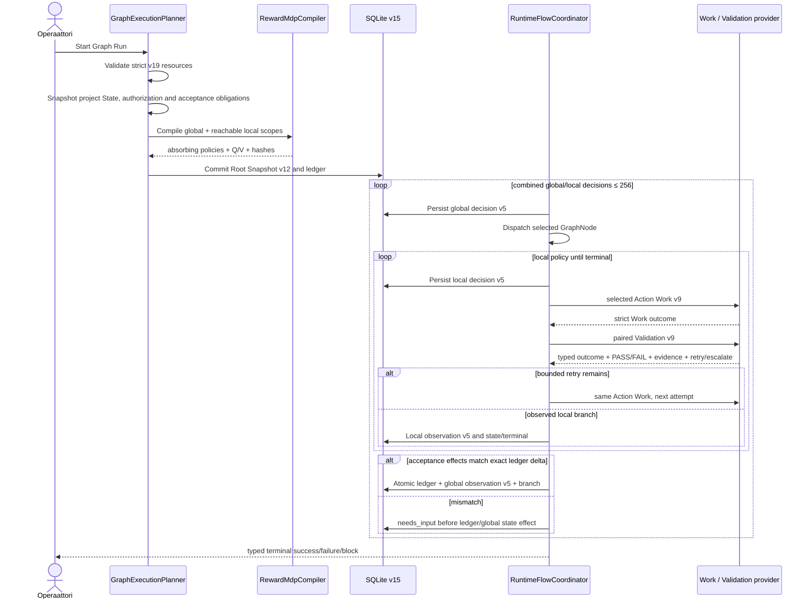
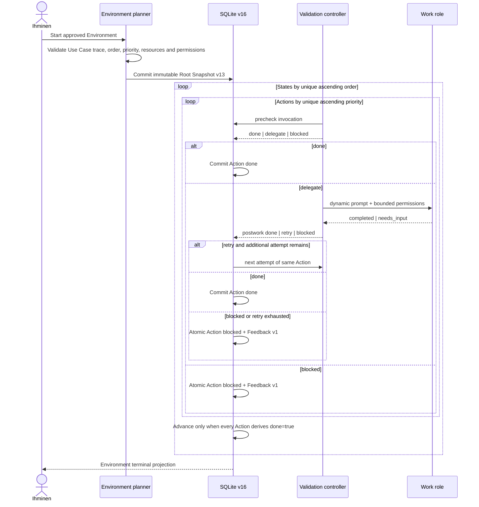

# 6. Ajonaikainen näkymä

## Tarkoitus ja tila

Tämä osio erottaa strict-v19:n aktiiviset runtime-skenaariot hyväksytyistä target-skenaarioista. RT-022–RT-025 pysyvät aktiivisina phase-09 cutoveriin asti. RT-026–RT-028 määrittävät ADR-034:n Environment-, Critic- ja Refinement-kulut, mutta niiden toteutusevidenssi on vielä pending.

## RT-025: hierarchical Reward-MDP Root Run

Planner ei käytä wall-clock-timeoutia policy-päätökseen. Compiler johtaa ID:t nodeista, canonicalisoi sparse exact-PPM-branchit ja integer-mikroyksiköt sekä ratkaisee jokaisen scopen deterministic iteration boundilla ja stable lexical tie-breakillä. Graph Run vaatii global + reachable local absorptionin; GraphNode Run vain target-localin.

Runtime ei ratkaise mallia uudelleen, arvo successor-tilaa eikä mutatoi probabilityjä/rewardia. Havaittu outcome-ID valitsee branchin deterministisesti. `Continue` palauttaa outcome-ID:n local policylle; `Escalate` saavuttaa global policyn vain local-terminalin emitted GraphNode-outcomena. Unauthorized action poistuu `A(s)`:stä ja dispatchaantuu nolla kertaa.

### Action Node ja acceptance-portti

1. Local compiled policy valitsee ActionNoden nykyisestä ActionNode-ID-statesta.
2. Schema-validi Work `completed` johtaa aina saman ActionNoden Validationiin.
3. Validation FAIL + `retry` ajaa saman Workin uudelleen vain `maxRetries`-rajan sisällä.
4. PASS, `escalate` tai loppunut retry palauttaa typed ActionNode-outcomen local branchille.
5. State target käynnistää seuraavan local lookupin; terminal target emittoi authoroidun GraphNode-outcomen.
6. Terminal Validationin acceptance-deltan ja evidenssin on vastattava emitted GraphNode-outcome-effectejä exactisti.
7. Duplicate verify, sitomaton GraphNode tai ActionNode-splittaus ei tuota Graph-progress-rewardia.

Action Nodejen välillä ei ole authoroitavaa Edgeä tai provider-routeria. Local policy on ainoa ActionNodejen välisen control flow'n omistaja.

## RT-022: restart, cancellation ja idempotenssi

- Queue ja invocation lifecycle ovat persistenttejä. Restart palauttaa queued-työn; kesken ollut provider-suoritus muuttuu interrupted-tilaan eikä replaya terminal outcomea.
- State-, acceptance-, outcome- ja control-flow-vaikutus näkyy vasta kokonaisen SQLite-transaktion jälkeen.
- Cancellation/finalization on durable barrier myöhäiselle provider-payloadille; post-cancel state-effect on 0.
- Policy decision viittaa model-, policy- ja snapshot-hasheihin. Observation viittaa täsmälliseen GraphNode invocationiin eikä kirjoita mallia.
- Tracker outbox käyttää stable external-refiä ja estää control flow'n, kunnes partial external effect on sovitettu.

## RT-023: GraphNode Root Run

GraphNode Root Run käyttää samaa strict snapshot-, worktree-, local policy-, Work/Validation-, retry/escalate- ja persistence-polkuja, mutta ei compileeraa tai dispatchaa global policya. Se päättyy local terminaliin eikä jatka peer-GraphNodeen.

## RT-024: Graph Node Module

Module inspect rajoittaa koon, validoi strict v7 JSON:n mukaan lukien local policyn ja laskee canonical hashin. Plan näyttää namespacen, profile/resource mappingin, konfliktit ja provenance-muutokset. Commit re-plannaa samasta inputista, materialisoi resource closuren ja kirjoittaa Project Config v19:n viimeisenä. Uusi node jättää global-matriisin incomplete-tilaan. Runtime ei lue packagea.

## RT-026: target Environment Run

Planner lukee vain hyväksytyn Use Casen ja target Project Config v20:n. Statejen `order` ja Actionien `priority` ovat scopekohtaisesti unique positive integer -arvoja; runtime ei käytä array-paikkaa päätöksenä. Action status on canonical fakta ja `done`/`blocked` ovat siitä johdettuja. Validationin precheck sallii vain `done | delegate | blocked`, postwork vain `done | retry | blocked`, ja Work vain `completed | needs_input`. `maxRetries=N` sallii yhteensä `1+N` Work-yritystä; provider/protokollavirhe ei kuluta semantic retryä eikä muutu keksityksi Validation-outcomeksi. Retry exhaustion sekä blocked-status ja Feedback-entry commitoidaan samassa transactionissa.

## RT-027: target Critic schedule ja proposal approval

1. Persistent schedule löytää erääntyneen Critic-ajon lease-suojatusti; restart voi jatkaa samaa schedule-invocationia luomatta duplikaattia.
2. Critic lukee immutable Run-snapshotin, worktree-commitin ja nimetyn evidenssin read-only-oikeuksilla. Onnistunut Run-worktree säilyy tämän lukuikkunan yli eikä cleanup katkaise todistusaineistoa.
3. Critic tuottaa strict proposal v1:n. Proposal ei ole Feedback Box -entry eikä muuta project/runtime-totuutta.
4. Ihminen hyväksyy tai hylkää proposal-ID:n ja expected revisionin erillisellä typed commandilla. Vain hyväksyntä voi luoda Feedback-entryn atomisesti; stale/duplicate-päätös vaikuttaa nolla kertaa.

## RT-028: target Refinement, continuation ja Product Snapshot

1. Refinement lukee approved Feedbackin, base-commitin, sallitut project-local-polut ja niiden preimage-hashit read-only-tilassa.
2. Proposal v1 jäädyttää exact diff/hash -sisällön. Ennen ihmishyväksyntää tiedosto-, Git- ja runtime-kirjoituksia on nolla.
3. Approval-palvelu lukitsee authoring-rajan, revalidoi proposalin tilan, base-commitin, allowed-path-setin ja jokaisen preimage-hashin.
4. Hyväksytty diffi sovelletaan managed worktreehen ja commitoidaan kerran. Konflikti tai hash-drift rollbackaa koko applyn.
5. Commit tuottaa uuden immutable Root Snapshot v13:n ja continuation Runin, joka viittaa parent Runiin, Feedbackiin, proposaliin, approvaliin ja committiin. Parent Run ei muutu in-place.
6. Product Snapshot projisoi commitin, artefaktit ja evidenssin; se ei ole project truth eikä dispatch authority. Cleanup voi alkaa vasta, kun lineage ja Critic/refinement-lukuevidenssi ovat durableja.

## Skenaarioindeksi

| ID | Tila | Omistaja |
| --- | --- | --- |
| RT-001 | historical | Pre-v18 Root Run baseline; audit trail vanhoissa initiativeissa. |
| RT-002 | historical | Pre-v18 Workflow execution. |
| RT-003 | historical | Pre-v18 Repair call/return. |
| RT-004 | historical | Pre-v18 scheduled learning. |
| RT-005 | historical | External write -ihmisraja säilyy CON-001/QS-007:ssä. |
| RT-006 | historical | Module inspect/install; aktiivinen seuraaja RT-024. |
| RT-007 | historical | Module export/remove; aktiivinen seuraaja RT-024. |
| RT-008 | historical | Composition; aktiivinen sopimus on Task Envelope v9/composition v10. |
| RT-009 | historical | Recovery; aktiivinen seuraaja RT-022. |
| RT-010 | historical | Run projection; aktiivinen acceptance on QS-013/QS-024. |
| RT-011 | historical | Graph/Loop orchestrator. |
| RT-012 | historical | Exact RunBook. |
| RT-013 | historical | Tracker reconciliation; invariantti säilyy RT-022:ssa. |
| RT-014 | historical | Scoped agent routing. |
| RT-015 | historical | Scoped Repair. |
| RT-016 | historical | Graph-only SSP. |
| RT-017 | historical | Scoped outcome-aware SSP. |
| RT-018 | historical | Scoped policy draft/readiness. |
| RT-019 | historical | Offline calibration/shadow/promotion. |
| RT-020 | historical | Single Graph Reward-MDP; säilyvät periaatteet ovat RT-025:ssä. |
| RT-021 | historical | Array-ordered Action execution; Work→Validation/retry säilyy RT-025:ssä. |
| RT-022 | active | Restart, cancellation and idempotency. |
| RT-023 | active | GraphNode Root Run. |
| RT-024 | active | Graph Node Module v7 materialization. |
| RT-025 | active | Hierarchical global/local Reward-MDP Root Run. |
| RT-026 | accepted target; pending implementation | Ordered Environment Run and Validation-led Action lifecycle. |
| RT-027 | accepted target; pending implementation | Scheduled Critic proposal and human approval. |
| RT-028 | accepted target; pending implementation | Exact refinement apply, immutable continuation Run and Product Snapshot. |

## Samanaikaisuusmalli

- Yhden Root Runin Statea tai acceptance-ledgeriä muuttavat roolit etenevät sekventiaalisesti.
- Provider-kohtaiset FIFO-kaistat voivat edetä rinnakkain eri Runeille.
- State revision, SQLite-transaction ja finalization barrier estävät lost update- ja late payload -vaikutukset.
- Authoring/module-mutaatiot serialisoidaan; stale install plan revalidoidaan ennen committia.

## Virhetilat

| Virhe | Fail-closed-vaste | Jatkaminen |
| --- | --- | --- |
| Config/resource/model invalidi | Root Runia tai provider-taskia ei luoda; exact issue raportoidaan. | Korjaa project truth ja käynnistä uusi Run. |
| Empty `A(s)` nonterminalissa | Policy decision failaa, dispatch = 0. | Korjaa authorization tai model guardit. |
| Nonterminal recurrent class / iteration-bound failure | Compile hylätään, Run = 0. | Korjaa finite model. |
| Out-of-enum outcome tai acceptance ilman evidenssiä | Transaction rollback; State/ledger/control effect = 0. | Korjaa Validation-output tai project outcome -katalogi. |
| Work/Validation technical failure | Root/option failaa tai blokkaantuu ilman semanttisen outcomen keksimistä. | Korjaa tekninen syy ja käynnistä valtuutettu uusi ajo. |
| Retryrajan ylitys | Retryä ei dispatchata; typed outcome palaa local policylle. | Local branch valitsee state-targetin tai terminalin. |
| Acceptance-effect mismatch | Root pysähtyy `needs_input`:iin; ledger/global state effect = 0. | Korjaa Validation-evidenssi tai authoroitu GraphNode-outcome ja vastaa uudelleen. |
| Provider preflight/protocol failure | Tehtävä failed/interrupted ilman provider-fallbackia. | Korjaa profiili/provider ja käynnistä uusi yritys. |
| Persistence failure | Koko transaction rollback. | Restart/retry viimeisestä commitista. |
| Module stale/conflict | Commit estyy; configia ei kirjoiteta. | Inspect/plan uudelleen nykytilasta. |
| External write ilman authorizationia | Action puuttuu hard admissible setistä tai Node pysähtyy `needs_input`:iin; kirjoituksia 0. | Ihminen antaa täsmällisen valtuutuksen uuteen snapshotiin. |
| Target precheck/postwork outcome ei kuulu sallittuun enumiin | Koko target-transaction rollback; Action status ja Feedback pysyvät ennallaan. | Korjaa provider-output ja jatka samasta commitoidusta runtime-tilasta. |
| Target blocked/retry exhaustion | Action `blocked` ja Feedback v1 syntyvät atomisesti; seuraava Action/State dispatch = 0. | Ihminen käsittelee Feedback/Critic/Refinement-rajan hyväksytyllä komennolla. |
| Refinement base/preimage/hash tai approval revision vanhentui | Apply, commit ja continuation Run = 0. | Luo uusi read-only-proposal nykyisestä hyväksytystä pohjasta. |

## Kanoniset lähteet ja evidenssi

`adr-033` ja nimetyt lähdekoodiankkurit omistavat aktiivisen v19-control semanticsin. `adr-034` ja Target Contract omistavat RT-026–RT-028-targetin. `TEST-027` / `EVID-027` kattavat aktiivisen runtimen; targetin `TEST-028`–`TEST-030` / `EVID-028`–`EVID-030` ovat pending toteutukseen ja fault-injection-evidenssiin asti.

## Seuraava katselmointiperuste

Katselmoi osio, kun uusi failure-, concurrency-, recovery-, authorization- tai external-effect-skenaario muuttaa yllä kuvattuja invariantteja.
