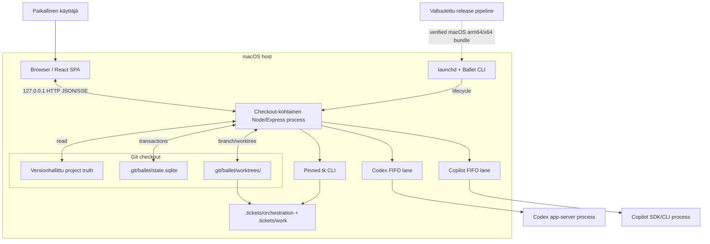

# 7. Käyttöönottonäkymä

## Tarkoitus

Tämä osio kuvaa turvallisuuden, eristyksen, palautumisen ja jakelun kannalta merkittävät tekniset ympäristöt sekä rakennusosien sijoittumisen niihin. Nykyinen deployment-yksikkö on yksi macOS-kone ja yksi täsmällinen Git-checkout.

## Tila

DEP-001 ja DEP-002 ovat toteutettua paikallista deploymentia. DEP-003:n ulkoinen julkaisu vaatii aina erillisen valtuutuksen. DEP-004 kuvaa aktiivisen Graph Runin tracker-rajan. DEP-005 hyväksyy targetin määräaikaisen vNext-eristyksen ja phase-09 canonicalizationin; sen toteutusevidenssi on pending.

## Topologia

## Deployment-yksiköt

| ID | Ympäristö ja mapping | Rajapinnat | Laatu- ja riskimerkitys |
| --- | --- | --- | --- |
| DEP-001 | Yksi macOS Git-checkout hostaa yhden loopback Ballet Node -prosessin, React-assetit ja `.git/ballet/state.sqlite`-kannan; launchd ylläpitää lifecyclea. BB-001 palvellaan BB-002:n kautta, BB-003/BB-008 luetaan checkoutista ja BB-004–BB-006 käyttävät samaa paikallista runtimea. | Browser `127.0.0.1`, paikallinen tiedostojärjestelmä, SQLite ja provider-prosessit. | Checkout-eristys ja yksinkertainen operointi; ei remote control planea tai HA-failoveria. |
| DEP-002 | Jokainen Root Run käyttää omaa `.git/ballet/worktrees/<root-run-id>`-hakemistoa ja Run-branchia; canonical runtime-faktat pysyvät checkoutin SQLite-kannassa. | Git worktree, provider task `cwd`, runtime-storet ja Run API. | Active checkout -suoja, attributable output ja restart-safe-faktat; stale worktree jää diagnosoitavaksi. |
| DEP-003 | Release bundle sisältää paketoidun Noden, compiled backend/CLI:n, frontendin ja native-riippuvuudet macOS arm64/x64:lle; verification/attestation tapahtuu ennen aktivointia. | GitHub release/attestation ja mahdollinen Homebrew vain valtuutuksen jälkeen. | Supply-chain integrity ja rollback-mahdollisuus; ulkoiset palvelut ja kirjoitus vaativat ihmisvaltuutuksen. |
| DEP-004 | Graph Root Run käyttää koneelle asennettua pinnattua `tk`-CLI:tä vain omassa worktreessään; runtime hallitsee `.tickets/orchestration`-storea ja agentin rajattu CLI `.tickets/work`-storea. | `tkCommand` local settings / `--tk-command`, argv-only child process, SQLite v15 outbox/linkit ja worktree-local tiedostot. | Puuttuva tai yhteensopimaton prerequisite estää Runin; external-ref/reconciliation estää duplikaatin; ticket-data jää Run-worktreehen. |
| DEP-005 | Environment-target elää phaseissa 02–08 samassa checkout-local-prosessissa vain eristetyssä vNext namespace/hakemistossa, `/api/vnext`- ja `/vnext`-pinnassa sekä erikseen nimetyssä `.git/ballet/state-vnext.sqlite`-kannassa. Phase 09 korvaa aktiivisen schema v15 -kannan fresh strict-v16-kannalla ja canonicalisoi API/UI-reitit. | CTR-012, target shared contracts, erillinen vNext store/repository, HTTP security/SSE:n adaptoidut primitiivit ja phase-09 removal manifest. | v19/vNext cross-read/write ja dual-write = 0; final branchissa vNext-prefixit ja vanha Graph-domain = 0. DB rollback on pre-cutover commitin checkout tai feature-haaran hylkäys, ei migration down. |

## Tiedosto- ja prosessisijoittelu

| Kohde | Omistajuus | Säilyvyys | Huomio |
| --- | --- | --- | --- |
| Checkoutin tracked files | Projektin omistaja ja Git | Versionhallittu | Goals, ADR:t, arc42, project config, instructionit, skillit, source ja design. |
| `.git/ballet/state.sqlite` | Ballet runtime | Machine-local, restartien yli | DB schema/migration on startup-raja; tiedostoa ei commitata. |
| `.git/ballet/state-vnext.sqlite` phaseissa 02–08 | Eristetty target-runtime | Machine-local, vain transitionin ajan | Ei lue/kirjoita schema v15 -tauluja; phase 09 poistaa väliaikaisen nimen ja aloittaa fresh strict-v16 canonical storen. |
| `.git/ballet/worktrees/<root-run-id>` | Root Run | Säilyy tarkastusta/valtuutettua integraatiota varten | Providerin `cwd`; active checkout ei ole työalue. |
| `<root-worktree>/.tickets/orchestration` | Ballet runtime | Root Run -worktreen elinkaaren ajan ja sen jälkeen evidenssinä | Root epic + Loop invocation child chore; agentti ei muokkaa storea. |
| `<root-worktree>/.tickets/work` | Project workflow / rajattu agentti-CLI | Root Run -worktreen elinkaaren ajan ja sen jälkeen evidenssinä | Release epic + implementation-issuet; Story/Release Map ei kopioi taskirunkoja. |
| `tk` child process | BB-010 adapteri | Yksi rajattu command invocation | Ei shelliä; worktree-bounded cwd/store, timeout ja output limit. |
| Node/Express process | launchd / CLI | Prosessikohtainen | Bindaa vain loopbackiin ja tunnistaa checkoutin. |
| Provider child process/session | BB-006 adapteri | Tehtävä-/sessio-kohtainen | Provider credentials ja protocol ovat adapterirajan ulkopuolisia; normalized outcome palaa runtimeen. |
| Release bundle | Release-operaattori | Artefakti- ja provenance-politiikan mukainen | Ei synny tai aktivoidu oletus-Root Runissa. |

## Käynnistys ja palautuminen

1. CLI/launchd ratkaisee checkoutin ja avaa sen runtime-tietokannan.
2. Aktiivinen `LocalDatabase` hyväksyy vain strict schema v15:n. Muu kanta jätetään koskemattomaksi; virhe ohjaa arkistoimaan nykyisen `.git/ballet/state.sqlite`-tiedoston ja käynnistämään uuden v15-kannan erikseen sen sijaan, että data migroitaisiin hiljaisesti.
3. Queue-, Root Run- ja tracker-outbox-reconciliation lukevat commitoidut faktat RT-009/RT-013:n mukaisesti.
4. React UI hakee tuoreen canonical read modelin; selainmuisti ei ole recovery-lähde.
5. Stale worktree tai interrupted provider-tehtävä näytetään diagnosoitavana eikä niitä siivota tai replayata hiljaisesti.
6. Target-transition avaa `state-vnext.sqlite`-kannan erillisellä schema v16 -loaderilla eikä koskaan kohdista sitä v15-kantaan. Phase-09 cutover vaatii palvelun pysäytyksen, pre-cutover-checkpointin ja fresh v16-käynnistyksen; migrationia tai reader fallbackia ei ole.

## Turvallisuus- ja verkkomapping

- Browser–service-liikenne pysyy `127.0.0.1`:ssä ja Origin-politiikan piirissä.
- Network-oikeus kuuluu yksittäiseen `ExecutionProfile`:en; palvelun paikallisuus ei itsessään valtuuta providerin verkkokäyttöä.
- Provider saa Run-worktreen `cwd`:ksi ja eksplisiittisen task payloadin.
- `tk` saa vain validoidun Run-worktreen ja valitun `.tickets`-store-polun; `tkCommand` ei tuo shell-tulkintaa.
- GitHub/Homebrew/CI/CD ovat DEP-003:n ulkoisia trust boundaryja; testin läpäisy ei valtuuta kirjoitusta niihin.
- Loop module -tiedosto tulee selaimen content-inputina tai versionhallittuna library data -lähteenä, ei backendin mielivaltaisena polkuna tai live registry -riippuvuutena.

## Kapasiteetti ja operointi

Arkkitehtuuri optimoi paikallista determinismiä, ei horisontaalista skaalausta. Provider-kohtaiset FIFO-kaistat rajaavat samanaikaisuutta. SQLite ja checkout-identiteetti tekevät yhdestä checkoutista consistency boundaryn. Usean checkoutin käyttö tarkoittaa useita erillisiä prosessi-/tietokanta-/worktree-kokonaisuuksia.

## Kanoniset lähteet

`README.md`, ADR-001, ADR-006, ADR-007, ADR-009, ADR-022 ja ADR-034 sekä `backend/cli/`, `backend/execution/git/`, `backend/storage/`, `backend/tracker/`, `scripts/` ja `packaging/`.

## Relevantit päätökset

`adr-001`, `adr-006`, `adr-007`, `adr-008`, `adr-009`, `adr-011`, `adr-022` ja target `adr-034`.

## Evidenssi

Lifecycle-, checkout identity-, worktree-, SQLite-, recovery-, tracker- ja packaged smoke -testit tuottavat aktiivisen paikallisen evidenssin. `GER-EVID-002` läpäisi hermetic-matriisin ja final packaged smoke läpäisi 2026-08-21; `GER-EVID-007` on pending, koska `tk` puuttuu PATHista. DEP-005:n cross-read/write-, route- ja removal-evidenssi kuuluu pending TEST-032/EVID-032-ketjuun. Tässä työssä ei tehty eikä väitetä release publicationia.

## Avoimet kysymykset

- Production hosting, non-macOS deployment, remote control plane tai jaettu runtime store eivät ole hyväksyttyjä.
- Operatiivisen backup/restore-politiikan tarve arvioidaan ennen tuotantokäyttöä; nykyinen recovery kattaa prosessirestartin, ei koneen menetystä.

## Seuraava katselmointiperuste

Katselmoi osio, kun tuettu OS, prosessitopologia, runtime-store, provider-prosessi tai release distribution -polku muuttuu.
