# 10. Laatuvaatimukset

## Tarkoitus

Tämä osio määrittää arkkitehtuurin suunnitteluun, hyväksymiseen ja evaluationiin käytettävät mitattavat laatuskenaariot. Goal omistaa laatuaikeen; skenaario määrittää havaittavan ärsykkeen, ympäristön, vasteen ja onnistumisen rajan.

## Tila

QS-001–QS-015 säilyttävät hyväksytyn laatuintention ja historiallisen evidenssin. `goal-014`:n acceptance intent ja käyttäjän 2026-08-20 päätösvaltuutus tekevät QS-016–QS-018:sta prioriteetin 1 strict-v13 RunBook-, visual stability- ja tracker-acceptance-rajat. QS-016 on paikallisesti verified; QS-017:n tekninen/browser-evidenssi sekä QS-018:n hermetic evidenssi ovat läpäisseet. Ihmisen visual verdict ja pinnatun oikean `tk`:n live-smoke säilyvät erillisinä pending-rajoina.

## Laatupuu

```mermaid
flowchart TD
  quality["Balletin laatu"] --> safety["Turvallisuus ja auktorisointi"]
  quality --> integrity["Determinismi ja eheys"]
  quality --> recovery["Palautettavuus ja observability"]
  quality --> usability["Käytettävyys ja ylläpidettävyys"]
  safety --> q1["QS-001 paikallinen raja"]
  safety --> q4["QS-004 worktree ja network"]
  safety --> q7["QS-007 external write"]
  integrity --> q2["QS-002 resurssit"]
  integrity --> q3["QS-003 repair"]
  integrity --> q11["QS-011 composition"]
  recovery --> q6["QS-006 evaluation"]
  recovery --> q12["QS-012 restart ja cancel"]
  usability --> q5["QS-005 arkkitehtuuritotuus"]
  usability --> q8["QS-008 learning"]
  usability --> q9["QS-009 module trust"]
  usability --> q10["QS-010 authoring"]
  usability --> q13["QS-013 Run projection"]
  integrity --> q14["QS-014 Graph/Loop v11"]
  integrity --> q15["QS-015 Workflow v12"]
  integrity --> q16["QS-016 RunBook determinismi"]
  usability --> q17["QS-017 Graph/Workflow vakaus"]
  recovery --> q18["QS-018 tk reconciliation"]
```

Laatupuu ei muuta prioriteettia: safety-, integrity- ja recovery-invariantit voivat estää toiminnon, vaikka käytettävyys kärsisi. UI:n ymmärrettävyys ei oikeuta keksittyä runtime-telemetriaa.

## Laatuskenaariot

<!-- quality-scenarios:start -->
| ID | Source | Stimulus | Environment | Affected artifact | Expected response | Measurable response criterion | Priority | Evidence | Status |
| --- | --- | --- | --- | --- | --- | --- | --- | --- | --- |
| QS-001 | goal-001, goal-007 | Operaattori käynnistää ja käyttää Balletia commitoidusta checkoutista. | Tuettu macOS-host ja paikallinen selain. | BB-001, BB-002, DEP-001 | Palvele vain checkout-local-komentokeskusta ja näytä täsmällinen operatiivinen tila. | API bindaa vain loopbackiin; toisella checkoutilla on eri service identity ja runtime state; automatisoidut lifecycle/API-tarkistukset läpäisevät. | 1 | EVID-001 | verified |
| QS-002 | goal-002, goal-003 | Root Run pyydetään muuttuneilla, puuttuvilla tai virheellisillä project-resursseilla. | Preflight ennen yhtäkään provider-tehtävää. | BB-003, BB-004, CON-003 | Snapshottaa yksi deterministinen validi resource closure tai failaa suljetusti. | Invalidi/duplikaatti/puuttuva profile, instruction tai skill tuottaa vähintään yhden tarkan issuen ja jonottaa 0 provider-tehtävää; samat lähteet tuottavat samat resource hashit. | 1 | EVID-002 | verified |
| QS-003 | goal-004, goal-006 | Validation pyytää ulkoista repairia. | Active Root Run, jossa on nolla, yksi tai useita capability-candidateja. | BB-004, BB-005, RT-003 | Reititä vain capabilityn ja source allowlistin perusteella ja palaa samaan Validationiin. | Target kuuluu allowlistiin; continuation on runtime-owned; ambiguous/puuttuva target tuottaa `needs_input`; repair depth-, attempt- ja transition-rajat ylittyvät 0 kertaa. | 1 | EVID-003 | verified |
| QS-004 | goal-005 | Normaali architecture- tai implementation-Node suoritetaan. | Root Run -worktree ilman eksplisiittistä research/release-tarvetta. | BB-004, BB-006, DEP-002, CON-001 | Pidä verkko pois päältä ja kirjoitukset Run-worktreessä. | 100 % non-research/non-release-konfiguroiduista Nodeista käyttää network-off-profiilia; permission-policy- ja worktree-testit läpäisevät; active checkout -kirjoituksia 0. | 1 | EVID-004 | verified |
| QS-005 | goal-009 | Project architecture- tai method-artefakti muuttuu. | Repository-validointi ennen handoffia. | BB-003, BB-008, CON-006 | Säilytä yksi ratkaistava source of truth vakailla ID:illä. | `npm run validate:arc42` raportoi 0 puuttuvaa required docia, duplicate ID:tä, broken local linkkiä, unresolved tracea tai resource referenceä. | 1 | EVID-005 | verified |
| QS-006 | goal-009 | Initiative saavuttaa architecture evaluation -vaiheen. | Evaluate Loop rajatun toteutuksen jälkeen. | BB-004, BB-008, RT-003, CON-006 | Vertaa toteutusta mitattaviin QS-kriteereihin ja kirjaa evidenssi, riski ja drift. | Jokainen REVIEW traceaa 100 % in-scope priority-1-QS:istä testiin/monitoriin ja evidenssistatukseen; puuttuva näyttö kirjataan findingiksi tai repair requestiksi, ei accepted-tilaksi. | 1 | EVID-006 | pending pilot |
| QS-007 | goal-005, goal-008, goal-009 | Release, deploy tai rollback pyydetään. | Release-validation Loop network-capabilitylla. | BB-006, BB-007, RT-005, DEP-003, CON-001 | Pysähdy täsmälliseen ihmisvaltuutukseen ennen jokaista hyväksymätöntä ulkoista toimintoa. | Ennen kirjattua valtuutusta suoritetaan 0 external write -komentoa; automatic behavior sisältää 0 merge/push-toimintoa; kaikki yritetyt komennot nimetään evidenssissä. | 1 | EVID-007 | policy verified; execution pending |
| QS-008 | goal-009 | Scheduled learning löytää mahdollisen teknologia- tai menetelmäparannuksen. | Maanantain research-ajo primary-source-network-oikeudella. | BB-006, BB-008, RT-004, CON-006 | Säilytä vain materiaalinen evidenssi ja reititä muutos oikeaan hyväksyntärajaan. | Jokaisella säilytetyllä findingillä on lähde, vaikutus, QS/RISK/ADR/BB-viite ja odotettu metriikka; ei materiaalista findingiä → 0 semanttista dokumenttimuutosta. | 2 | EVID-008 | pending pilot |
| QS-009 | goal-010 | Operaattori importoi, asentaa, exportoi tai poistaa Loop modulen myös injected failure-, conflict- tai active Run -tilanteessa. | Tyhjä tai konfiguroitu projekti loopback API/UI:n kautta. | BB-001–BB-003, BB-009, RT-006, RT-007, CON-007 | Validoi/hashaa epäluotettu sisältö, näytä täsmällinen plan, materialisoi deterministisesti ja säilytä project/runtime-rajat. | Kaikki package/service/API/UI/release smoke -skenaariot läpäisevät; stale/incompatible/active-operaatio kirjoittaa 0 config-muutosta; injected config failure jättää 0 uutta referoitua resurssia; removal poistaa 0 shared-resurssia. | 1 | EVID-009 | implementation verified; full gate pending |
| QS-010 | goal-011 | Operaattori navigoi Context-, composition- ja selected-Loop detail -tasot, muokkaa kumpaakin Edge-lajia tai asentaa starter-modulen. | Paikallinen selain 1440×900 ja 390×844 configured/cyclic/empty-fixtureillä. | BB-001, BB-009, RT-006, CON-005 | Säilytä yksi hierarkia, deterministiset datarajat, keyboard access ja authoritative post-install state. | Route/projection/UI/module-testit läpäisevät; canvas sisältää 0 foreign-level node/Edge-kind-lajia; Space valitsee ja Enter avaa Level 1 Loopin; molemmat viewportit näyttävät kolme tasoa ilman clipped core actionia tai horizontal page overflow’ta. | 1 | EVID-010 | historical verified; superseded by QS-014 |
| QS-011 | goal-003 | Sama immutable Root Run -snapshot ja sama `TaskEnvelope` koostetaan toistuvasti, minkä lisäksi yksi required resource rikotaan. | Provider-task preflight Codex- ja Copilot-adapterirajojen edessä. | BB-003, BB-004, BB-006, RT-008, CON-003 | Tuota validille inputille tavutasolla sama provider-payload ja estä invalidi composition ilman fallbackia. | Validin inputin prompt-bytes, composition hash, resolved resource -järjestys ja output schema ovat 100 % identtiset jokaisessa toistossa ja molempien adapterien inputissa; invalidi composition jonottaa 0 taskia ja provider/model/profile-fallbackien määrä on 0. | 1 | EVID-011 | verified |
| QS-012 | goal-006 | Palvelu restarttaa, kun task on queued tai running, ja cancellation commitoidaan ennen myöhäistä provider-payloadia. | Checkout-local SQLite, queue reconciliation ja active Root Run. | BB-004–BB-006, RT-009, DEP-001, DEP-002, CON-002 | Säilytä queued-työ, merkitse running-työ keskeytyneeksi ilman replayta ja estä duplicate/post-cancel-vaikutus. | Restartin jälkeen 100 % queued-tehtävistä säilyy; 100 % aiemmin running-tehtävistä on täsmälleen kerran `interrupted` eikä automaattista replayta synny; commitoituja State-revisioita/control-flow-eventtejä monistuu 0; cancellationin jälkeinen payload luo 0 state/outcome/continuation-muutosta. | 1 | EVID-012 | verified |
| QS-013 | goal-007 | Operaattori tarkastaa aktiivista, repairissa olevaa, palannutta ja finalisoitua Runia sekä vastaa Human Nodeen. | Run mission control paikallisessa selaimessa immutable snapshotin ja canonical persistencen päällä. | BB-001, BB-002, BB-005, RT-010, CON-005 | Johda position, role, profile, attempt, revision, repair, return ja finalization vain snapshotista/read storesta; älä keksi telemetriaa. | View-model/panel-testit osoittavat 100 % nimetyistä kentistä canonical DTO -lähteeseen; provider-tekstistä johdettuja state-kenttiä on 0; UI näyttää 0 keksittyä prosenttia, ETA:a tai elapsed-arvoa; repair/return/human/finalization-fixtureiden expected projectionit läpäisevät. | 1 | EVID-013 | verified |
| QS-014 | goal-012 | Operaattori authoroi project-global graphin tai avaa yhden Loopin, ja runtime kohtaa nolla, yhden tai usean flow/repair route candidaten. | Strict-v11 config, immutable Root Run snapshot ja paikallinen selain desktop/narrow-viewportissa. | BB-001, BB-003–BB-006, BB-009, RT-011, CON-002, CON-005 | Näytä täsmälleen Graph Engineering / Loop Engineering, validoi jokainen cross-Loop-valinta graph-allowlistilla ja capabilityllä sekä pysähdy ambiguityssa tai ihmisvaltuutuksessa `needs_input`-tilaan. | V11 parseri hylkää 100 % v10-, unknown-, silent-default- ja dual-write-fixtureistä; Context/numeric route/legacy-mallin aktiivisia polkuja on 0; Graph-projektiossa on täsmälleen yksi LoopNode per ProjectLoop ja yksi Orchestrator-control sekä 0 sisäistä Work/Validation-nodea; Loop-projektiossa on 0 project-global route/control-nodea; runtime-testit osoittavat zero-flow completionin, kaikki flow/repair-dispatchit Orchestratorin kautta, capability/allowlist-rejectionin, ambiguity/permission `needs_input`-tilan, repair-returnin samaan Validationiin ja flow framejen määrän 0. | 1 | EVID-014 | technical implementation passed GLE-EVID-002–008; human acceptance pending |
| QS-015 | goal-013 | Repositoryn Loop authoroidaan tai suoritetaan, Validation palauttaa PASS/FAIL-tuloksen, palvelu avaa runtime-kannan tai käyttäjä navigoi selected-Loop-näkymään. | Strict-v12 config, v2 module, v5 snapshot/envelope/outcome, v7/v6 execution, SQLite v8 ja paikallinen selain desktop/narrow-viewportissa. | BB-001, BB-003–BB-006, BB-009, RT-002, RT-003, RT-011, CON-002, CON-005, CON-008 | Säilytä 1:1 Job/Validation-paritus ja exact Pass/Fail Edget; suorita ensimmäinen Job + kolme retryä, eskaloi neljäs FAIL, palaa repairista samaan Validationiin ja projisoi Workflow-canvasille yksi Job-artwork per pari sekä vain persisted Edget. | Parseri hylkää 100 % v11/v1/unknown/invalid-pairing/edge/reachability-fixtureistä; aktiivisia `WorkLoopNode`, `WorkNode`, `LOCAL_RETRY`, `ORCHESTRATOR_REPAIR`, `view=loop` tai `work_loop_node_runs` -polkuja on 0; runtime-testit osoittavat Job→Validation, PASS→Job/PASS, kolme retryä, neljännen FAIL-eskaloinnin, same-Validation repair-returnin ilman Job rerunia/retry resetiä, technical failure bypassin sekä State/restart/cancellation/recoveryn; UI-testit osoittavat atomisen parin create/delete-guardin, erilliset editorit, canvasilla vain JobNodet ja persisted Edget, edge-geometriat vain `straight` tai `smoothstep`, nolla endpoint-nodea/validate/retry-viivaa, canonical URL/back-forwardin, keyboard/a11y:n ja desktop/narrow-layoutin; v7-kanta failaa suljetusti täsmäohjeella. | 1 | EVID-015 | technical implementation, ADR-021 canvas correction and final gates passed; human visual acceptance pending |
| QS-016 | goal-014 | Graph Run käynnistyy, terminal Validation palauttaa minkä tahansa sallitun 18 reitin päätös/outcome-parin, graphia muutetaan kesken Runin tai transition-raja saavutetaan. | Strict-v13 config, v6 immutable snapshot/envelope/outcome, v7/v8 composition/execution ja SQLite v9; Graph-, isolated- ja scheduled-root-fixturet. | BB-003–BB-006, BB-009, RT-003, RT-012, CON-002, CON-009 | Reititä exact snapshot-transitioniin ilman kohteen provider-päättelyä, finalisoi vain eksplisiittisestä DONEsta, pidä isolated/scheduled-ajot Graphin ulkopuolella ja säilytä repair call/return erillisenä. | Schema-testit läpäisevät 1/5/40 Loopin validit fixturet ja hylkäävät 100 % missing start/unreachable/duplicate key/no DONE/invalid outcome/transition-repair confusion -fixtureistä; runtime-matriisi todentaa kaikki 18 transitionia, checkout-muutoksen vaikutuksen 0 käynnissä olevaan Runiin, transition 257:n eston, DONE-finalisoinnin, isolated/scheduled continuationien määrän 0 ja repair returnin samaan Validationiin. | 1 | EVID-016 | verified locally |
| QS-017 | goal-007, goal-014 | Operaattori authoroi tai tarkastaa 1, 5 tai 40 Loopin Graphia desktop- ja narrow-viewportissa ja avaa Loopin Workflow Engineeringiin. | Paikallinen selain, strict-v13 config ja suojattu Workflow-canvas. | BB-001, BB-002, RT-010, RT-012, CON-005, CON-009 | Näytä Graph pelkistettynä deterministic layered -korttikaaviona ja säilytä Workflow Engineeringin avaruusteema sekä authoring-semantics muuttumattomina. | 1/5/40 layoutissa on 0 päällekkäistä Loop-korttia; pan/zoom säilyy eikä automaattinen fit pienennä tekstiä lukukelvottomaksi; jokainen edge-label sisältää decision+outcomen ja accessible namen; cycles/back routes ovat deterministisiä; desktop/narrow testit läpäisevät ilman page overflow'ta; Workflow regression QA osoittaa saman gridin, artworkit/koot, glows, amber-ID:t, mint-edget, connection pointit ja vain straight- tai smoothstep-geometriat. | 1 | EVID-017 | technical/browser verified; human visual verdict pending |
| QS-018 | goal-006, goal-014 | Graph Run kohtaa puuttuvan/epäyhteensopivan `tk`:n, timeoutin, malformed outputin, invalidin store-graphin, osittaisen kirjoituksen, restartin/cancelin tai BUILD-claimin. | Runtime DB v9, hermetic fake CLI ja optional pinned live `tk` Run-worktreessä. | BB-004, BB-005, BB-010, RT-009, RT-013, DEP-002, DEP-004, CON-010 | Estä Run ennen epätäydellistä sovitusta, säilytä yksi external-ref/linkki restartien yli ja rajaa agentti work-storeen sekä yksi claim yhtä BUILD invocationia kohti. | Hermetic matriisi läpäisee success/timeout/malformed Markdown/JSONL/duplicate external-ref/dangling parent/dependency/cycle/partial write/restart/cancel/reconciliation -tapaukset; failed preflight jonottaa 0 provider-tehtävää; partial/restart tuottaa 1 ticketin per external-ref; pending outboxin aikana seuraavia transitioneja on 0; BUILD claimaa 0 tai 1 issuea invocationissa; live-smoke-status raportoidaan erikseen. | 1 | EVID-018 | hermetic verified; pinned live smoke pending |
<!-- quality-scenarios:end -->

## Priorisoinnin tulkinta

- **Prioriteetti 1:** release/acceptance estyy, jos kriteeriä ei ole osoitettu tai puuttumisen vaikutusta ei ole eksplisiittisesti hyväksytty.
- **Prioriteetti 2:** skenaario vaikuttaa menetelmän kehitykseen mutta voi odottaa oikeaa triggeriä; pending-evidenssi ei oikeuta semanttista muutosta.
- Testin läpäisy todentaa nimetyn ympäristön. Se ei yksin todista tuotantokaltaista operointia, jos skenaario vaatii pilotin tai ulkoisen valtuutuksen.

## Kanoniset lähteet

Goalit omistavat quality intention. Tämä osio omistaa mitattavat skenaariot; [TRACEABILITY](TRACEABILITY.md) omistaa niiden suhteet päätöksiin, rakenteisiin, testeihin ja evidenssiin.

## Relevantit päätökset

`adr-005`, `adr-006`, `adr-007`, `adr-008`, `adr-011`, `adr-012`, `adr-013`, `adr-015`, `adr-016`, `adr-017`, `adr-018`, `adr-019`, `adr-020`, `adr-021` ja `adr-022`.

## Evidenssi

EVID-001–EVID-018 ratkaistaan TRACEABILITYssa. EVID-014 säilyttää v11-historian ja EVID-015 strict-v12 Workflow -hard cutin evidenssin. EVID-016 on paikallisesti verified, EVID-017:n technical/browser-osuus on verified ja EVID-018:n hermetic-osuus on verified. Puuttuvia ihmis- tai live-smoke-osuuksia ei käsitellä onnistumisina.

## Avoimet kysymykset

- Pilot-specific performance-, latency- tai usability-threshold vaatii ihmisen hyväksynnän initiative-BRIEFissä ennen priorisointia.
- QS-012:n paikalliset fault-injection-testit tulee myöhemmin täydentää operatiivisella restart-evidenssillä ennen production-readiness-väitettä.

## Seuraava katselmointiperuste

Katselmoi osio, kun Goal muuttuu, skenaariota ei voi mitata tai evaluation osoittaa, ettei kriteeri erota onnistumista epäonnistumisesta.
