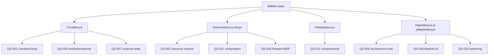

# 10. Laatuvaatimukset

## Tarkoitus ja tila

Tämä osio omistaa aktiiviset, mitattavat hyväksymisskenaariot. QS-014–QS-023 ja QS-025 säilyvät ID-tasolla historiallisena trace-ketjuna, mutta niiden Loop/Workflow/scoped-policy/Repair/learning-mittareita ei käytetä v18:n hyväksymiseen. QS-024 säilyttää capability-first/protected Action flow -vaatimuksen. QS-026 on yhden Graph Reward-MDP:n priority-1-raja.

## Laatupuu

## Laatuskenaariot

<!-- quality-scenarios:start -->
| ID | Source | Stimulus | Environment | Affected artifact | Expected response | Measurable response criterion | Priority | Evidence | Status |
| --- | --- | --- | --- | --- | --- | --- | --- | --- | --- |
| QS-001 | goal-001, goal-007 | Operaattori käynnistää Balletin commitoidusta checkoutista. | Tuettu macOS-host ja paikallinen selain. | BB-001, BB-002, DEP-001 | Palvele vain checkout-local-komentokeskusta. | API bindaa vain loopbackiin; toisella checkoutilla on eri identity/state; lifecycle/API-smoke läpäisee. | 1 | EVID-001 | verified |
| QS-002 | goal-002, goal-003 | Root Run pyydetään muuttuneilla tai virheellisillä project-resursseilla. | Preflight ennen provider-tehtävää. | BB-003, BB-004, CON-003 | Snapshottaa yksi deterministinen validi resource closure tai failaa suljetusti. | Invalidi/duplikaatti/puuttuva profile, instruction tai skill tuottaa exact issuen ja 0 provider-taskia; sama input tuottaa samat hashit. | 1 | EVID-002 | verified |
| QS-003 | goal-004, goal-006, goal-020 | Validation palauttaa FAIL-dispositionin retry tai escalate. | Active Action Node, immutable snapshot ja SQLite v14. | BB-004, BB-005, RT-021 | Noudata bounded retryä tai palauta typed semantic outcome Graph-MDP:lle. | Work-yritykset ≤ `maxRetries + 1`; loppunut retry dispatchaa 0 uutta Workia; escalate tuottaa yhden option outcomen; erillisiä Repair-tauluja/rooleja 0. | 1 | EVID-003, EVID-026 | implementation verified |
| QS-004 | goal-005 | Provider-Node suoritetaan. | Root Run -worktree. | BB-004, BB-006, DEP-002, CON-001 | Pidä kirjoitukset worktreessä ja noudata profilen network-rajaa. | Permission/worktree-testit läpäisevät; active checkout -kirjoituksia 0; network ei laajene fallbackilla. | 1 | EVID-004 | verified |
| QS-005 | goal-009 | Arkkitehtuuri- tai method-artefakti muuttuu. | Repository-validointi ennen handoffia. | BB-003, BB-008, CON-006 | Säilytä yksi ratkaistava source of truth vakailla ID:illä. | `npm run validate:arc42` raportoi 0 puuttuvaa dokumenttia, duplicate ID:tä, broken linkkiä, unresolved tracea tai resource referenceä. | 1 | EVID-005, EVID-026 | implementation verified |
| QS-006 | goal-009 | Initiative saavuttaa evaluation-vaiheen. | Rajatun toteutuksen jälkeen. | BB-008, CON-006 | Traceaa in-scope priority-1-kriteerit testiin/evidenssiin ja nimeä puute. | REVIEW kattaa 100 % in-scope priority-1-QS:istä; ajamatonta pilottia ei merkitä läpäistyksi. | 1 | EVID-006 | review |
| QS-007 | goal-005, goal-008, goal-009 | Merge, push, release, deploy tai rollback pyydetään. | Local runtime ilman tai täsmällisellä valtuutuksella. | BB-006, BB-007, CON-001, CON-013 | Pysähdy ennen hyväksymätöntä ulkoista toimintoa. | Ennen kirjattua valtuutusta external write -komentoja 0; Project State ei voi antaa lupaa; yritetyt toimet nimetään evidenssissä. | 1 | EVID-007, EVID-026 | policy verified; live effect not exercised |
| QS-008 | goal-009 | Menetelmästä löytyy mahdollinen parannus. | Evidenssipohjainen evaluation. | BB-008, CON-006 | Säilytä vain materiaalinen finding ja vie semanttinen muutos päätösrajaan. | Findingillä on lähde, vaikutus, QS/RISK/ADR/BB-viite ja mittari; ei findingiä → 0 semanttista churnia. | 2 | EVID-008 | pending operational evidence |
| QS-009 | goal-010 | Graph Node Module importoidaan, asennetaan, viedään tai poistetaan. | Strict v6 package, API ja release fixture. | BB-001–BB-003, BB-009, RT-024, CON-007 | Validoi/hashaa, näytä plan ja materialisoi config-last. | Kaikki 14 v6 package/inspect/install/export/remove-roundtripit läpäisevät; stale/conflict/active-operaatio kirjoittaa 0 config-muutosta; package sisältää 0 local policy/Repair-resurssia. | 1 | EVID-009, EVID-026 | implementation verified; release smoke pending final gate |
| QS-010 | goal-011, goal-018 | Operaattori navigoi Graph-, GraphNode- ja Action Node -authoringissa. | Canonical URL, desktop/narrow, keyboard. | BB-001, CON-005 | Säilytä yksi hierarkia, scope ja authoritative post-save state. | Route/CRUD/back-forward/keyboard-testit läpäisevät; foreign-scope-elementtejä ja route-aliaksia 0. | 1 | EVID-010, EVID-024 | implementation verified |
| QS-011 | goal-003 | Sama Root Snapshot ja Task Envelope koostetaan toistuvasti; required resource rikotaan. | Codex/Copilot adapter boundary. | BB-003, BB-004, BB-006, CON-003 | Tuota validille inputille tavutasolla sama payload ja estä invalidi composition. | Prompt bytes, composition hash, resource order ja output schema ovat identtiset; invalidi composition jonottaa 0 taskia; fallbackeja 0. | 1 | EVID-011 | verified |
| QS-012 | goal-006 | Palvelu restarttaa queued/running-työn aikana tai myöhäinen payload saapuu cancellationin jälkeen. | Checkout-local SQLite v14. | BB-004–BB-006, RT-022, CON-002 | Säilytä queued, merkitse running interruptediksi ilman replayta ja estä duplicate/post-cancel-vaikutus. | Queued säilyy; running on kerran interrupted; State/ledger/policy/outcome/event-duplicateja 0; post-cancel state effect 0. | 1 | EVID-012, EVID-026 | verified hermetically |
| QS-013 | goal-007 | Operaattori tarkastaa aktiivista tai finalisoitua Runia. | Immutable snapshot ja canonical read store. | BB-001, BB-002, BB-005, CON-005 | Näytä position, Action Node, attempt, revision, acceptance, reward, Q/V ja finalization vain canonical datasta. | DTO/view-testit läpäisevät; provider-proosasta johdettuja state-kenttiä, prosentteja, ETA:a tai elapsed-arvoja 0. | 1 | EVID-013, EVID-026 | implementation verified |
| QS-014 | goal-012 | Historiallinen Graph/Loop authoring -vaihe. | Superseded v11. | historical | Säilytä audit trail, älä käytä active acceptanceen. | Active v18 sisältää Loop/Orchestrator-polkuja 0. | historical | EVID-014 | superseded |
| QS-015 | goal-013 | Historiallinen Workflow/Edge-vaihe. | Superseded v12. | historical | Säilytä Work→Validation-intentio vain Action Node -sopimuksessa. | Active v18 sisältää Workflow/PassEdge/FailEdge-polkuja 0. | historical | EVID-015 | superseded |
| QS-016 | goal-014 | Historiallinen exact RunBook -vaihe. | Superseded v13. | historical | Säilytä project-local default flow ja tracker-invariantit. | Active control owner on ADR-031. | historical | EVID-016 | superseded |
| QS-017 | goal-014 | Historiallinen Graph/Workflow visual -vaihe. | Superseded v13. | historical | Säilytä vain jäljelle jäävät design-tokenit ja evidenssi. | Active UI noudattaa QS-024:ää. | historical | EVID-017 | superseded |
| QS-018 | goal-006, goal-014 | Tracker kohtaa timeoutin, malformed outputin, partial effectin tai restartin. | SQLite v14 ja hermetic fake CLI. | BB-005, BB-010, RT-022 | Estä eteneminen ennen reconciliationia ja säilytä stable external-ref. | Failed preflight task = 0; partial/restart ticket per external-ref = 1; pending outboxin aikana seuraavia dispatch-vaikutuksia 0. | 1 | EVID-018 | hermetic verified; pinned live smoke pending |
| QS-019 | goal-015 | Historiallinen scoped routing/Repair -vaihe. | Superseded v14. | historical | Säilytä vain Graph/GraphNode/Action Node -scope-intentio. | Active scoped orchestrator-, Repair- ja routing persistence -polkuja 0. | historical | EVID-019 | superseded |
| QS-020 | goal-015 säilyvä osa | Operaattori käyttää Graph-, GraphNode- ja Action Node -tasoja 1/5/40 GraphNode- ja 1/17/64 Action Node -fixtureillä. | 1440×900, 390×844, keyboard, reduced motion ja Run-lukko. | BB-001, CON-005 | Säilytä capability cards ja protected deterministic Action flow. | Kolme authoring-routea ja kaksi Run-routea; Action flow näyttää Start/Work/Validation/Pass?/Retry?/Retry count/Continue/Escalate; vain Work/Validation ovat painikkeita; overlap/page overflow/clipped core action = 0. | 1 | EVID-020, EVID-024, EVID-026 | automated/browser verified; human project-owner verdict pending |
| QS-021 | goal-016 | Historiallinen Graph-only SSP-vaihe. | Superseded v15. | historical | Säilytä finite-policy-intentio ADR-031:ssä. | Active `ssp_v1`/agent fallback -polkuja 0. | historical | EVID-021 | superseded |
| QS-022 | goal-017 | Historiallinen scoped outcome-aware SSP-vaihe. | Superseded v16/v17. | historical | Säilytä outcome-aware transition vain Graph Reward-MDP:ssä. | Active local policyjä 0. | historical | EVID-022 | superseded |
| QS-023 | goal-017 | Historiallinen scoped model-miss/cost-vaihe. | Superseded v17. | historical | Säilytä actual state- ja immutable observation -periaatteet. | Observation v4 mutatoi modelia 0 kertaa. | historical | EVID-023 | superseded |
| QS-024 | goal-007, goal-018 säilyvä osa | Operaattori authoroi capabilityja, outcomeja ja Graph Reward Decision Modelia tai käyttää Action Node CRUDia. | Canonical URL sections, desktop/narrow, keyboard/focus, long IDs ja scale-fixturet. | BB-001, BB-002, CON-005 | Näytä Capability Graph, Reward Decision Model, Ordered Actions ja protected Action flow; erota compiled policy factual executionista. | CRUD/reitit läpäisevät; local Decision Model/Repair -UI:ta 0; card overlap/page overflow/clipped action = 0; Run näyttää exact state/acceptance/PPM/reward/Q/V/policy/effect-faktat. | 1 | EVID-024, EVID-026 | automated/installed browser QA passed; human project-owner verdict pending |
| QS-025 | goal-019 | Historiallinen calibration/shadow/promotion-vaihe. | Superseded v17. | historical | Säilytä observation vain audit trailina. | Active dataset registry-, candidate-, shadow-, activation- ja rollback-polkuja 0. | historical | EVID-025 | superseded |
| QS-026 | goal-020 | Sama model/snapshot/state ajetaan eri input-järjestyksillä/nopeuksilla; kohdataan duplicate/invalidate, unauthorized action, outcome-haarat, retry/escalate, restart ja recurrent policy. | Strict v18/v3/v6/v11/v9/v10/v11/v4/v14 ja hermetic default Graph. | BB-001–BB-006, BB-009, BB-013, RT-020–RT-024, CON-013 | Compileeraa kerran deterministic absorbing policy; johda reward vain ledger-deltasta; poista unauthorized action `A(s)`:stä; suorita ordered Action Nodet bounded retry/escalatella. | Duplicate progress-reward = 0; invalidointi voi laskea progressia; obligation ID/paino muuttuu Runissa 0 kertaa; sama input tuottaa saman policy-hashin/Q/V/actionin; jokainen branch = 1 000 000 ppm ja näyttää provenienssin; sama next state + eri outcome voi tuottaa eri penalty/Q:n; unauthorized Q/dispatch = 0; retry ≤ `maxRetries`; recurrent class = 0; default reachable action count ≥ 2; hermetic Run saavuttaa DONE; production/project legacy agent/local-policy/Repair/JobNode-persistence = 0; lint warning = 0. | 1 | EVID-026, GRM-evid-004 | technical acceptance passed; production-like pilot pending |
<!-- quality-scenarios:end -->

## Priorisoinnin tulkinta

- Prioriteetti 1 estää acceptance-väitteen, jos kriteeriä ei ole osoitettu tai rajoitusta hyväksytty eksplisiittisesti.
- Historiallinen rivi säilyttää trace-ID:n; se ei ole aktiivinen release-portti.
- Testin läpäisy todentaa nimetyn ympäristön, ei tuotantokaltaista pilottia tai ulkoista vaikutusta.

## Kanoniset lähteet ja evidenssi

Goalit omistavat quality intention. Tämä osio omistaa mitattavat skenaariot ja [TRACEABILITY](TRACEABILITY.md) niiden päätös/rakenne/test/evidence-ketjut. Aktiivisen cutin päätös on `adr-031`; `adr-025`/`adr-027` omistavat protected Action flow'n. `GRM-evid-004` päivitetään vain ajetuista final porteista, ja tuotantokaltainen pilotti säilyy erillisenä pending-evidenssinä.

## Avoimet kysymykset

- Tuotantokaltaisen pilotin budgetti, stop-ehdot ja operatiiviset hyväksymismitat vaativat project ownerin päätöksen ennen ajoa.
- QS-012:n hermetic fault injection täydentyy myöhemmin operatiivisella restart-evidenssillä.

## Seuraava katselmointiperuste

Katselmoi osio, kun Goal muuttuu, skenaariota ei voi mitata tai evaluation osoittaa, ettei kriteeri erota onnistumista epäonnistumisesta.
