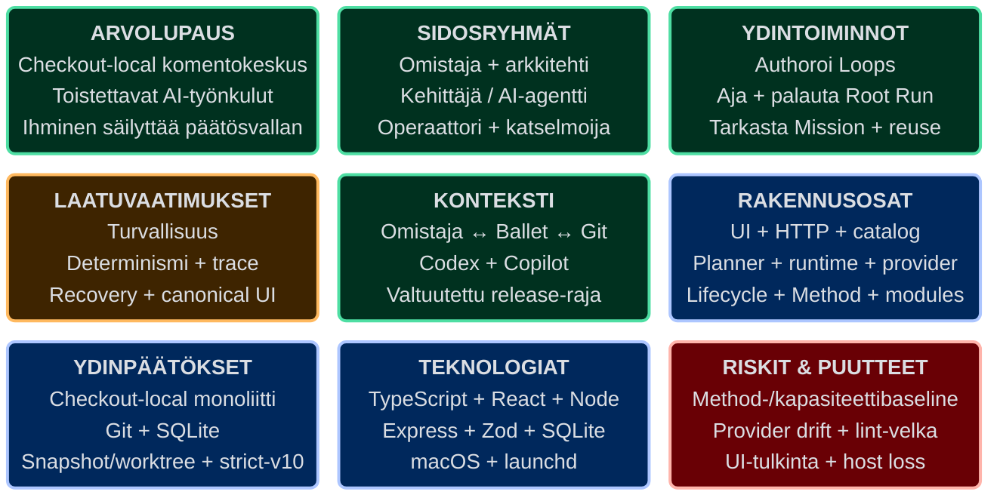

# Ballet — Architecture Communication Canvas

| Kenttä | Arvo |
| --- | --- |
| System | Ballet 0.1.0, alpha |
| Snapshot | 2026-08-17 |
| Iteraatio | 1 |
| Yleisö | Projektin omistaja, arkkitehti, kehittäjä, AI-agentti, operaattori ja katselmoija |
| Käyttötapa | Nykyarkkitehtuurin yhteinen keskustelu- ja perehdytysnäkymä |
| Tila | `draft`, kunnes projektin omistaja katselmoi canvasin |

## Visuaalinen canvas

Lue tämä yhdeksän kortin ruudukko ensin. Kortit muodostavat keskustelun pikakartan; alemmat osiot avaavat jäljitettävät yksityiskohdat.

## Canvasin rooli

Tämä canvas on tiivis, johdettu kommunikaatioprojektio. Se ei hyväksy uutta WHAT/WHY:tä, päätöstä, rajapintaa tai toteutusfaktaa. Goalit omistavat tavoitteen, ADR:t päätökset, arc42-osiot arkkitehtuurin ja lähdekoodi toteutuksen. Ristiriidassa kanoninen lähde voittaa ja canvas korjataan.

Rakenne perustuu viralliseen [Architecture Communication Canvasiin](https://canvas.arc42.org/architecture-communication-canvas). Malli on julkaistu [CC BY-SA 4.0](https://creativecommons.org/licenses/by-sa/4.0/) -lisenssillä.

## Value Proposition — arvolupaus

Ballet on yhteen Git-checkoutiin rajattu komentokeskus, jolla projektin omistaja voi määritellä, suorittaa ja arvioida toistettavia AI-avusteisia työnkulkuja. Projektin intentio, automaatio ja arkkitehtuurievidenssi pysyvät versionhallittuina; provider-suoritus tapahtuu eristetyssä worktreessä; runtime-tila on palautettava ja tarkastettava ilman Ballet-tiliä tai etäohjaustasoa.

Arvo syntyy erityisesti siitä, että ihmisen päätösvalta, providerille annettu täsmällinen tehtävä, State/control flow ja syntynyt lähdekoodimuutos voidaan yhdistää samaan todennettavaan ketjuun. Ballet ei lupaa automaattista mergeä, pushia, releasea tai deployta.

## Key Stakeholders — keskeiset sidosryhmät

| Sidosryhmä | Tarve ja päätösvalta | Canvasin tärkein viesti |
| --- | --- | --- |
| Projektin omistaja | Omistaa WHAT/WHY:n, prioriteetin, hyväksymisen ja ulkoisten kirjoitusten valtuutuksen. | Agentti ei päättele liiketoimintapäätöstä tai ulkoista lupaa implisiittisesti. |
| Ohjelmistoarkkitehti | Tarvitsee rajat, vastuut, transaktiot, päätökset, riskit ja trace-ketjut. | Arc42 ja ADR:t ovat kanoniset; canvas ohjaa oikeaan lähteeseen. |
| Kehittäjä | Tarvitsee rajatun muutospinnan, invariantit ja toistettavat tarkistukset. | Shared schemas, building block -rajat ja nimetty evidenssi rajaavat työn. |
| AI-agentti | Tarvitsee eksplisiittisen roolin, resurssit, oikeudet, output-skeeman ja pysähtymisehdot. | `TaskEnvelope` ja immutable snapshot korvaavat ambient-oletukset. |
| Agenttioperaattori | Tarvitsee yksiselitteisen tiedon nykyisestä sijainnista, roolista, yrityksestä, revisionista ja repairista. | Run UI projisoi vain canonical persistencen; se ei keksi progressia tai ETA:a. |
| Riippumaton katselmoija | Tarvitsee muuttumattoman arviointikohteen ja mitattavan hyväksymisketjun. | BRIEF, PLAN, diffi, testit, EVIDENCE ja REVIEW pidetään erillään. |
| Release-operaattori ja ylläpitäjä | Tarvitsee turvallisen lifecycle-, recovery- ja julkaisuoperaation. | Restart ei replayaa työtä; release ja muu ulkoinen kirjoitus vaativat täsmällisen valtuutuksen. |

## Core Functions — ydintoiminnot

1. **Project authoring:** Goals-, ADR-, arc42-, Loop-, ExecutionProfile-, instruction- ja skill-resurssien lukeminen ja hallittu muokkaus.
2. **Loop authoring:** Context-, composition- ja selected-Loop detail -projektiot sekä yksiselitteinen `LoopEdge`/`Edge`-omistajuus.
3. **Root Run lifecycle:** reachable automationin validointi, immutable snapshot, branch/worktree, käynnistys, Human Validation, cancellation ja finalization.
4. **Deterministinen execution:** exact prompt/hash, vakaa resource order, strict output schema ja provider-kohtaiset FIFO-kaistat Codexille ja Copilotille ilman fallbackia.
5. **Work Loop runtime:** sekventiaalinen Work/Validation-ohjaus, atomiset State-revisiot, rajattu retry sekä capability repair call/return.
6. **Persistence ja recovery:** SQLiteen commitoitu runtime-, queue-, event-, schedule- ja control-flow-evidenssi sekä restart/reconciliation ilman implisiittistä replayta.
7. **Mission control:** Mission / All Loops / live inspector canonical snapshotista ja persistence-read modelista.
8. **Loop module reuse:** yhden Loopin JSON-paketin inspect/plan/commit, export ja provenance-aware removal project-local-resursseiksi.
9. **Checkout lifecycle:** macOS CLI/launchd, paikallinen diagnostiikka, validoitu release-artefakti ja erikseen valtuutettu update.

## Quality Requirements — laatuvaatimukset

| Prioriteetti | Tavoite | Mitattava arkkitehtuurivaste |
| --- | --- | --- |
| 1 | Turvallisuus ja least authority | Väärä Origin, checkout, write root, network-oikeus tai ihmisvaltuutus tuottaa nolla kiellettyä vaikutusta (QS-001, QS-004, QS-007). |
| 1 | Jäljitettävyys ja determinismi | Sama snapshot ja `TaskEnvelope` tuottavat tavutasolla saman promptin, hashin, resurssijärjestyksen ja output-skeeman; compose-virhe jonottaa nolla tehtävää (QS-002, QS-005, QS-011). |
| 1 | Palautettavuus ja eheys | Restart käyttää vain commitoituja faktoja, merkitsee running-työn keskeytyneeksi ilman replayta ja estää cancellationin jälkeisen State-muutoksen (QS-003, QS-012). |
| 1 | Yksiselitteinen operointi | UI näyttää position, roolin, profilen, attemptin, revisionin, repairin, returnin ja finalizationin vain canonical datasta (QS-010, QS-013). |
| 2 | Siirrettävyys ja ylläpidettävyys | Project-local-resurssit, strict contracts, Loop module -materialisointi ja arc42-gate pitävät workflow'n erossa platform-koodista (QS-005, QS-008, QS-009). |

Koko laatupuu, ärsyke–vaste–mitta ja evidenssistatus ovat [arc42-osiossa 10](../10-quality-requirements.md).

## Business Context — liiketoimintakonteksti

| Ulkoinen osapuoli/järjestelmä | Vuorovaikutus Balletin kanssa | Luottamusraja |
| --- | --- | --- |
| Projektin omistaja ja operaattori | Intentio, Run-komento, Human Validation, havainto ja ulkoinen valtuutus. | Ihminen säilyttää WHAT/WHY:n ja external write -vallan. |
| Kehittäjä / AI-agentti | Rajattu toteutus tai arvio; saa täsmällisen tehtävän, tilan ja output-skeeman. | Provider-vastaus ei ole kanoninen ennen schema- ja runtime-validointia. |
| Git-checkout | Lähdekoodi, project truth, historia ja Root Run -worktree. | Active checkout ja Run-worktree ovat erillisiä kirjoitusalueita. |
| Codex ja GitHub Copilot | Saavat canonical taskin adapterin kautta ja palauttavat tapahtumat/outcomen. | Provider ei päätä continuationia eikä Ballet vaihda provideria fallbackina. |
| macOS / launchd | Prosessi-, tiedosto- ja lifecycle-palvelut. | Nykyinen tuettu host-raja on macOS `arm64`/`x64`. |
| GitHub, CI/CD ja Homebrew | Release-evidenssi, artefaktit ja jakelu. | Verkko ja ulkoinen kirjoitus ovat erikseen valtuutettuja toimia. |
| Loop module -paketti | Selain tuo rajatun JSON-sisällön tai valitsee versionhallittua library dataa. | Paketti on epäluotettua dataa, ei executable codea tai live-riippuvuus. |

Täydellinen I/O-, kanava- ja trust boundary -kartta on [arc42-osiossa 3](../03-context-and-scope.md).

## Components / Modules — komponentit ja moduulit

| ID | Rakennusosa | Omistaa | Ei omista |
| --- | --- | --- | --- |
| BB-001 | Frontend operator workspace | Configure/Run-projektiot, editorit ja inspector. | Canonical runtime state tai control flow. |
| BB-002 | HTTP + application services | Request-validointi ja käyttötapausten orkestrointi. | Runtime-continuation tai provider-protokolla. |
| BB-003 | Project catalog | Strict project config, Markdown ja execution-resurssit. | Käynnissä olevan Runin muuttuva snapshot. |
| BB-004 | Root Run planner | Reachability, snapshot, worktree, lifecycle ja finalization. | Provider-kohtainen protokolla. |
| BB-005 | Work Loop runtime | Work/Validation, State revision, retry ja repair call/return. | UI-projektio tai project workflow -sisältö. |
| BB-006 | Provider execution | Composition, queue lanes, adapterit ja event normalization. | Loopin continuation tai provider-fallback. |
| BB-007 | Checkout lifecycle | CLI, launchd, Git-worktree, package ja update. | Automaattinen integraatio remoteen. |
| BB-008 | Project-local arc42 Method | Arkkitehtuurikorpus, initiative-ketjut ja validointi. | Runtime-logien pitkäaikainen kopio. |
| BB-009 | Loop module boundary | Inspect/plan/commit, export, provenance ja remove. | Runtime-aikainen package dependency tai executable hooks. |

Whitebox-vastuut ja lähdekoodiankkurit ovat [arc42-osiossa 5](../05-building-block-view.md).

## Core Decisions — Good or Bad / ydinoletukset ja niiden trade-offit

Canvas ei luokittele hyväksyttyä päätöstä jälkikäteen mielipiteellä “hyväksi” tai “huonoksi”. Se näyttää tavoitellun hyödyn ja tietoisesti kannetun kustannuksen; ADR omistaa perustelun.

| Hyväksytty valinta | Tavoiteltu hyöty | Tietoinen kustannus / kipu | Päätöslähde |
| --- | --- | --- | --- |
| Checkout-local TypeScript-monoliitti | Pieni operointipinta, selkeä identity/trust boundary ja shared contracts. | Ei keskitettyä fleet- tai remote browser -hallintaa. | ADR-001, ADR-003 |
| Versionhallittu project truth erotetaan machine-local runtimesta | Intentio on katselmoitava ja runtime voidaan palauttaa paikallisesti. | Git- ja SQLite-lähteiden omistajuus on pidettävä tarkkana. | ADR-002, ADR-007 |
| Immutable snapshot ja dedicated branch/worktree | Run pysyy todennettavana eikä kirjoita active checkoutiin. | Käynnissä oleva Run ei omaksu config-muutosta. | ADR-006 |
| Eksplisiittiset resurssit, provider-neutral adapterit, ei fallbackia | Promptin provenance ja provider-erojen eristys. | Capability- tai composition-virhe pysäyttää työn. | ADR-005, ADR-012, ADR-013 |
| Strict-v10, sekventiaalinen Root Run ja revisionoitu State | Control flow, retry, repair ja recovery ovat yksiselitteisiä. | Yhden Runin sisäinen rinnakkaisuus on tietoisesti rajattu. | ADR-015 |
| Project-local arc42 Method ja Loop module -materialisointi | Workflow ja reuse kehittyvät ilman platform-kovakoodausta tai live registryä. | Projekti vastaa oman menetelmä- ja pakettidatansa laadusta. | ADR-011, ADR-014, ADR-016 |
| Kolmitasoinen authoring ja canonical Run-projektio | Monimutkaisuus ja runtime-faktat voidaan näyttää oikealla abstraktiotasolla. | UI-read modelin drift ja koristeellisen kartan väärintulkinta vaativat testejä. | ADR-017 |

## Technologies — teknologiat

- **Frontend:** strict TypeScript, React 18, Vite 6, Tailwind 4, shadcn/Base UI sekä XYFlow/Dagre.
- **Backend:** Node.js 22 release-baseline, TypeScript/ESM, Express 4 ja Zod 4.
- **Data:** Git + Markdown/JSON/YAML project truthille; SQLite schema v9 + `better-sqlite3` runtime- ja tracker-outboxille; `.tickets/orchestration` ja `.tickets/work` issueille; Git branch/worktree lähdekooditulokselle.
- **Execution:** Codex app-server -adapteri, `@github/copilot-sdk`, provider-kohtaiset FIFO-kaistat ja strict outcome schemas.
- **Lifecycle:** macOS `arm64`/`x64`, launchd, npm, GitHub Actions, GitHub Releases/attestations ja Homebrew.
- **Quality:** Vitest, Testing Library, strict TypeScript build, ESLint, arc42-validator ja design.md-lint.

Versiot, sizing ja pinon rajat on koottu [Tech Stack Canvasiin](TECH-STACK-CANVAS.md).

## Risks and Missing Information — riskit ja puuttuva tieto

| Tyyppi | Nykyinen tieto | Seuraava evidenssi tai päätös |
| --- | --- | --- |
| RISK-001 | Ensimmäinen end-to-end arc42 Method -pilotti ja tuotantokaltaiset kapasiteetti-/latency-baselinet puuttuvat. | Aja rajattu pilotti ja kirjaa METHOD-HEALTH-mitat. |
| RISK-007 | Providerin capability/protocol drift voi estää preflightin tai adapterin. | Capability probe- ja adapteritestit jokaisen provider-päivityksen yhteydessä. |
| RISK-011 | ESLint-baseline on 0 erroria / 14 warningia; ylläpidettävyysvelka voi kasvaa. | Warning-määrä ei saa kasvaa; poisto erillisessä rajatussa työssä. |
| RISK-012 | Run-kartan koristeelliset elementit voidaan tulkita progressiksi tai runtime-stateksi. | QS-013-projektiotestit ja ihmisarvio käytettävyydestä. |
| Puuttuva operatiivinen tieto | Host-loss backup/restore, HA, non-macOS-hosting ja ulkoinen observability eivät ole hyväksyttyjä ratkaisuja. | Uusi Goal/ADR vain, jos product scope laajenee. |
| Puuttuva liiketoimintatieto | Käyttäjämäärä-, kustannus-, hinnoittelu- ja hyötybaselinea ei ole hyväksytyssä korpuksessa. | Projektin omistaja päättää, tarvitaanko business-case-mittaus. |
| Puuttuva compliance-tieto | Sertifiointi-, regulatory- tai henkilötietojen käsittelyvaatimusta ei ole hyväksytty. | Scope-muutos vaatii privacy/compliance-arvion ennen teknistä valintaa. |

Täydellinen riskirekisteri on [arc42-osiossa 11](../11-risks-and-technical-debt.md).

## Kanoniset lähteet ja päivitystriggeri

- WHAT/WHY: `.ballet/goals/**`.
- Päätökset: `.ballet/adr/**` ja [arc42-osio 9](../09-architecture-decisions.md).
- Vastuut, ajot ja deployment: [osiot 3–8](../03-context-and-scope.md).
- Laatu, riskit ja termit: [osiot 10–12](../10-quality-requirements.md).
- Toteutettu pinta: `frontend/`, `backend/`, `shared/`, `package.json` ja `.github/workflows/release.yml`.

Päivitä canvas, kun arvolupaus, keskeinen sidosryhmä, building block -vastuu, hyväksytty ADR, teknologiaperusta tai project-tason riski muuttuu. Pelkkä initiative-kohtainen evidenssi päivittää ensisijaisesti oman kanonisen lähteensä.
