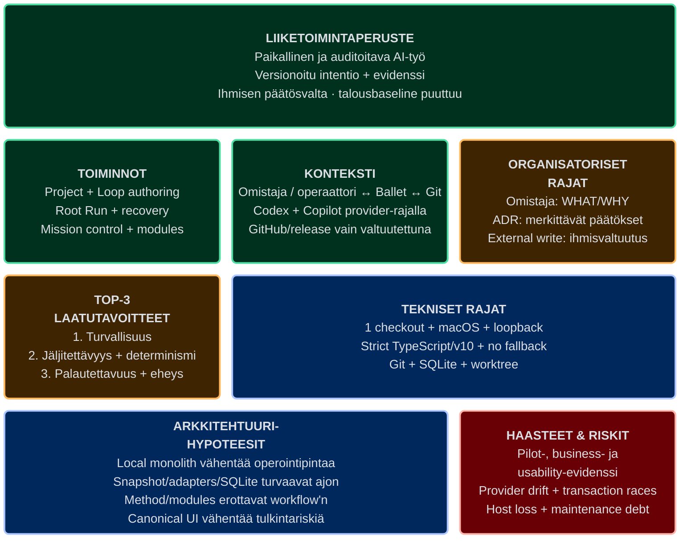

# Ballet — Architecture Inception Canvas

| Kenttä | Arvo |
| --- | --- |
| System | Ballet 0.1.0, alpha |
| Snapshot | 2026-08-17 |
| Iteraatio | 1 |
| Käyttötapa | Retrospektiivinen inception-näkymä olemassa olevasta järjestelmästä |
| Päätösomistaja | Projektin omistaja |
| Tila | `draft`, kunnes projektin omistaja katselmoi canvasin |

## Visuaalinen canvas

Lue tämä kahdeksan kortin ruudukko ensin. Se näyttää aloitusasetelman, tärkeimmät rajat ja epävarmuudet; yksityiskohtainen proosa erottaa alempana faktat, päätökset ja hypoteesit.

## Canvasin rooli

Ballet on jo toteutettu järjestelmä, joten tämä ei ole greenfield-workshopin pöytäkirja. Canvas rekonstruoi aloitusnäkymän hyväksytyistä Goaleista, ADR:istä, arc42-korpuksesta ja nykyisestä työpuusta. **Fakta** kuvaa todennettua nykytilaa, **hyväksytty päätös** viittaa kanoniseen lähteeseen ja **hypoteesi** pysyy testattavana oletuksena; canvas ei muuta mitään niistä uudeksi totuudeksi.

Rakenne perustuu viralliseen [Architecture Inception Canvasiin](https://canvas.arc42.org/architecture-inception-canvas). Malli on julkaistu [CC BY-SA 4.0](https://creativecommons.org/licenses/by-sa/4.0/) -lisenssillä.

## Business Case — liiketoimintaperuste

**Hyväksytty intentio:** Ballet vähentää AI-avusteisen ohjelmistotyön koordinointi-, toistettavuus- ja todentamisongelmia pitämällä projektin WHAT/WHY:n, automaation, arkkitehtuurin ja evidenssin yhdessä checkoutissa. Ihminen säilyttää hyväksymisen ja ulkoisten vaikutusten vallan, kun agentit saavat rajatut, versionhallittavat tehtävät.

**Toteutettu vastaus:** checkout-local SPA/palvelu, strict-v10 Loops, immutable Root Run -snapshot, Git-worktree, provider-neutral execution, SQLite-runtime, Mission/All Loops -havaittavuus, project-local arc42 Method ja Loop module -materialisointi.

**Puuttuva tieto:** hyväksytty korpus ei sisällä käyttäjämäärää, rahallista hyötyä, kehitys-/operointikustannusta, hinnoittelua tai vaihtoehtokustannuksen baselinea. Canvas ei keksi niitä. Projektin omistaja päättää, tarvitaanko erillinen business-case-mittaus ennen seuraavaa investointipäätöstä.

## Functional Overview — toiminnallinen yleiskuva

1. **Paikallinen komentokeskus (REQ-001):** selaa ja hallitse yhtä täsmällistä Git-checkoutia ilman Ballet-tiliä tai remote control planea.
2. **Versionhallittu project truth (REQ-002, REQ-009):** Goals, ADR:t, arc42, project config, instructionit, skillit ja initiative-evidenssi pysyvät katselmoitavina.
3. **Provider task composition (REQ-003):** ratkaise `ExecutionProfile`, primary instruction, skillit, `TaskEnvelope` ja output schema deterministisesti Codexille tai Copilotille.
4. **Loop runtime (REQ-004, REQ-006):** aja Work/Validation sekventiaalisesti revisionoidulla Statella, retryllä, repair call/returnilla, persistoidulla jonolla ja restart-recoveryllä.
5. **Eristetty toimitustyö (REQ-005):** snapshottaa ja suorita dedicated Git branch/worktreessä; älä mergeä tai pushaa automaattisesti.
6. **Operaattorikokemus (REQ-007, REQ-011):** authoroi Context/composition/detail-tasoilla ja tarkasta Run Mission / All Loops / live inspector -näkymässä ilman keksittyä runtime-tilaa.
7. **Lifecycle ja jakelu (REQ-008):** asenna ja aja checkout-kohtainen macOS-palvelu sekä tuota validoidut `arm64`/`x64`-artefaktit.
8. **Loop reuse (REQ-010):** inspect, plan, commit, export ja remove yhden Loopin strict JSON-paketti project-local-resursseiksi ilman live package -riippuvuutta.

## Quality Goals — kolme tärkeintä laatutavoitetta

| Prioriteetti | Tavoite | Konkreettinen onnistumisehto |
| --- | --- | --- |
| 1 | Turvallisuus | Checkout-, worktree-, verkko- ja ihmisvaltuutusrajan rikkominen tuottaa nolla kiellettyä kirjoitusta (QS-001, QS-004, QS-007). |
| 1 | Jäljitettävyys ja determinismi | Intentio, snapshot, exact prompt/hash, State/control flow, lähdekoodimuutos, testi ja evidenssi voidaan yhdistää vakailla ID:illä ilman rinnakkaista totuutta (QS-002, QS-005, QS-011). |
| 1 | Palautettavuus ja eheys | Restart, interruption ja cancellation jatkavat vain täysin commitoiduista faktoista eivätkä replayaa tai monista hyväksyttyä vaikutusta (QS-003, QS-012). |

Yksiselitteinen UI (QS-010, QS-013) on tärkeä vastaus näihin kolmeen tavoitteeseen, ei canvasissa niiden ohi nostettu neljäs prioriteetti.

## Business Context — liiketoimintakonteksti

| Osapuoli / järjestelmä | Balletiin tuleva tieto | Balletista lähtevä tieto tai vaikutus |
| --- | --- | --- |
| Projektin omistaja / operaattori | Goalit, Run-komento, Human Validation ja ulkoinen valtuutus. | Canonical tila, evidenssi, worktree-tulos ja pyydetty päätös. |
| Kehittäjä / AI-agentti | Rajattu muutos, analyysi tai strict outcome. | Rooli, `TaskEnvelope`, resurssit, State ja repair request. |
| Riippumaton katselmoija | Conformance- ja hyväksymishavainto. | BRIEF, PLAN, diffi, testit, EVIDENCE ja REVIEW. |
| Git-checkout | Lähdekoodi, project truth ja historia. | Dedicated worktree -tulos; integraatio vain ihmisvaltuutuksella. |
| Codex / GitHub Copilot | Provider-eventit ja schema-validi outcome tai virhe. | Exact prompt, profiili, oikeudet ja output schema adapterin kautta. |
| macOS / launchd | Paikallinen process/filesystem/lifecycle. | Checkout-kohtainen daemon, status ja rotating logs. |
| GitHub / CI/CD / Homebrew | Remote-status, build- ja release-evidenssi. | Push/release/deploy/update vain täsmällisen valtuutuksen polussa. |

Järjestelmäraja ja tekniset kanavat ovat [arc42-osiossa 3](../03-context-and-scope.md).

## Organisational Constraints — organisatoriset rajoitteet

| Rajoite | Seuraus |
| --- | --- |
| Projektin omistaja omistaa WHAT/WHY:n, prioriteetin ja hyväksymisen. | AI-agentti pysähtyy `needs_input`-tilaan eikä keksi puuttuvaa päätöstä. |
| Merkittävä, kallis tai vaikeasti peruttava arkkitehtuurivalinta vaatii ihmisarvioidun ADR:n. | Hyväksyttyä päätöstä ei muuteta canvasissa, koodissa tai dokumenttichurnilla hiljaisesti. |
| Merge, push, release, deploy, rollback ja muu ulkoinen kirjoitus vaativat täsmällisen valtuutuksen. | Testien läpäisy tai Validation-tulos ei itsessään anna julkaisulupaa. |
| Roadmap-, milestone-, delivery- ja arc42-workflow on project-local-dataa. | Platform-koodi toteuttaa vain yleisiä Loop/runtime/provider/persistence-primitivejä. |
| Oletusmenetelmä on clarify → structures → concepts → communicate → implementation → evaluate. | Validation saa pyytää allowlistatun repairin; flow ei ole vesiputous eikä automaattinen julkaisuputki. |
| Aktiivinen arkkitehtuurikorpus on suomeksi; stable ID:t ja lähdekooditermit pysyvät muuttumattomina. | Dokumentointi palvelee paikallista yleisöä rikkomatta koneellisia sopimuksia. |

## Technical Constraints — tekniset rajoitteet

| Rajoite | Arkkitehtuurivaikutus |
| --- | --- |
| Yksi checkout on yksi service identity, Node/Express-prosessi ja SQLite-kanta. | Ei keskitettyä account/control planea tai checkoutien jaettua runtimea. |
| UI/API on loopbackissa ja tuotantoalusta on nykyisin macOS `arm64`/`x64`. | Remote browser, cloud hosting ja non-macOS eivät ole hyväksyttyä scopea. |
| Strict TypeScript/shared schemas ja Zod-validointi ovat boundary-sopimus. | Invalidi input/output failaa ennen canonical mutationia. |
| Strict-v10 Root Run muuttaa Statea yhden Node-roolin kautta kerrallaan. | Revision-, retry-, repair- ja finalization-järjestys pysyy yksiselitteisenä. |
| Immutable snapshot ja dedicated Git worktree ovat Node-kirjoitusraja. | Active checkout ei muutu Runissa eikä config hot-reload vaikuta käynnissä olevaan Runiin. |
| Provider, profiili, instructionit, skillit ja output schema ratkaistaan eksplisiittisesti. | Ambient resurssia tai provider-fallbackia ei käytetä. |
| SQLite on canonical machine-local runtime store; Git omistaa project truthin ja lähdekoodituloksen. | Transaktiorajat ja omistajuus on pidettävä erillään; host-loss HA/backup ei sisälly ratkaisuun. |
| Loop module on strict data package, joka materialisoidaan project-local-resursseiksi. | Ei executable hooksia, backendin arbitrary pathia, remote fetchiä tai runtime-aikaista registry-riippuvuutta. |
| `DESIGN.md` omistaa UI-tokenit ja visuaaliset periaatteet. | Run-koriste ei saa muodostua runtime-semantikan lähteeksi. |

## Architecture Hypotheses — arkkitehtuurihypoteesit

Nämä hypoteesit eivät ole uusia ADR-päätöksiä. “Tuettu” tarkoittaa, että nykyinen rakenne ja paikallinen evidenssi tukevat väitettä; se ei korvaa puuttuvaa tuotantokaltaista tai käyttäjäevidenssiä.

| ID | Hypoteesi | Nykyinen evidenssi | Tila ja puute |
| --- | --- | --- | --- |
| HYP-AIC-001 | Checkout-local-monoliitti pienentää operointi- ja privacy-pintaa riittävästi ensimmäiseen käyttötapaukseen. | ADR-001/002, CON-001 ja QS-001:n local boundary -testit. | Rakenteellisesti tuettu; monen käyttäjän/fleetin tarvetta ei ole mitattu. |
| HYP-AIC-002 | Immutable snapshot + worktree tekee agenttityöstä turvallisesti attribuoitavan ja myöhemmin tarkastettavan. | ADR-006, RT-001, QS-004 ja Git-worktree-testit. | Paikallisesti tuettu; pitkäkestoisen Runin operatiivinen baseline puuttuu. |
| HYP-AIC-003 | Strict composition ja provider-adapterit säilyttävät determinismin ja provider-neutralin runtimen. | ADR-005/012/013, RT-008 ja QS-011 composition/adapter-testit. | Paikallisesti tuettu; provider protocol drift jää jatkuvaksi riskiksi. |
| HYP-AIC-004 | SQLite-transaktiot ja persistent queue mahdollistavat restartin ilman replayta tai duplicate canonical outcomea. | ADR-007/015, RT-010 ja QS-012 recovery/cancellation-testit. | Paikallisesti tuettu; host-loss backup/restore ei kuulu nykyiseen ratkaisuun. |
| HYP-AIC-005 | Project-local arc42 Method ja Loop module -materialisointi sallivat workflow'n kehittymisen ilman platform-kovakoodausta tai live package -riippuvuutta. | ADR-011/014/016, BB-008/009, QS-008/009 ja module smoke -evidenssi. | Rakenteellisesti tuettu; ensimmäinen end-to-end Method -pilotti puuttuu. |
| HYP-AIC-006 | Canonical-dataan sidottu authoring/Run UI vähentää operaattorin tulkintavirheitä. | ADR-017, BB-001, QS-010/013 ja projection/panel-testit. | Automaattisesti tuettu; ihmisillä mitattu usability-evidenssi puuttuu. |

## Technical Challenges & Risks — tekniset haasteet ja riskit

| Haaste/riski | Vaikutus | Nykyinen kontrolli tai seuraava askel |
| --- | --- | --- |
| RISK-001: Method-pilotin ja kapasiteetin baseline puuttuu. | Arkkitehtuurin hyötyä, suorituskykyä ja ihmisrajojen kitkaa ei voida vielä yleistää. | Aja rajattu end-to-end-pilotti ja kirjaa METHOD-HEALTH/EVIDENCE. |
| Provider capability/protocol drift (RISK-007). | Preflight tai adapteri voi lakata toimimasta. | Fail-closed capability probe, pinned dependencies ja adapteritestit; ei fallbackia. |
| State/control-flow/recovery-transaktiot. | Osittainen commit voisi replayata tai monistaa vaikutuksen. | Revision checks, SQLite-transaktio, startup reconciliation ja QS-012. |
| Snapshot/worktree/finalization-kilpailut. | Stale työalue, väärä status tai myöhäinen payload voisi muuttaa tilaa. | Immutable snapshot, cancellation/finalization barrier ja restart-skenaario RT-010. |
| Prompt supply chain ja Loop package trust. | Epäluotettu instruction/skill/package voisi laajentaa tehtävää tai oikeuksia. | Size/schema/provenance/diff, inspect/plan/commit, network-off ja explicit resources. |
| Ylläpidettävyysvelka (RISK-011). | 14 lint warningia ja laaja TypeScript-monoliitti voivat kasvattaa muutosriskiä. | 0 erroria, warning-baseline ei kasva, vastuurajojen conformance review. |
| Run-visualisoinnin väärintulkinta (RISK-012). | Operaattori voisi tehdä päätöksen koristeen eikä canonical tilan perusteella. | QS-013, semanttinen inspector ja ihmisillä tehtävä käytettävyyskatselmus. |
| Host-loss, HA ja backup/restore. | Checkout-local-kannan menetys ei palaudu nykyarkkitehtuurilla. | Ei ratkaistu nykyisessä scopessa; vaatii Goal/ADR:n ennen toteutusta. |
| Liiketoimintamittareiden puute. | Investoinnin hyötyä ei voida kvantifioida. | Projektin omistaja päättää business-case-evidenssin tarpeen. |

Kattava riskirekisteri ja omistajat ovat [arc42-osiossa 11](../11-risks-and-technical-debt.md).

## Hyväksymis- ja päivitysraja

Canvas voidaan hyväksyä nykytilan inception-projektioksi, kun projektin omistaja vahvistaa:

- että Business Case vastaa hyväksyttyä intentiota ilman keksittyä talousväitettä;
- että kolme laatutavoitetta ovat oikeassa prioriteettijärjestyksessä;
- että HYP-AIC-001–006 ovat oikeita testattavia väitteitä eivätkä uusia päätöksiä; ja
- että puuttuvat business-, pilot-, usability- ja host-loss-tiedot näkyvät riittävän selvästi.

Päivitä canvas, kun hyväksytty Goal, tärkeimmän laatutavoitteen prioriteetti, organisatorinen/tekninen rajoite, perustava ADR tai hypoteesin evidenssistatus muuttuu.

## Kanoniset lähteet

- WHAT/WHY ja vaatimukset: `.ballet/goals/**` ja [arc42-osio 1](../01-introduction-and-goals.md).
- Rajoitteet ja konteksti: [arc42-osiot 2–3](../02-constraints.md).
- Strategia ja päätökset: [arc42-osio 4](../04-solution-strategy.md), `.ballet/adr/**` ja [arc42-osio 9](../09-architecture-decisions.md).
- Laatu, riskit ja evidenssi: [arc42-osiot 10–11](../10-quality-requirements.md), [TRACEABILITY](../TRACEABILITY.md) ja initiative-ketjut.
