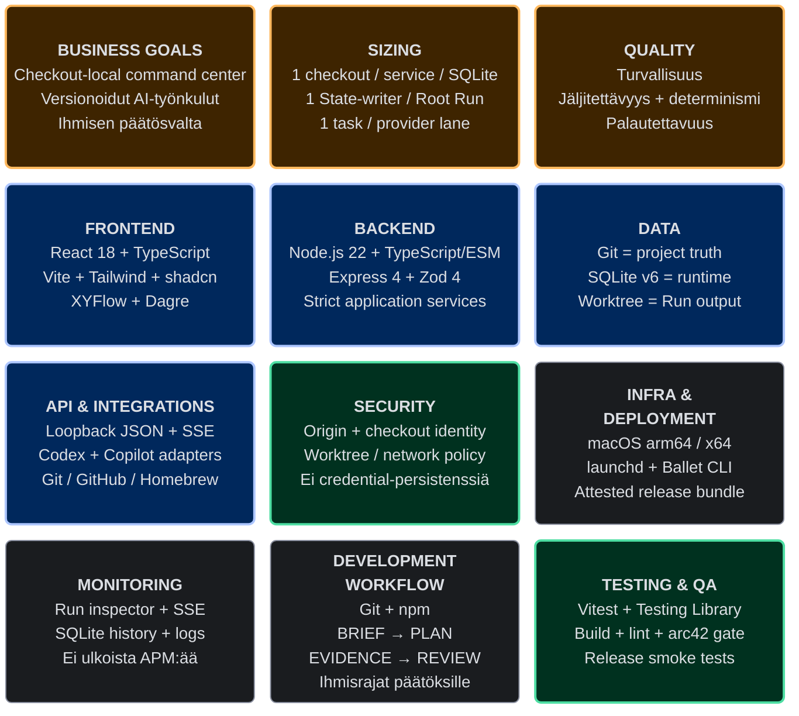

# Ballet — Tech Stack Canvas

| Kenttä | Arvo |
| --- | --- |
| Product | Ballet 0.1.0, alpha |
| Snapshot | 2026-08-17 |
| Iteraatio | 1 |
| Scope | Nykyisen repositoryn status quo; ei tulevaisuuden teknologiavalintaa |
| Yleisö | Projektin omistaja, arkkitehti, kehittäjä, AI-agentti ja operaattori |
| Tila | `draft`, kunnes projektin omistaja katselmoi canvasin |

## Visuaalinen canvas

Lue tämä ruudukko ensin. Jokainen kortti tiivistää yhden virallisen Tech Stack Canvas -elementin; alemmat osiot sisältävät perustelut, rajat ja lähdeankkurit.

## Canvasin rooli

Tämä canvas on yhden sivun teknologiaprojektio, ei uusi päätös- tai vaatimuslähde. Goalit omistavat WHAT/WHY:n, ADR:t teknologiavalintojen perustelut, arc42-osiot arkkitehtuurinäkymät, `package.json` riippuvuusversiot ja lähdekoodi toteutetun käyttäytymisen. Ristiriidassa kanoninen lähde voittaa ja canvas päivitetään.

Rakenne perustuu viralliseen [Tech Stack Canvasiin](https://techstackcanvas.io/), jonka kentät kattavat business goals-, sizing-, quality-, frontend-, backend-, data-, infrastructure-, monitoring-, workflow-, integration-, testing- ja security-näkökulmat. Malli on julkaistu [CC BY-SA 4.0](https://creativecommons.org/licenses/by-sa/4.0/) -lisenssillä.

## Business Goals

1. **Checkout-local-komentokeskus:** määrittele, suorita ja tarkasta AI-avusteiset työnkulut ilman Ballet-tiliä tai remote control planea (`goal-001`, REQ-001).
2. **Versionhallittu ja toistettava automaatio:** pidä intentio, Loops, ExecutionProfiles, instructionit, skillit ja arkkitehtuurievidenssi Gitissä (`goal-002`, REQ-002, REQ-009).
3. **Hallittu multi-provider-suoritus:** suorita Codex- ja Copilot-roolit deterministisesti, eristetyssä worktreessä ja palautettavalla canonical Statella (`goal-003`–`goal-006`, REQ-003–REQ-006).

## Sizing

| Päätökseen vaikuttava numero | Nykyinen raja tai baseline | Arkkitehtuurin seuraus | Lähde |
| --- | --- | --- | --- |
| Deployment boundary | 1 täsmällinen checkout → 1 service identity, Node/Express-prosessi ja SQLite-kanta | Ei keskitettyä monen checkoutin kontrollitasoa; checkoutit skaalautuvat erillisinä yksikköinä. | DEP-001, CTR-001 |
| Root Run -samanaikaisuus | Yksi Statea muuttava Node-rooli kerrallaan yhdessä Root Runissa | Control flow ja State-revisiot pysyvät yksiselitteisinä. | RT-001, CON-002 |
| Provider-samanaikaisuus | 1 running task / provider FIFO lane; Codex- ja Copilot-kaistat voivat edetä rinnakkain | Provider-kohtainen järjestys säilyy ilman koko järjestelmän globaalia serialisointia. | RT-008, BB-006 |
| State ja prompt context | State 256 KiB; relevant history 64 KiB; Task Envelope 384 KiB; valmis prompt 512 KiB | Oversize failaa suljetusti; sisältöä ei typistetä semanttisesti. | `README.md`, QS-011 |
| Project execution resource | Primary instruction 128 KiB; yksittäinen skill 128 KiB | Resource catalog estää liian suuren prompt supply chain -resurssin preflightissa. | `ExecutionResourceCatalog.ts` |
| Snapshot | 32 MiB / tiedosto; 256 MiB / configuration snapshot | Root Run pysyy paikallisesti käsiteltävänä ja liian suuri snapshot estyy ennen suoritusta. | `LocalWorkspaceManager.ts` |
| Event/log retention | Non-terminal console 1 MiB / task; application log 20 MiB ja 5 backupia | Diagnostiikka on rajattu; terminal events ja truncation-status säilyvät. | `ExecutionStore.ts`, `RotatingFileLogger.ts`, `README.md` |
| Tuettu release-matriisi | macOS `arm64` ja `x64`; Node 22 release CI:ssä | Native `better-sqlite3` paketoidaan ja smoke-testataan per arkkitehtuuri. | DEP-003, `.github/workflows/release.yml` |
| Nykyinen Ballet-project-topologia | 11 Loopia, 20 Work Loop Nodea, 6 Human Validation -porttia, 62 LoopEdgeä | Tämä on ADR-019:n yhden vastuun project-data-baseline, ei platformin kovakoodattu maksimi. | `.ballet/project.json`, `validate:arc42` |

## Major Quality Attributes

| Prioriteetti | Laatu | Teknologiavaikutus | QS |
| --- | --- | --- | --- |
| 1 | Turvallisuus ja least authority | Loopback, Origin-policy, worktree-only writes, network-off-profiilit, strict validation ja ihmisvaltuutus external writeen. | QS-001, QS-004, QS-007 |
| 1 | Jäljitettävyys ja determinismi | Immutable snapshot, exact prompt/hash, stable resource order, strict schemas, Git- ja SQLite-evidenssi. | QS-002, QS-005, QS-011 |
| 1 | Palautettavuus ja eheys | SQLite-transaktiot, append-only State revisions, persistent queue, interruption/no-replay ja cancellation barrier. | QS-003, QS-012 |
| 1 | Yksiselitteinen operointi | Typed React-projektiot, Mission / All Loops / live inspector ja ei keksittyä telemetriaa. | QS-010, QS-013 |
| 2 | Siirrettävyys ja ylläpidettävyys | Git-owned project resources, one-Loop-module materialization, TypeScript/shared contracts ja arc42-validation. | QS-005, QS-008, QS-009 |

## Frontend Technologies

| Valinta | Käyttö | Peruste ja seuraus |
| --- | --- | --- |
| TypeScript, ES2022, strict mode | React SPA ja shared API/domain contracts | Sama tyypitetty kieli frontendissä, backendissä ja shared-rajalla; compile-time boundary tukee ADR-003:a. |
| React 18.3 + React DOM | Configure- ja Run-workspacet | Paikallinen SPA ilman erillistä frontend-palvelua tuotannossa. |
| Vite 6 + React plugin | Dev server, bundlaus ja chunking | Nopea paikallinen kehitys; tuotantoassetit palvellaan checkout-kohtaisesta palvelusta. |
| Tailwind CSS 4 + shadcn 4 + Base UI 1.6 | Token-driven UI primitives | `DESIGN.md` omistaa cyber-industrial-tyylin; featuret käyttävät shared/shadcn-kerrosta. |
| XYFlow 12 + Dagre 3 + smart-edge 4 | Loop Engineer ja Run-topologia | Graafi on domain-projektio; layout/edge-ornamentti ei omista runtime-statea. |
| React Markdown 10 + remark-gfm 4 | Goals-, ADR-, arc42- ja instruction-näkymät | Repositoryn Markdown esitetään ilman rinnakkaista dokumenttiformaattia. |
| Inter + Geist Mono, Lucide React | Typografia ja ikonit | Noudattaa `DESIGN.md`:n informaatiotiheyttä ja saavutettavaa visuaalista kieltä. |

Lähdeankkurit: `frontend/src/`, `vite.config.ts`, `DESIGN.md`, `package.json` ja BB-001.

## Backend Technologies

| Valinta | Käyttö | Peruste ja seuraus |
| --- | --- | --- |
| Node.js 22 release-baseline | Checkout-local service, CLI ja provider-prosessit | Yksi paikallinen prosessi ja standardikirjasto; `package.json` ei tällä hetkellä määritä `engines`-kenttää. |
| TypeScript 6 toolchain, ES modules | Backend, CLI ja shared contracts | Sama strict TypeScript -arkkitehtuuri; backend buildaa `dist-server`-hakemistoon. |
| Express 4.19 | Loopback HTTP/JSON/SSE API | Pieni local boundary; ei remote API gatewayta tai palveluverkkoa. |
| Zod 4.4 | API-, project-, runtime-, outcome- ja package-skeemat | Fail-closed-validointi ja koneellisesti tarkat issue-polut. |
| `@js-temporal/polyfill` 0.5 | Time zone- ja DST-tietoinen scheduler | Schedule-laskenta käyttää eksplisiittisiä instant/date/time zone -arvoja. |
| Git child processes ja filesystem API | Snapshot, branch/worktree, status ja commit | Git on execution isolation/provenance -mekanismi; active checkout ei ole Node-työalue. |
| YAML 2.9 ja `smol-toml` 1.7 | Markdown-frontmatter ja paikallisten konfiguraatiomuotojen jäsennys | Tekstipohjaiset project-resurssit pysyvät katselmoitavina. |

Lähdeankkurit: `backend/`, `shared/`, `tsconfig.node.json`, `package.json` sekä BB-002–BB-007.

## Data Storage & Management

| Teknologia/data | Omistettu tieto | Rajaus |
| --- | --- | --- |
| Git + Markdown/JSON/YAML | Goals, ADR:t, arc42, `.ballet/project.json`, theme, instructionit, skillit ja Loop packages | Versionhallittu project truth; ei runtime task/event -historiaa. |
| SQLite schema v6 + `better-sqlite3` 12.11 | Root/Loop/Node Runit, State revisions, repair frames, tasks/events ja schedule state | `.git/ballet/state.sqlite`; checkout-local, synchronous transaction boundary, ei jaettua HA-kantaa. |
| Git branch/worktree | Root Runin mutable source/output | Dedicated worktree per Run; onnistuminen voidaan commitoida, epäonnistuminen säilyttää diagnostiikan. |
| JSON machine-local settings | Provider command overrides, read-only roots ja service identity | `.git/ballet`; ei versionhallintaan eikä credential-storeksi. |
| Rotating text logs | Application- ja launchd-diagnostiikka | Paikallinen diagnostiikka, ei canonical control flow eikä ulkoinen logipalvelu. |

## Infrastructure & Deployment

- **Host:** paikallinen macOS `arm64`/`x64`.
- **Lifecycle:** checkout-kohtainen `launchd` job ja Ballet CLI (`start`, `stop`, `restart`, `status`, `logs`, `update`, `version`).
- **Network:** React UI ja Express API loopbackissa; provider-verkkoyhteys vain eksplisiittisen `ExecutionProfile`-valinnan kautta.
- **Build:** TypeScript project references, Vite/Rollup ja native `better-sqlite3`-paketointi.
- **Release:** GitHub Actions matrix build Node 22:lla, Vitest/lint, SHA-256-checksums, GitHub artifact attestation, GitHub Release ja Homebrew formula.
- **Activation:** verified updater tai paikallinen release install; julkaiseminen ja ulkoinen kirjoitus vaativat ihmisvaltuutuksen.

Kanoninen deployment-kuvaus: [osio 7](../07-deployment-view.md), DEP-001–DEP-003.

## Monitoring & Analytics

| Nykyinen ratkaisu | Mitä se näyttää | Tunnettu raja |
| --- | --- | --- |
| `ballet status` / `ballet logs` | Process, launchd, checkout identity, provider readiness ja rotating logs | Paikallinen; ei keskitettyä fleet-näkymää. |
| Cursor-resumable SSE | Provider-neutral console events ja reconnect | 1 MiB non-terminal retention per task; providerin hidden reasoningia ei säilytetä. |
| SQLite runtime history + Run UI | Root Run-, State-, repair-, queue-, cancellation- ja finalization-evidenssi | Checkout-local; ei host-loss backup/restore -ratkaisua. |
| METHOD-HEALTH ja TRACEABILITY | Arkkitehtuuri-/menetelmäevidenssin gapit ja handoff | Ensimmäinen end-to-end-pilot baseline on vielä pending. |

**Ei käytössä:** ulkoinen APM, metrics backend, crash reporting, product analytics tai käyttäjäseuranta. Niitä ei oleteta ilman uutta Goal-/ADR-/privacy-arviota.

## Development Workflow & Collaboration

- Git-diffiin perustuva versionhallittu project truth ja conventional commit -käytäntö.
- npm + `package-lock.json`; paikallinen `npm run dev`, `build`, `test`, `lint` ja `validate:arc42`.
- Yhden vastuun project-local Ballet Method: specification clarification → solution strategy → Building Block View → runtime/deployment → crosscutting concepts → architecture decision → communication → implementation → evaluation sekä continuous learning.
- BRIEF/PLAN/EVIDENCE/REVIEW per bounded initiative; ihmisrajat WHAT/WHY:lle, ADR:lle ja external writeille.
- ESLint 9 + typescript-eslint; tunnettu baseline 0 erroria / 14 warningia (RISK-011).
- `DESIGN.md` ja design.md-lint UI-designjärjestelmän ylläpitoon.

## API & Integrations

| Rajapinta | Teknologia/protokolla | Trust boundary |
| --- | --- | --- |
| Browser ↔ Ballet | Loopback HTTP JSON ja SSE, shared TypeScript/Zod schemas | Origin/request-validointi; browser ei lue SQLitea suoraan. |
| Ballet ↔ Codex | Codex CLI app-server, JSON-RPC/event-normalization | Exact prompt + schema; credentials/provider ambient context jää providerille. |
| Ballet ↔ GitHub Copilot | `@github/copilot-sdk` 1.0.6 ja CLI-capability probe | Sama canonical task/outcome -portti; ei fallbackia. |
| Ballet ↔ Git | Paikalliset Git-komennot | Root Run -worktree write boundary; remote ei ole Run-oletus. |
| Release ↔ GitHub/Homebrew | GitHub Actions, Releases, attestations ja tap repository | Ulkoinen kirjoitus vain erikseen valtuutetussa release-polussa. |
| Loop module import | Browser File API → bounded JSON loopback API | Ei arbitrary server pathia, remote fetchiä tai executable package codea. |

## Testing & QA

- **Unit/integration:** Vitest 4.1 kahdessa projektissa (`node` backendille, `jsdom` frontendille).
- **UI:** Testing Library React, user-event ja jest-dom; typed route/projection/panel -testit.
- **Contract:** Zod/schema-, HTTP-, outcome-, Task Envelope-, State-, recovery-, queue-, scheduler- ja module-testit.
- **Static gates:** strict TypeScript build, ESLint ja `git diff --check`.
- **Architecture:** `npm run validate:arc42` tarkistaa 12 osiota, stable ID:t, trace/linkit, State-contractin ja strict-v10-graafin.
- **Release:** macOS arm64/x64 native package smoke, `better-sqlite3` load, local server fixture, Git cleanliness ja graceful shutdown.
- **UI design:** `npx @google/design.md lint DESIGN.md`; erillistä browser-E2E-frameworkia ei ole dependencyissä.

## Security & Compliance

| Kontrolli | Toteutus | Evidenssi/raja |
| --- | --- | --- |
| Local attack surface | Loopback bind, Origin-policy ja yksi checkout identity | CON-001, QS-001 |
| Least authority | Worktree-only writes, read-only roots, network-off-oletus ja explicit external-write authority | QS-004, QS-007 |
| Input/output integrity | Zod strict schemas, size limits, canonical JSON, SHA-256 ja role-specific outcome | QS-002, QS-009, QS-011 |
| Recovery integrity | SQLite transactionit, revision checks, persistent task status ja cancellation barrier | QS-012 |
| Secrets | Ballet ei pyydä tai persistoi provider credentialeja; provider CLI omistaa autentikoinnin | CTR-005, provider adapter boundary |
| Supply chain | npm lockfile, checksums, GitHub artifact attestation, native smoke ja fail-closed updater | DEP-003 |
| Prompt supply chain | Paikallinen inspect/plan/commit, provenance/diff ja ei code/hooks/remote fetchiä | RISK-008–RISK-010 |
| Formal compliance | Ei hyväksyttyä sertifiointi-, regulatory- tai henkilötietojen käsittelyvaatimusta | Avoin vain, jos product scope muuttuu; canvas ei keksi compliance-statusta. |

## Sanity Check: pinon koherenssi

- TypeScript/shared schemas yhdistää SPA:n, HTTP-rajan ja runtime-domainin ilman erillistä palveluverkkoa.
- SQLite + Git/worktree jakavat canonical runtime- ja source-output-vastuut tarkoituksellisesti.
- Loopback/launchd/macOS-valinnat tukevat local-first Goal- ja trust boundary -mallia mutta rajaavat alustatuen.
- Provider SDK/protokollat ovat adaptereiden takana; runtime-control semantics ei riipu providerista.
- Testi-, release- ja architecture-gatet kohdistuvat samoihin laatutavoitteisiin, mutta production-kapasiteetti-, backup/restore- ja usability-baselinet puuttuvat yhä.

## Avoimet tiedot ja riskit

- Mitattuja käyttäjä-, request-rate-, latency-, memory- tai pitkäkestoisen Runin kapasiteettibaselineja ei ole; niitä ei arvioida tässä (RISK-001/EVID-006).
- Node release-baseline on 22, mutta `package.json` ei ilmaise `engines`-rajaa.
- Host-loss backup/restore, production hosting ja non-macOS deployment eivät ole hyväksyttyjä.
- Ulkoinen observability/analytics sekä formal compliance puuttuvat tarkoituksella nykyisestä scopesta.
- Provider-capability drift, 14 lint warningin velka ja Run-visualisoinnin tulkinta ovat RISK-007, RISK-011 ja RISK-012.

## Kanoniset lähteet ja päivitystriggeri

- Teknologiaversiot: `package.json`, `package-lock.json`, `.github/workflows/release.yml`.
- Arkkitehtuuriperusteet: [ratkaisustrategia](../04-solution-strategy.md), [building blocks](../05-building-block-view.md), [deployment](../07-deployment-view.md), [konseptit](../08-crosscutting-concepts.md) ja [päätösindeksi](../09-architecture-decisions.md).
- Laatu ja riskit: [osio 10](../10-quality-requirements.md) ja [osio 11](../11-risks-and-technical-debt.md).

Päivitä canvas, kun runtime-, frontend-, persistence-, provider-, deployment-, QA- tai security-teknologia muuttuu tai uusi sizing-evidenssi vaikuttaa päätökseen. Versionbump tai riippuvuuspäivitys ilman arkkitehtuurivaikutusta vaatii vain version/rivin synkronoinnin, ei uutta ADR:ää.
