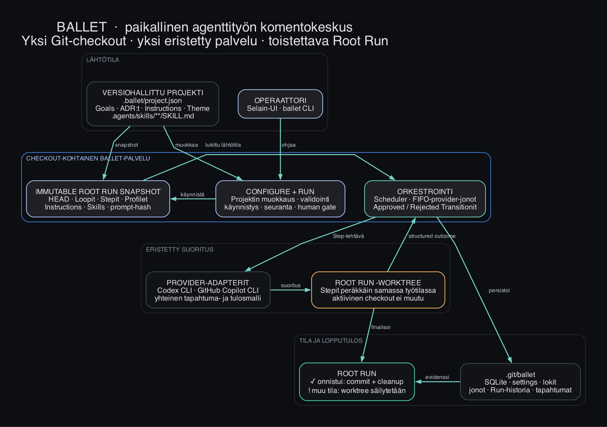

# Ballet-projektin yhteenveto

> **Ballet on yhden Git-checkoutin paikallinen komentokeskus, jolla määritellään, suoritetaan ja seurataan Codex- ja GitHub Copilot -agenttien toistettavia työnkulkuja.**

## Mikä on projektin tarkoitus?

Ballet yhdistää projektin versionhallittuun automaatiomalliin kolme asiaa: **mitä tehdään**, **miten agentti suoritetaan** ja **mitä ajossa oikeasti tapahtui**. Se toimii paikallisesti macOS:ssa, pitää lähdekoodin ja tunnukset käyttäjän koneella eikä tarvitse Ballet-tiliä tai pilvipalvelua.

Tuotteen tärkein lupaus on hallittu agenttisuoritus: jokainen Root Run sidotaan Git-HEADiin ja muuttumattomaan konfiguraatiosnapshotiin, ajetaan erillisessä worktreessä ja tallennetaan jäljitettäväksi.

## Mitä Balletilla tehdään?

1. **Määritellään työ** repositoryssä: Loopit, Stepit, Transitionit, ExecutionProfilet, instructionit, skillsit ja teema.
2. **Koostetaan provider-tehtävä** deterministisesti System-ohjeesta, primary instructionista, valituista skillseistä, roolikohtaisesta Task Envelopesta ja tulosskeemasta.
3. **Suoritetaan työnkulku** Codexilla tai Copilotilla; composite Work Loop Node erottaa Work- ja Validation-vaiheen, ja Loop Orchestrator reitittää vain allowlistattuja korjauksia.
4. **Seurataan ajoa** selainkäyttöliittymästä: tila, konsolitapahtumat, hyväksytty/hylätty jatkopolku, virheet ja finalisointi.
5. **Suojataan aktiivinen checkout**: onnistunut työ commitoidaan Run-branchille ja siivotaan, muu worktree säilytetään tutkittavaksi. Ballet ei mergeä eikä pushaa automaattisesti.

## Keskeiset osat

| Osa | Tehtävä |
| --- | --- |
| React/Vite-käyttöliittymä | Configure- ja Run-työtilat, Loop-canvas, editorit, runtime- ja Run-näkymät |
| Paikallinen Express-palvelu | Loopback-API, validointi, orkestrointi, ajastus ja tapahtumavirrat |
| Provider-adapterit | Codex CLI ja GitHub Copilot CLI yhteisen tehtävä-, tapahtuma- ja tulosmallin takana |
| SQLite-tila | Runien, Stepien, jonojen, tapahtumien ja ajastusten kestävä paikallinen historia |
| Git-eristys | Root Run -kohtainen branch ja worktree, snapshot, commitointi ja epäonnistumisten säilytys |
| Checkout-CLI | `ballet`, `stop`, `restart`, `status`, `logs`, `update` ja `version` sekä launchd-elinkaari |

## Nykytila tämän repositoryn perusteella

- Tuote on merkitty **alphaksi**, pakettiversio on **0.1.0** ja projektikonfiguraatio käyttää strict **v9** -skeemaa.
- Projektissa on **8 hyväksyttyä Goalia**, **13 ADR:ää** ja laaja toteutus kaikille ydinkerroksille.
- Balletin omassa automaatiossa on **4 Loopia**, **13 agentti-Stepiä**, **4 Human-porttia** ja **5 Codex-ExecutionProfilea**.
- Koodissa ovat sekä Codex- että Copilot-adapterit, scheduler, provider-kohtaiset FIFO-jonot, SQLite-palautuminen, Git-worktree-eristys ja macOS-jakelutyökalut.
- Repositoryssä on **87 testitiedostoa**. Execution composition -aineiston mukaan avoimia V1-päätösblockereita ei ole.

## Mitä puuttuu tai ei vielä näy käytössä?

**Oman projektikonfiguraation näyttöaukot:** Ballet tukee näitä, mutta nykyinen `.ballet/project.json` ei vielä harjoita niitä end-to-end.

- Ei Copilot-ExecutionProfilea tai Copilot-Stepiä.
- Ei Scheduled-Stepiä.
- Ei `.agents/skills/**/SKILL.md`-resursseja; nykyisten Steppien `skillIds`-listat ovat tyhjiä.
- Tässä checkoutissa ei ole Git-release-tagia, vaikka pakkaus-, Homebrew-, varmennus- ja päivityspolut on toteutettu.

**Tarkoituksella nykyversion ulkopuolella:**

- keskitetty moniprojektihallinta, käyttäjätilit, etädaemonit ja laiteparitus;
- automaattinen merge tai push;
- Linux- ja Windows-jakelu;
- provider-fallback ja Codex/Copilotin ulkopuoliset providerit;
- template-/registry-/marketplace-ekosysteemi, Built-in-resurssikatalogi ja standalone Agent -entity;
- vaalea teema sekä keskeytyneen käynnissä olleen työn hiljainen automaattinen uudelleenajo.

## Tiivis arvio

Balletin vahvin idea ei ole “agenttien määrä”, vaan **todennettava suoritusketju**:

`versionhallittu intentio → immutable snapshot → eristetty työtila → strukturoitu tulos → pysyvä evidenssi`

Seuraava hyödyllinen kypsyysaskel olisi tagattu alpha-julkaisu ja yksi end-to-end-esimerkkiajo, joka käyttää samassa projektissa Copilotia, Scheduled-Stepiä ja Project-skilliä. Se todentaisi myös ne ydinkyvykkyydet, joita Balletin oma nykykonfiguraatio ei vielä käytä.
