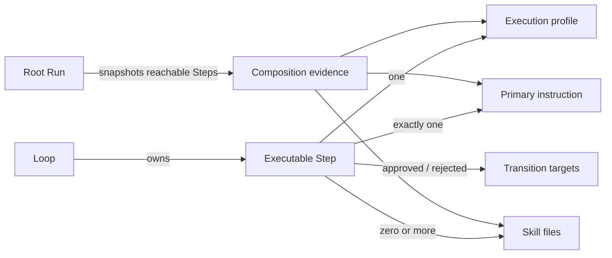

# Execution composition — ehdotettu data-malli

Tila: ihmisen tarkistettava ehdotus. Tämä dokumentti ei muuta production-skeemaa eikä hyväksy avoimia tuotepäätöksiä.

## Rajaus

Malli erottaa nykyisen Agent-kytkennän kolme vastuuta:

1. `ExecutionProfile` kertoo, miten Step ajetaan.
2. Step kertoo, mitä tehdään, millä primary instructionilla ja millä skilleillä.
3. Run evidence kertoo, millä täsmällisellä snapshotilla suoritus todella ajettiin.

Ensimmäiseen versioon lisätään vain yksi authoring-entity: `ExecutionProfile`. Loop ja Step ovat nykyisiä entityjä. Instruction ja Skill ovat tiedostopohjaisia resursseja. Origin on enum-arvo ja Run snapshot evidenssirakenne, ei uusi authoring-entity.

Rolea, Presetiä, Policyä, Recipeä, Templatea tai Template Packia ei lisätä.

## Omistajuudet



Agent ei välitä näitä viitteitä kohdemallin execution-polulla. Nykyinen `agentId` on migration-lähde, ei execution compositionin kohdeviite. Mahdollisen Agent-kokoelman muun tuoteroolin kohtalo on avoin päätös.

## ExecutionProfile

Ehdotettu tarkka v1-rakenne:

```ts
interface ExecutionProfile {
  id: string;
  name: string;
  provider: "codex" | "copilot";
  model: string;
  reasoningEffort: string;
  networkAccess: boolean;
}
```

Sallitut kentät ovat vain nämä kuusi. Strict schema hylkää muun muassa:

- instruction- ja skill-viitteet;
- task descriptionin ja Transitionit;
- `policy`-aliobjektin;
- paikalliset komento- tai polkuasetukset;
- `workspaceAccess`-kentän; sekä
- Agentin identity- tai appearance-metadatan.

Profiilit ovat versionhallittavaa projektikonfiguraatiota ja niihin viitataan ID:llä. Ihmisen antama `name` on Node editorissa näytettävä nimi; execution ei ratkaise profiilia nimen perusteella.

## Executable Step

Nykyiset Loop-, Step type-, schedule- ja appearance-kentät säilyvät automaatiomallin vastuulla. Execution composition korvaa Agent-viitteen seuraavilla kentillä:

```ts
interface StepExecutionComposition {
  executionProfileId: string;
  primaryInstructionId: string;
  skillIds: string[];
}

interface ExecutableStepV1 {
  id: string;
  type: "agent" | "scheduled";
  description: string; // UI-label: Task description
  executionProfileId: string;
  primaryInstructionId: string;
  skillIds: string[];
  on: {
    approved: TransitionTarget;
    rejected: TransitionTarget;
  };
  nodeStyle: LoopNodeStyle;
  nodeSize: LoopNodeSize;
  schedule?: StepSchedule; // vain scheduled
}
```

V1-invarianssit:

- `executionProfileId` ratkaisee täsmälleen yhteen olemassa olevaan profileen.
- `primaryInstructionId` on yksi non-empty, origin-scoped Built-in- tai Project-viite.
- `skillIds` on set-semanttinen lista: nolla tai useita uniikkeja Built-in- tai Project-viitteitä.
- System-ohje on pakollinen mutta implisiittinen, joten se ei vie primary instructionin paikkaa.
- `description` on Stepin task description; Agentin description ei korvaa sitä migrationissa.
- `approved` ja `rejected` ovat molemmat pakollisia ja ratkaistavissa olevia kohteita.
- Human-Stepillä ei ole execution profile-, primary instruction- tai skill-kenttiä.
- Terminal-nodella ei ole execution compositionia.
- Scheduled-Step käyttää samaa compositionia kuin agentti-Step ja säilyttää schedule-kenttänsä.
- Uudelle Stepille ei valita profilea tai primary instructionia hiljaisella fallbackilla.

Additional instructions ei ole V1-kenttä. Mahdollinen myöhempi capability lisätään primary instructionin jälkeen ja ennen skillejä vasta erillisellä skeema- ja UX-päätöksellä.

## Ehdotettu project config v9

Kokoelma esitetään listana, koska jokainen profile sisältää vaaditun `id`-kentän. Lista serialisoidaan `id`:n UTF-8 byte -järjestyksessä. Loop- ja nodejärjestys säilyttää käyttäjän määrittämän järjestyksen.

```json
{
  "version": 9,
  "executionProfiles": [
    {
      "id": "focused-local",
      "name": "Focused local",
      "provider": "codex",
      "model": "gpt-5.6-sol",
      "reasoningEffort": "medium",
      "networkAccess": false
    }
  ],
  "loops": [
    {
      "id": "blueprint-design",
      "start": "data-model",
      "nodes": [
        {
          "id": "data-model",
          "type": "agent",
          "description": "Johda hyväksytyistä päätöksistä tarkistettava data-malli.",
          "executionProfileId": "focused-local",
          "primaryInstructionId": "project:architecture",
          "skillIds": [
            "project:ballet-blueprint"
          ],
          "on": {
            "approved": "ui-design",
            "rejected": "blocked"
          },
          "nodeStyle": "sol",
          "nodeSize": "large"
        }
      ]
    }
  ]
}
```

Esimerkki näyttää vain kohdemallin olennaisen osan; validi Loop sisältää edelleen nykyiset pakolliset terminal-nodet.

Versionumero `9` ja listamuoto ovat tämän paketin yhtenäinen ehdotusoletus, eivät hyväksytty päätös. Ne on merkitty `OPEN-DECISIONS.md`:ään.

## ResourceRef ja origins

Instruction- ja skill-ID on origin-scoped merkkijono:

```text
system:<id>
builtin:<id>
project:<id>
```

V1 Step saa viitata primary- ja skill-kentissään vain `builtin:`- ja `project:`-resursseihin. Samannimiset Built-in- ja Project-resurssit eivät varjosta toisiaan.

| Origin | Pakollisuus | Muokattavuus | V1-käyttö |
|---|---|---|---|
| System | Pakollinen | Read-only | Yksi implisiittinen, minimaalinen execution contract; ei valitsimissa |
| Built-in | Optional | Read-only, cloneable | Primary instruction tai skill voidaan valita eksplisiittisesti |
| Project | Optional | Repository-owned, editable | Primary instruction tai skill voidaan valita eksplisiittisesti |

`read-only` kuvaa resurssin authoring-oikeutta, ei Run-workspacen käyttöoikeutta.

System-originissa ei ole V1-skillejä. Sen yhden V1-instructionin ehdotettu ID on `system:execution-contract-v1`, eikä sisältö sisällä roadmap-, milestone-, release-, deploy- tai muuta ohjelmistokehityksen workflow-menettelyä.

Built-in-resurssin clone luo uuden `project:`-ID:n ja itsenäisen Project-tiedoston. Mahdollinen `clonedFrom` on provenance-metadataa ilman runtime-semanticsia.

Project-instructionin ehdotettu pysyvä identiteetti tulee eksplisiittisestä frontmatter-ID:stä ja sisältö `.ballet/instructions/`-Markdown-tiedostosta. Tiedosto ilman validia eksplisiittistä ID:tä on tavallinen project-dokumentti, ei valittava InstructionResource; invalidi tai duplicate eksplisiittinen ID on katalogivirhe. Project-skillin V1-ID johdetaan sen `.agents/skills/`-juureen suhteutetusta POSIX-hakemistopolusta, esimerkiksi `.agents/skills/review/security/SKILL.md` → `project:review/security`. Jokaisen path-segmentin pitää olla lowercase kebab-casea. Frontmatterin title tai name ei muuta ID:tä.

Project-resurssin tarkka `sourceVersion` on `project/<projectSnapshotHash>`. System- ja Built-in-resurssilla arvo on `ballet/<balletVersion>/catalog/<catalogVersion>`. `sourceVersion` kertoo katalogi- tai projektiversion ja `sourceSha256` yksilöi juuri kyseisen lähdetiedoston tavut; molemmat tallennetaan evidenssiin. Identiteetti- ja versiosäännöt ovat paketin ehdotusoletuksia ja vaativat ihmisen hyväksynnän.

## Run snapshot ja evidence

Root Run ratkaisee ennen ensimmäistä queue-operaatiota kaikkien saavutettavien Stepien:

- execution profilen;
- System-ohjeen;
- primary instructionin;
- valitut skillsit; sekä
- Stepin task- ja Transition-datan.

Resoluutio on all-or-nothing samasta project snapshotista. Resume, retry ja saman Root Runin cross-Loop-siirtymät käyttävät samaa immutable snapshotia.

Ehdotettu Root Runin staattinen Step-snapshot:

```ts
interface ResourceEvidence {
  kind: "system" | "primary" | "skill";
  origin: "system" | "builtin" | "project";
  id: string;
  sourcePath?: string;
  sourceVersion: string;
  sourceSha256: string;
  content: string;
  contentSha256: string;
}

interface StepControlSnapshot {
  loopId: string;
  stepId: string;
  type: "agent" | "scheduled";
  description: string;
  approvedTarget: TransitionTarget;
  rejectedTarget: TransitionTarget;
}

interface StepCompositionSnapshot {
  compositionVersion: 1;
  projectSnapshotHash: string;
  step: StepControlSnapshot;
  executionProfile: ExecutionProfile;
  systemInstruction: ResourceEvidence;
  primaryInstruction: ResourceEvidence;
  skills: ResourceEvidence[];
  canonicalSkillIds: string[];
  instructionBundle: string;
  instructionBundleSha256: string;
  snapshotSha256: string;
}

interface ExecutionAttemptEvidence {
  compositionSnapshotSha256: string;
  loopId: string;
  stepId: string;
  attempt: number;
  taskEnvelopeVersion: 1;
  taskEnvelope: string;
  taskEnvelopeSha256: string;
  outputSchemaVersion: string;
  outputSchema: string;
  outputSchemaSha256: string;
  providerAdapterVersion: string;
}
```

Kaikki SHA-256-arvot ovat lowercase hex -muodossa. `sourceSha256` lasketaan snapshottujen lähdetavujen perusteella ja `contentSha256` täsmälleen executioniin käytetystä normalisoidusta body-sisällöstä. Evidenssi säilyttää myös sisällön; pelkkä ID ja hash eivät ole auditointiin riittävä snapshot.

Stepin task description ja molemmat Transition-targetit kuuluvat Root Runin staattiseen `StepControlSnapshot`-rakenteeseen. Sen sijaan Run inputista, recent historysta ja mahdollisesta resume-vastauksesta muodostuva task envelope syntyy yrityskohtaisesti. Jokainen ExecutionSpec tallentaa `ExecutionAttemptEvidence`-rakenteen ja viittaa immutableen Step composition -snapshottiin sen hashilla. Näin myöhemmän yrityksen task-envelope-hash ei teeskentele olleensa tiedossa Root Runin alussa.

ExecutionSpec ja Loop execution plan saavat uuden version. Historiallisia immutable v1-snapshotteja ei kirjoiteta uudelleen, vaan read-polku tukee versionoitua unionia.

## Step result ja runtime state

```ts
type StepResult = "approved" | "rejected";
```

`StepRun.result` on kanoninen kontrollitulos. Execution taskin status, Step Runin status, provider outcome ja virhe-evidenssi säilyvät erillisinä.

| Tapahtuma | Runtime/Step state | StepResult | Transition |
|---|---|---|---|
| Validoitu completed outcome | completed | approved tai rejected | vastaava target |
| Human-vastaus | completed | approved tai rejected | vastaava target |
| Needs input | waiting/needs input | ei arvoa | ei Transitionia |
| Blocked | blocked | ei arvoa | ei Rejected-transitionia |
| Runtime failure | failed | ei arvoa | ei Rejected-transitionia |
| Cancel | cancelled | ei arvoa | ei Transitionia |

Outcome-payload on evidenssiä. Transition engine lukee vain validoitua `StepRun.result`-kenttää.

## `workspace_access`-arvio

Mahdollinen myöhempi kenttä olisi semanttisesti `workspaceAccess: "read-only" | "write"`, mutta sitä ei lisätä V1:een.

Perustelut:

- nykyinen Root Run luo tarkoituksella kirjoitettavan worktreen;
- provider-adapterien sandbox- ja permission-policy olettavat workspace-write-kyvykkyyden;
- onnistuneen Runin finalisointi ja muuttuneiden tiedostojen evidenssi perustuvat kirjoituksiin;
- agenttikohtaiset paikalliset `readOnlyRoots` eivät ole sama asia kuin workspacen write/read-only-valinta; sekä
- kentän lisääminen ilman enforcementia olisi harhaanjohtava turvallisuuslupaus.

Kenttä vaatii myöhemmin oman ADR:n, provider capability -matriisin, preflight-säännöt, finalisointisemantiikan ja testit. V1:n nykyinen baseline on kirjoitettava Run-worktree eikä profiili tallenna tätä implisiittisenä kenttänä.

## Validointi ja fail-closed-rajat

Authoring-save estää:

- puuttuvan profilen tai primary instructionin;
- väärän originin tai resurssityypin;
- duplicate skill-ID:n;
- tyhjän instruction- tai skill-bodyn; ja
- tuntemattoman Step- tai profile-kentän.

Root Run preflight estää koko Runin ennen queuea, jos yksikin reachable Step ei ratkea, resurssit muuttuvat kesken snapshotin, hash ei täsmää, provider ei täytä profilea tai Ballet ei pysty hallitsemaan composition-kanavaa deterministisesti.

Instruction- tai skill-sisältöä ei typistetä hiljaisesti. Kokorajan ylitys on näkyvä preflight-virhe. Dynaaminen Run input/history saa käyttää erikseen versionoitua determinististä truncationia.

## Suhde nykyisiin hyväksyttyihin päätöksiin

Kohdemalli edellyttäisi hyväksynnän jälkeen rajattuja muutoksia ADR-002:n, ADR-004:n, ADR-005:n, ADR-006:n ja ADR-008:n Agent-omistajuutta kuvaaviin kohtiin. Tämä paketti ei muuta niiden tilaa tai production-koodia. Ehdotettu muutos astuu voimaan vasta, jos ADR-012 ja muut riippuvat proposed-ADR:t hyväksytään.
