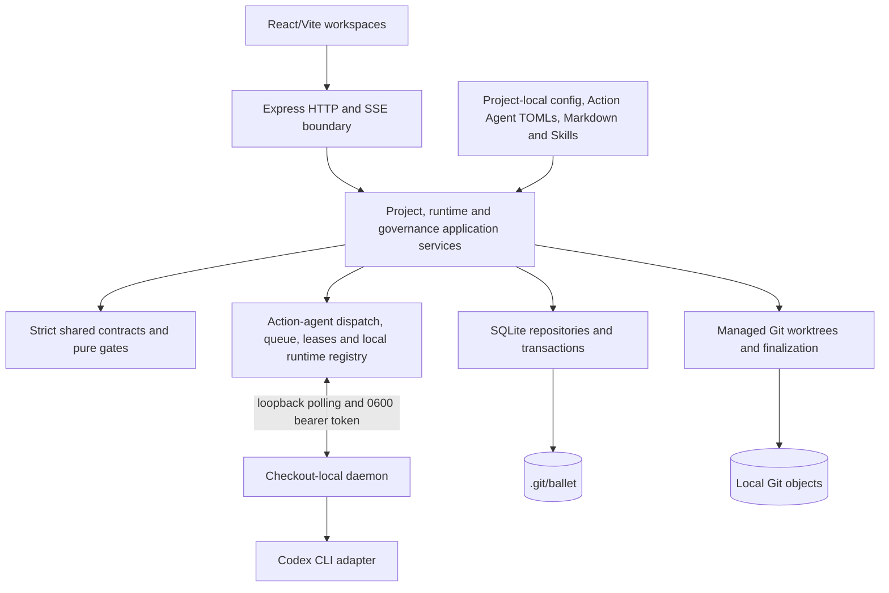

# Ballet architecture

Ballet is a checkout-local orchestration command center. [ADR-034](.ballet/adr/adr-034-validation-led-environment-state-action-orchestration.md) owns Environment → State → Action and Validation-led execution. This entrypoint owns the version matrix and trust boundaries; detailed views have one owner each.

## Reading guide

| Task | Read next |
| --- | --- |
| Current work and verification | [STATUS](.ballet/arc42/STATUS.md) → its dated evidence |
| Architecture or source ownership | [arc42 index](.ballet/arc42/README.md) → the relevant section; [accepted decisions and supersession](.ballet/arc42/09-architecture-decisions.md) |
| Runtime behavior | [state contract](.ballet/arc42/STATE-CONTRACT.md) and [runtime scenarios](.ballet/arc42/06-runtime-view.md) |
| UI or authoring | [DESIGN](DESIGN.md), then the relevant component and its tests |
| Implementation checks | [AGENTS](AGENTS.md) and the target directory's AGENTS.md |

Load only the task-relevant views and Skills. Initiative documents record bounded delivery history; they do not override newer accepted ADRs or the active contracts below.

## Active version matrix

| Contract | Version |
| --- | ---: |
| Project Config | 26 |
| Root Snapshot | 21 |
| Task Envelope / role outcome | 11 / 11 |
| Prompt composition | 16 |
| ExecutionSpec | 18 |
| SQLite | 24 |
| Feedback / Critic / Refinement | 2 / 2 / 2 |
| Codex Agent / Run Evidence | 3 / 1 |

Executable version owners are [shared constants](shared/orchestration/versions.ts), [schemas](shared/orchestration/schemas/environmentSchemas.ts) and [SQLite](backend/orchestration/persistence/RuntimeSchema.ts). The version cut is strict. Incompatible config or local state is rejected unchanged; there is no migration, reader, route alias or dual write.

## Context view

The browser and CLI are local clients. One checkout-local daemon owns provider readiness checks and processes; the server owns SQLite, worktrees, validation, finalization and evidence. Neither daemon nor provider receives human-approval authority.

## Container view

## Component view

Source responsibilities and component mappings live in the [building-block view](.ballet/arc42/05-building-block-view.md).

## Truth and ownership

| Truth | Canonical owner | Forbidden substitute |
| --- | --- | --- |
| WHAT/WHY and approved intent | Git: Overview, User Stories, ADRs and Event Storming models | automatic run closure, provider prompt or client state |
| Environment authoring | Git: Project Config, Action Agent TOMLs, instructions and Skills | SQLite completion flags |
| Runtime status, attempts, gates, schedules and decisions | SQLite v24 plus immutable Root Snapshot v21 | config `done`/`blocked` fields or provider prose |
| Repository effect | local commit SHA plus exact artifact hashes | approval flag without applied bytes |
| Terminal evidence | recomputable Run Evidence projection inside its owning Run | mutable copied evidence document |

## Runtime sequences

The [runtime view](.ballet/arc42/06-runtime-view.md) owns RT-026–RT-035: Validation/Work execution, retry exhaustion, Critic approval, exact Refinement continuation, authoring and daemon recovery. The [state contract](.ballet/arc42/STATE-CONTRACT.md) owns status projections. Provider failure and cancellation are operational boundaries, never implicit semantic retries.

## Persistence ownership

SQLite owns Environment, State, Action and Agent executions; immutable task specs and outcomes; event cursors; Feedback; Critic schedules/runs/proposals; Refinement proposals/approvals/applies; continuation lineage; and Run Evidences. Foreign keys, guarded updates, unique causal keys and transactions encode cross-row invariants. Repository content and Git objects remain outside SQLite and are referenced by exact hashes.

Successful work must remain Critic-readable through immutable commit/artifact evidence after transient worktree cleanup. Failed or blocked worktrees remain bounded diagnostics.

## Security and trust boundaries

- The HTTP server binds to `127.0.0.1`, validates Host, same-origin browser mutations, content type and body size, and applies strict Zod schemas.
- Human approval actor identity comes from the trusted local UI/session boundary, never request payloads or provider output.
- Dispatch specs and prompt evidence use a discriminated `action_agent | agent` subject. The immutable Action Agent carries the frozen TOML definition/hash while its Skill closure is separately frozen. Validation, Critic and Refinement proposal are read-only; Work writes only within its managed worktree; approval policy is always `never`.
- Validation and Work load model/reasoning and primary developer instructions from their immutable Action Agent TOML. Permissions derive from the role and no TOML or machine-local binding can widen them. Critic/Refinement retain fixed read-only governance Agent definitions.
- Internal daemon routes are loopback-only and require a checkout-specific random bearer token stored with mode `0600`; no device, pairing, Keychain, TLS or WebSocket contract is active.
- Prompts and retained events must exclude secrets; provider child environments use an explicit allowlist.
- Internal Git operations disable user/repository hooks. Ballet never merges, pushes, publishes or deploys automatically.
- Loopback health and persisted recovery do not wait for daemon discovery; missing/extra/invalid Action Agents, missing Skills and offline, unauthenticated or capability-mismatched Codex runtimes fail closed at Run preflight.

## Project/platform boundary

Generic `shared/`, `backend/` and `frontend/` code knows only Overview, User Story, Event Storming model, Agent, Environment, State, Action, role, resource, approval and evidence primitives. Ballet's own five-State delivery arrangement, arc42 paths and exact verification commands live in `.ballet/**` and `.agents/**`. The compact fixture proves the same platform with unrelated IDs and fewer Actions.

Overview, ADRs, User Stories and Event Storming are repository-owned Markdown; none enters Config, SQLite or Run gates. Their exact source/HTTP mappings live in the [building-block view](.ballet/arc42/05-building-block-view.md); their UI contracts live in [DESIGN](DESIGN.md).

## Failure modes

| Failure | Required behavior |
| --- | --- |
| Invalid config or duplicate order/priority | readiness blocks before any provider task |
| Missing/extra/invalid Action Agent, missing Skill or changed frozen hash | snapshot/dispatch fails closed |
| Provider failure or invalid structured output | operational failure is recorded; no false semantic retry or done |
| Retry exhaustion or Validation blocked | Action and one Feedback entry commit atomically; later work stops |
| Duplicate callback or restart | queued work survives; claimed work is never requeued and lease expiry exposes one `runtime_lost` terminal failure |
| Cancel during provider execution | provider is cancelled and no later dispatch occurs |
| Critic overlap or crash | lease/recovery permits at most one occurrence and one catch-up |
| Stale/failing Refinement apply | zero project writes and zero continuation Runs |
| Finalization interruption | recoverable idempotent finalization completes once or exposes a factual failure |
| Incompatible local database | startup rejects it with archive/remove remediation |

## Canonical documentation

- [arc42 index](.ballet/arc42/README.md)
- [architecture status](.ballet/arc42/STATUS.md)
- [traceability](.ballet/arc42/TRACEABILITY.md)
- [quality scenarios](.ballet/arc42/10-quality-requirements.md)
- [design contract](DESIGN.md)
- [editable orchestration diagram](ballet.drawio)
