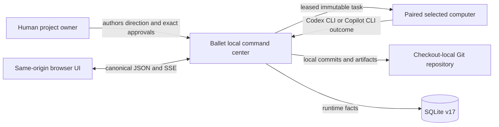
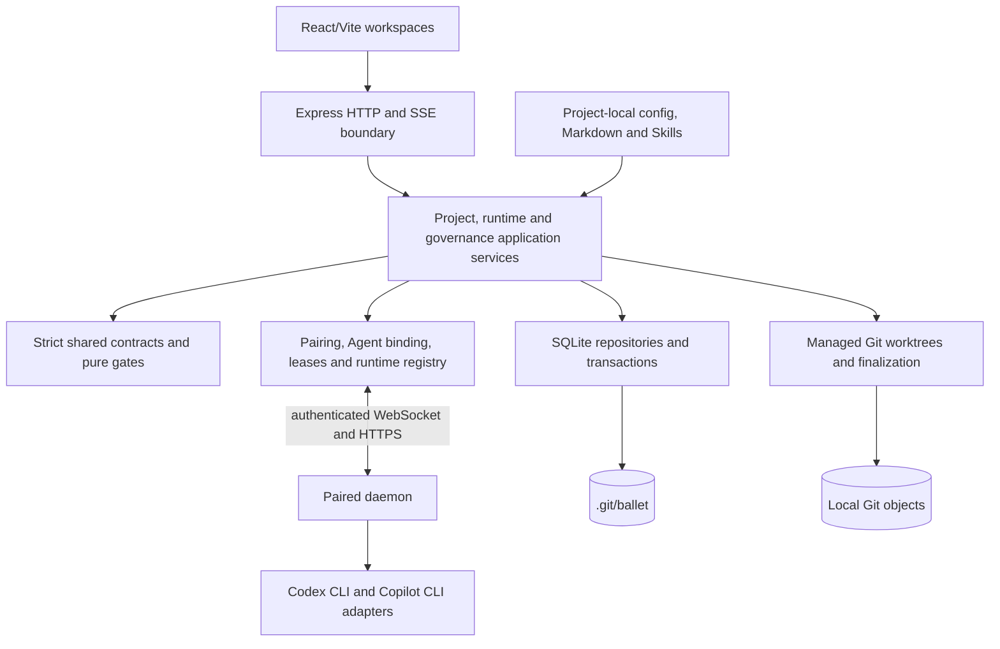
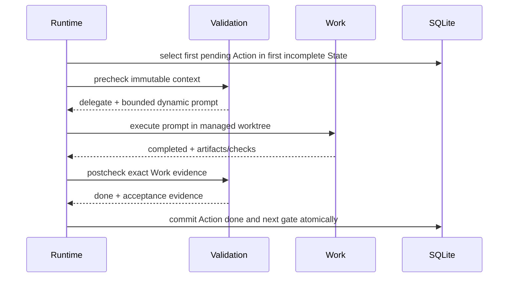
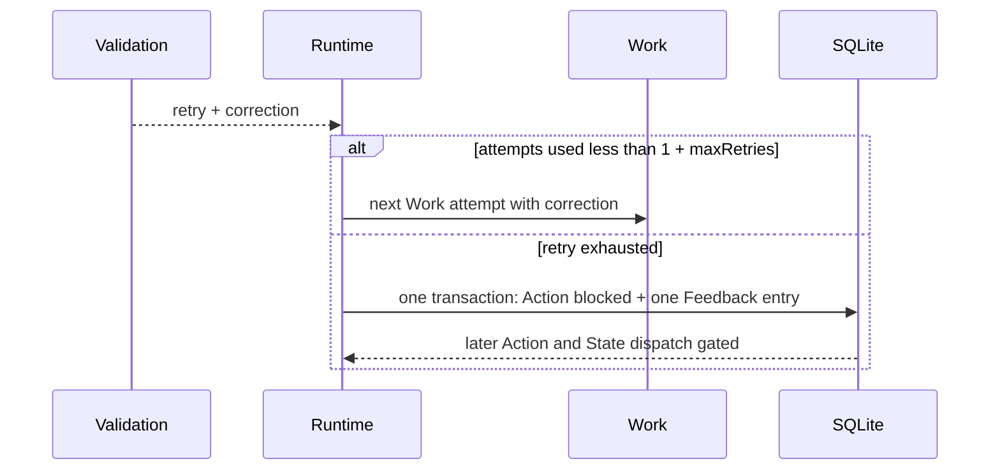
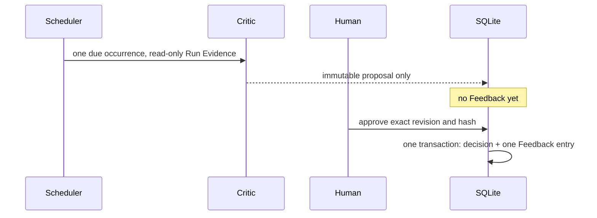

# Ballet architecture

Ballet is an orchestration command center whose Environment → State → Action and Validation-led semantics are owned by [ADR-034](.ballet/adr/adr-034-validation-led-environment-state-action-orchestration.md). The accepted strict replacement for authoring and execution placement is [ADR-035](.ballet/adr/adr-035-markdown-agents-paired-daemon-and-run-evidence.md) and its [target contract](.ballet/arc42/initiatives/markdown-agent-daemon-orchestration/TARGET-CONTRACT.md).

The active implementation is the atomic v21/v17 cut. No temporary public namespace, migration, compatibility reader, route alias or dual-write is authorized.

## Active version matrix

| Contract | Version |
| --- | ---: |
| Project Config | 21 |
| Root Snapshot | 14 |
| Task Envelope / role outcome | 11 / 11 |
| Prompt composition | 12 |
| ExecutionSpec | 13 |
| SQLite | 17 |
| Feedback / Critic / Refinement | 2 / 2 / 2 |
| Agent/daemon binding / Run Evidence | 1 / 1 |

The version cut is strict. Incompatible config or local state is rejected unchanged; there is no migration, reader, route alias or dual write.

## Context view

The browser and CLI are local clients. A paired daemon owns provider processes on the selected computer; neither daemon nor provider receives human-approval authority. External systems are outside the default execution boundary.

## Container view

## Component view

| Component | Responsibility | Primary source |
| --- | --- | --- |
| Direction and config | strict v21 load/save, Markdown Agents, approval invalidation, references and resources | `shared/orchestration/schemas/**`, `backend/orchestration/project/**` |
| Run planning | approved closure, immutable Snapshot v14, ordered State/Action seeds and permissions | `backend/orchestration/runtime/EnvironmentRunPlanner.ts` |
| Action control | Validation-first transitions, retry formula and next eligible work | `backend/orchestration/persistence/ActionOutcomeCoordinator.ts`, `FlowCoordinator.ts` |
| Runtime execution | queue, daemon dispatch, cancellation, recovery and finalization | `backend/orchestration/runtime/EnvironmentRuntimeService.ts`, `DaemonOrchestrationProvider.ts` |
| Control plane and daemon | computer pairing, machine-local Agent binding, backend capabilities, leases and Codex/Copilot execution | `backend/control-plane/**`, `backend/daemon/**` |
| Governance | Critic scheduling, proposal decisions, exact Refinement apply and continuation | `backend/orchestration/governance/**` |
| Persistence | SQLite v17 schema, transactions, events, Feedback, reviews and Run Evidence | `backend/orchestration/persistence/**` |
| API/security | canonical routes, strict request schemas, loopback/origin/body limits and trusted actor boundary | `backend/orchestration/http/**`, `backend/server/createBalletServer.ts` |
| UI | Loop Engineering, Markdown project workspaces, Agents, Runtimes, Run Gate, Feedback and reviews | `frontend/src/orchestration/**` |

## Truth and ownership

| Truth | Canonical owner | Forbidden substitute |
| --- | --- | --- |
| WHAT/WHY and approved intent | Git: Goals, ADRs, Constraints, Use Cases, Markdown Agents and Project Config v21 | provider prompt or client state |
| Environment authoring | Git: Config, instructions and Skills | SQLite completion flags |
| Runtime status, attempts, gates, schedules, Agent bindings and decisions | SQLite v17 plus immutable Root Snapshot | config `done`/`blocked` fields or provider prose |
| Repository effect | local commit SHA plus exact artifact hashes | approval flag without applied bytes |
| Terminal evidence | recomputable Run Evidence projection inside its owning Run | mutable copied evidence document |

## Runtime sequences

### Normal Action

### Retry and block

Provider failure, cancellation and invalid structured output are operational failure boundaries. They do not silently become semantic retry decisions.

### Critic approval

### Refinement continuation

## Persistence ownership

SQLite owns Environment, State, Action and Agent executions; immutable task specs and outcomes; event cursors; Feedback; Critic schedules/runs/proposals; Refinement proposals/approvals/applies; continuation lineage; and Run Evidences. Foreign keys, guarded updates, unique causal keys and transactions encode cross-row invariants. Repository content and Git objects remain outside SQLite and are referenced by exact hashes.

Successful work must remain Critic-readable through immutable commit/artifact evidence after transient worktree cleanup. Failed or blocked worktrees remain bounded diagnostics.

## Security and trust boundaries

- The HTTP server binds to `127.0.0.1`, validates Host, same-origin browser mutations, content type and body size, and applies strict Zod schemas.
- Human approval actor identity comes from the trusted local UI/session boundary, never request payloads or provider output.
- Daemon binding and permissions are snapshotted: Validation, Critic and Refinement proposal are read-only; Work writes only within its managed worktree; approval policy is always `never`.
- Provider, model, reasoning and network policy are selected in the machine-local Agent binding from capabilities reported by the paired daemon.
- Prompts and retained events must exclude secrets; provider child environments use an explicit allowlist.
- Internal Git operations disable user/repository hooks. Ballet never merges, pushes, publishes or deploys automatically.
- Loopback health and persisted recovery do not wait for daemon discovery; unbound, offline, unauthenticated or capability-mismatched Agents fail closed at Run preflight.

## Project/platform boundary

Generic `shared/`, `backend/` and `frontend/` code knows only Direction, Use Case, Agent, Environment, State, Action, role, runtime binding, resource, approval and evidence primitives. Ballet's own five-State delivery arrangement, arc42 paths and exact verification commands live in `.ballet/**` and `.agents/**`. The compact fixture proves the same platform with unrelated IDs and fewer Actions.

## Failure modes

| Failure | Required behavior |
| --- | --- |
| Invalid config, duplicate order/priority or stale approval | readiness blocks before any provider task |
| Missing instruction/Skill or changed resource hash | snapshot/dispatch fails closed |
| Provider failure or invalid structured output | operational failure is recorded; no false semantic retry or done |
| Retry exhaustion or Validation blocked | Action and one Feedback entry commit atomically; later work stops |
| Duplicate callback or restart | idempotent recovery resumes or exposes one explicit terminal failure |
| Cancel during provider execution | provider is cancelled and no later dispatch occurs |
| Critic overlap or crash | lease/recovery permits at most one occurrence and one catch-up |
| Stale/failing Refinement apply | zero project writes and zero continuation Runs |
| Finalization interruption | recoverable idempotent finalization completes once or exposes a factual failure |
| Incompatible local database | startup rejects it with archive/remove remediation |

## Canonical documentation

- [arc42 index](.ballet/arc42/README.md)
- [architecture status](.ballet/arc42/STATUS.md)
- [traceability](.ballet/arc42/TRACEABILITY.md)
- [quality scenarios](.ballet/arc42/10-quality-requirements.md)
- [design contract](DESIGN.md)
- [editable orchestration diagram](ballet.drawio)
