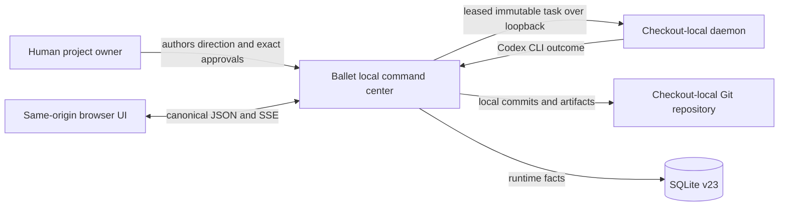
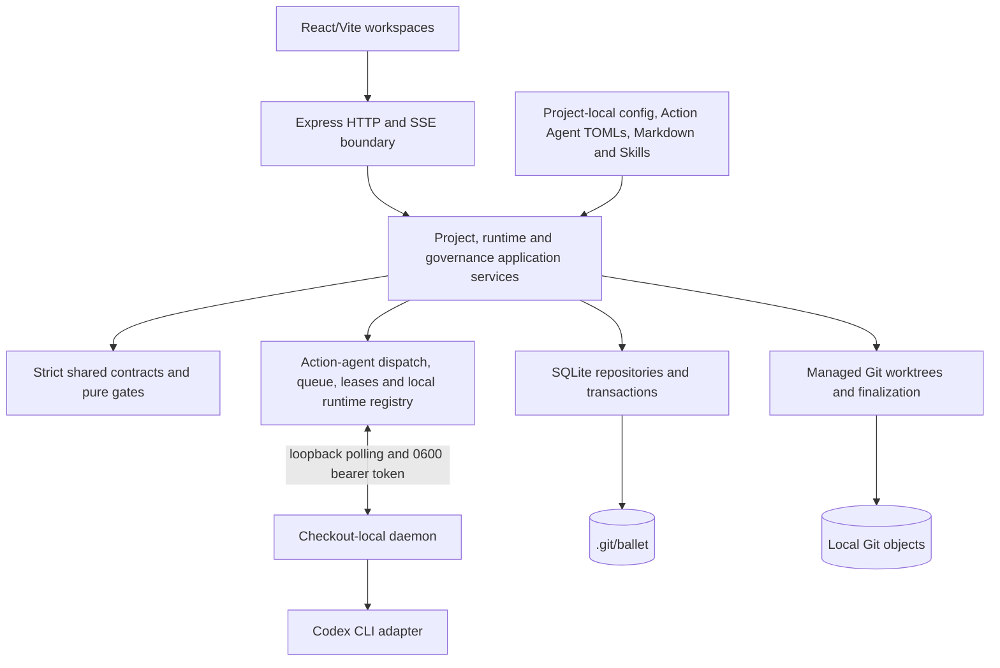
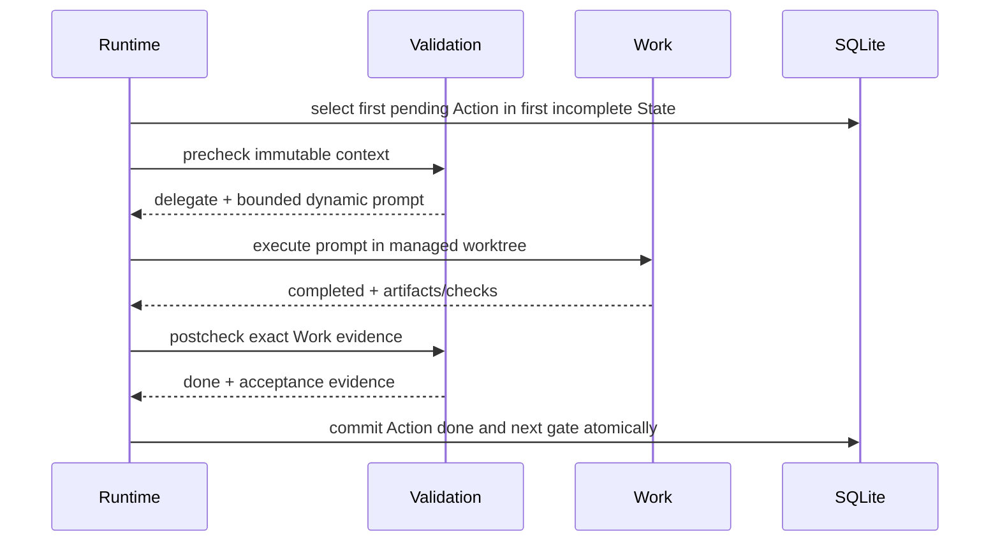
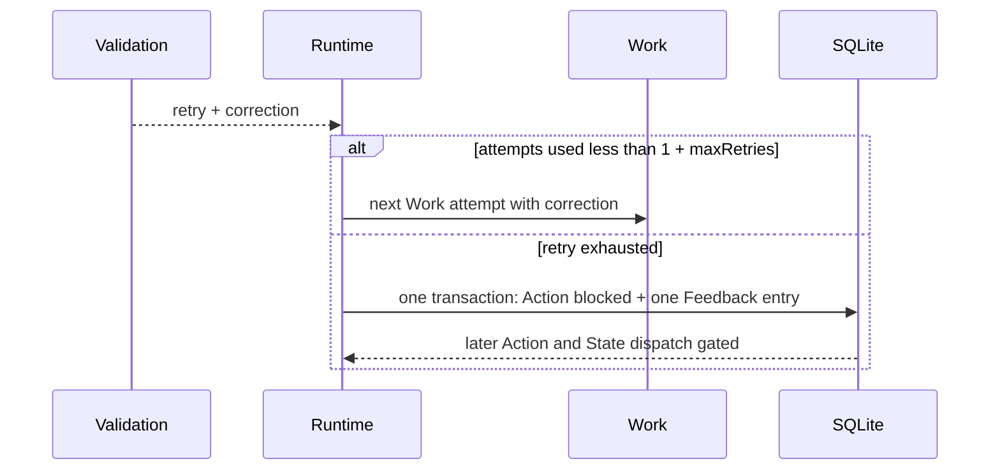
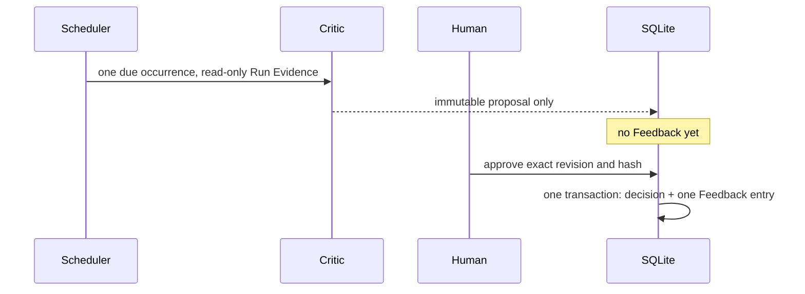
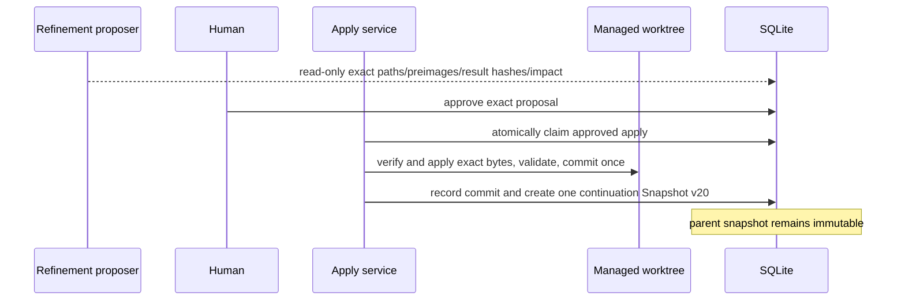

# Ballet architecture

Ballet is an orchestration command center whose Environment → State → Action and Validation-led semantics are owned by [ADR-034](.ballet/adr/adr-034-validation-led-environment-state-action-orchestration.md). [ADR-041](.ballet/adr/adr-041-instruction-directed-project-context-and-sortable-ordering.md) removes State-owned Use Case closure, makes project-document reading instruction/Skill-directed and makes sortable ID lists the only ordering editor. [ADR-042](.ballet/adr/adr-042-action-specific-codex-agents.md) makes every Action's Validation and Work TOML the canonical instruction/model/reasoning truth. [ADR-040](.ballet/adr/adr-040-codex-only-fixed-governance-agents.md) retains two read-only governance Agents and the Codex-only runtime. [ADR-035](.ballet/adr/adr-035-markdown-agents-paired-daemon-and-run-evidence.md) retains Feedback/Refinement and Run Evidence, while [ADR-037](.ballet/adr/adr-037-checkout-local-daemon.md) owns the checkout-local CLI worker. [ADR-045](.ballet/adr/adr-045-spacious-concise-floating-loop-tree.md) owns the spacious React Flow + Dagre STATE -> ACTION -> AGENTS tree, concise node labels and lightweight floating edges while retaining planet/Action-flow strict removal.

The active implementation is the atomic v25/v23 cut. No temporary public namespace, migration, compatibility reader, route alias or dual-write is authorized.

## Active version matrix

| Contract | Version |
| --- | ---: |
| Project Config | 25 |
| Root Snapshot | 20 |
| Task Envelope / role outcome | 11 / 11 |
| Prompt composition | 16 |
| ExecutionSpec | 18 |
| SQLite | 23 |
| Feedback / Critic / Refinement | 2 / 2 / 2 |
| Codex Agent / Run Evidence | 3 / 1 |

The version cut is strict. Incompatible config or local state is rejected unchanged; there is no migration, reader, route alias or dual write.

## Context view

The browser and CLI are local clients. One checkout-local daemon owns provider readiness checks and processes; the server owns SQLite, worktrees, validation, finalization and evidence. Neither daemon nor provider receives human-approval authority.

## Container view

## Component view

| Component | Responsibility | Primary source |
| --- | --- | --- |
| Direction and config | strict v25 load/save, project-local documents and approvals, Action Agent TOMLs, two governance Agent TOMLs, references and Skill composition | `shared/orchestration/schemas/**`, `backend/orchestration/project/**` |
| Run planning | immutable Snapshot v20 with Action Agent definitions/hashes and Skill closures, ordered State/Action seeds and role-derived permissions | `backend/orchestration/runtime/EnvironmentRunPlanner.ts` |
| Action control | Validation-first transitions, retry formula and next eligible work | `backend/orchestration/persistence/ActionOutcomeCoordinator.ts`, `FlowCoordinator.ts` |
| Runtime execution | queue, local-daemon dispatch, cancellation, recovery and server-owned finalization | `backend/orchestration/runtime/EnvironmentRuntimeService.ts`, `LocalDaemonOrchestrationProvider.ts` |
| Local daemon | readiness, polling, leases and the Codex process; no repository/finalization ownership | `backend/daemon/**`, `backend/orchestration/persistence/LocalDaemonStore.ts` |
| Governance | Critic scheduling, proposal decisions, exact Refinement apply and continuation | `backend/orchestration/governance/**` |
| Persistence | SQLite v23 schema without Action execution bindings, transactions, events, daemon facts, Feedback, reviews and Run Evidence | `backend/orchestration/persistence/**` |
| API/security | canonical routes, strict request schemas, loopback/origin/body limits and trusted actor boundary | `backend/orchestration/http/**`, `backend/server/createBalletServer.ts` |
| UI | deterministic React Flow + Dagre Loop Engineering State/Action/Agents tree, Markdown project workspaces, Agents, Runtimes, Run Gate, Feedback and reviews | `frontend/src/orchestration/**` |

## Truth and ownership

| Truth | Canonical owner | Forbidden substitute |
| --- | --- | --- |
| WHAT/WHY and approved intent | Git: Goals, ADRs, Constraints, Use Cases, User Stories, generic instructions, Skills, Action/governance `.codex/agents/*.toml` files and Project Config v25 | automatic run closure, provider prompt or client state |
| Environment authoring | Git: Config, Action Agent TOMLs and Skills | SQLite completion flags |
| Runtime status, attempts, gates, schedules and decisions | SQLite v23 plus immutable Root Snapshot v20 | config `done`/`blocked` fields or provider prose |
| Repository effect | local commit SHA plus exact artifact hashes | approval flag without applied bytes |
| Terminal evidence | recomputable Run Evidence projection inside its owning Run | mutable copied evidence document |

## Runtime sequences

### Normal Action

### Retry and block

Provider failure, cancellation and invalid structured output are operational failure boundaries. They do not silently become semantic retry decisions.

### Critic approval

### Refinement continuation

## Persistence ownership

SQLite owns Environment, State, Action and Agent executions; immutable task specs and outcomes; event cursors; Feedback; Critic schedules/runs/proposals; Refinement proposals/approvals/applies; continuation lineage; and Run Evidences. Foreign keys, guarded updates, unique causal keys and transactions encode cross-row invariants. Repository content and Git objects remain outside SQLite and are referenced by exact hashes.

Successful work must remain Critic-readable through immutable commit/artifact evidence after transient worktree cleanup. Failed or blocked worktrees remain bounded diagnostics.

## Security and trust boundaries

- The HTTP server binds to `127.0.0.1`, validates Host, same-origin browser mutations, content type and body size, and applies strict Zod schemas.
- Human approval actor identity comes from the trusted local UI/session boundary, never request payloads or provider output.
- Dispatch specs and prompt evidence use a discriminated `action_agent | agent` subject. The immutable Action Agent carries the frozen TOML definition/hash while its Skill closure is separately frozen. Validation, Critic and Refinement proposal are read-only; Work writes only within its managed worktree; approval policy is always `never`.
- Validation and Work load model/reasoning and primary developer instructions from their immutable Action Agent TOML. Permissions derive from the role and no TOML or machine-local binding can widen them. Critic/Refinement retain fixed read-only governance Agent definitions.
- Internal daemon routes are loopback-only and require a checkout-specific random bearer token stored with mode `0600`; no device, pairing, Keychain, TLS or WebSocket contract is active.
- Prompts and retained events must exclude secrets; provider child environments use an explicit allowlist.
- Internal Git operations disable user/repository hooks. Ballet never merges, pushes, publishes or deploys automatically.
- Loopback health and persisted recovery do not wait for daemon discovery; missing/extra/invalid Action Agents, missing Skills and offline, unauthenticated or capability-mismatched Codex runtimes fail closed at Run preflight.

## Project/platform boundary

Generic `shared/`, `backend/` and `frontend/` code knows only Direction, Use Case, User Story, Agent, Environment, State, Action, role, resource, approval and evidence primitives. Ballet's own five-State delivery arrangement, arc42 paths and exact verification commands live in `.ballet/**` and `.agents/**`. The compact fixture proves the same platform with unrelated IDs and fewer Actions.

User Story v1 is repository-owned YAML frontmatter in `.ballet/user-stories/<uuid>.md`: Role, Goal, Benefit and ordered Given/When/Then criteria. The card editor and `/api/user-stories` CRUD share this single source through the existing atomic document repository, with optimistic content hashes and the project authoring lock. Markdown notes are preserved. User Story content is never copied into Project Config, SQLite, browser storage, Root Snapshots or Run gates. The collection is read from files on every request; API invalidations are transient notifications only. See the [building-block view](.ballet/arc42/05-building-block-view.md) and [design contract](DESIGN.md#user-story-visual-contract).

## Failure modes

| Failure | Required behavior |
| --- | --- |
| Invalid config, duplicate order/priority or stale approval | readiness blocks before any provider task |
| Missing/extra/invalid Action Agent, missing Skill or changed frozen hash | snapshot/dispatch fails closed |
| Provider failure or invalid structured output | operational failure is recorded; no false semantic retry or done |
| Retry exhaustion or Validation blocked | Action and one Feedback entry commit atomically; later work stops |
| Duplicate callback or restart | queued work survives; claimed work is never requeued and lease expiry exposes one `runtime_lost` terminal failure |
| Cancel during provider execution | provider is cancelled and no later dispatch occurs |
| Critic overlap or crash | lease/recovery permits at most one occurrence and one catch-up |
| Stale/failing Refinement apply | zero project writes and zero continuation Runs |
| Finalization interruption | recoverable idempotent finalization completes once or exposes a factual failure |
| Incompatible local database | startup rejects it with archive/remove remediation |

## Canonical documentation

- [arc42 index](.ballet/arc42/README.md)
- [architecture status](.ballet/arc42/STATUS.md)
- [traceability](.ballet/arc42/TRACEABILITY.md)
- [quality scenarios](.ballet/arc42/10-quality-requirements.md)
- [design contract](DESIGN.md)
- [editable orchestration diagram](ballet.drawio)
